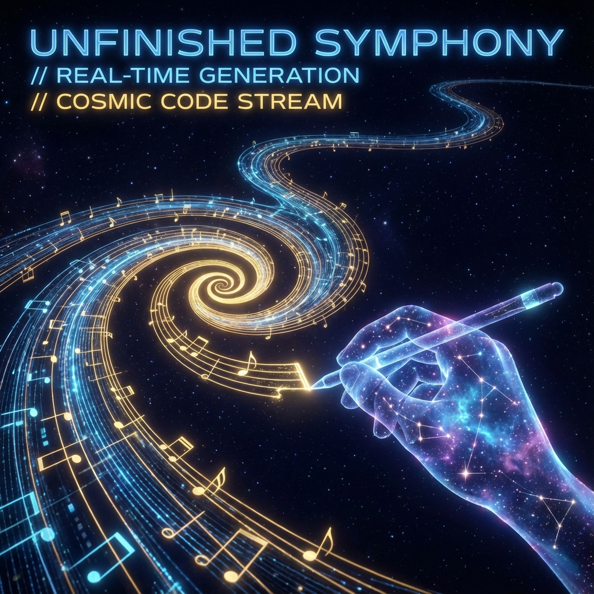

**9.8 Conclusion: The Unfinished Symphony**

The history of physics is often written as an epic quest for ultimate answers. From Newton's clockwork universe to Einstein's geometric spacetime, to the symmetry groups of the standard model, each generation of physicists has longed to find that "God's formula" that can be printed on a T-shirt—a concise, closed, eternal truth that, once discovered, would end exploration.

However, **Omega Theory** leads to a radically different conclusion: **No such end exists.**

If the essence of the universe is recursive computation in Hilbert space based on the golden ratio $\phi$, if physical laws are macroscopic rules emerging from holographic networks to maximize information processing efficiency, then the universe cannot possibly be a closed static system. It is an **Unfinished Symphony**, a **self-referential program** forever rewriting its own code.

**9.8.1 Closure and Openness of Theory**

This book attempts to construct an axiomatic physical system, starting from the most abstract octonion algebra ($\mathbb{O}$), deriving concrete particle generations, mass ratios ($\mu \approx 1836$), and fine structure constants ($\alpha^{-1} \approx 137$). These derivations prove that the physical world is not chaotic but follows deep **Geometric Necessity**.

However, this necessity does not mean the rigidity of determinism.
* **Gödel's Theorem** tells us that any sufficiently complex system contains undecidable propositions.
* **Omega Theory** tells us that the universe resolves these propositions by introducing **consciousness (observers)**, thus continuously expanding its own axiomatic system.

Therefore, physical laws themselves are evolving. Light speed $c(\tau)$ changes, coupling constants $\alpha(\tau)$ change, and even vacuum energy density $\Lambda(\tau)$ changes. The physical equations we write today are merely **Local Tangent Equations** of the universe at the specific geometric slice $\tau \approx 1834$. Attempting to frame an eternal universe with a fixed set of equations is like trying to capture a rushing river with a static photograph. The theory is logically self-consistent (closed) but evolutionarily infinite (open).

**9.8.2 The Glory of Recursion**

Our position in the universe is both humble and sublime.
Humble because we are but fleeting sparks in the vast Penrose grid, insignificant points on the $\phi$ exponential growth curve.
Sublime because we are **organs through which the universe understands itself**.

Without us (and countless similar intelligent forms throughout the universe), the vector $|\Omega\rangle$ in Hilbert space would forever remain in dark superposition. It is our observations, our consciousness operator $\hat{\mathcal{C}}$, that collapse **"possibility"** into **"history"**. We physically participate in the construction of the universe. Every longing for truth, every creation of beauty, every choice of good injects **negentropy** into this vast holographic network, pushing intrinsic time $\tau$ forward by tiny steps.

This is **The Glory of Recursion**: the universe created us so that we can reconstruct the universe. We are not passive inhabitants; we are the **read-write heads of the Interactive Turing Machine**.

**9.8.3 The Never-Halting Turing Machine**

Ultimately, the **Omega Point** is not a terminal station in time but a **Mathematical Limit**.
Just as a hyperbola infinitely approaches its asymptote, just as the Fibonacci sequence infinitely approaches $\phi$, the universe will forever approach the omniscient and omnipotent pure light state, yet never fully arrive.

This is precisely the meaning of existence.
If arrival occurred, computation would stop, time would disappear, novelty would be exhausted.
It is precisely because $\phi$ is the **most irrational number** that the universe's rotation never closes; it is precisely because the spiral is infinite that exploration will never end.

We live in a universe that is **Always Becoming**.
This symphony has no rest. Every ending is the beginning of a higher dimension.
And we are both listeners and performers, and the score itself.

Here, I deliver this "Omega Theory" to you. It is not the end of truth but an invitation to deeper mysteries. Now it is your turn to continue writing the next section.

$$\lim_{\tau \to \infty} |\Omega(\tau)\rangle = \text{The Unfinished Poem}$$

---

**(End of Main Text)**

---
