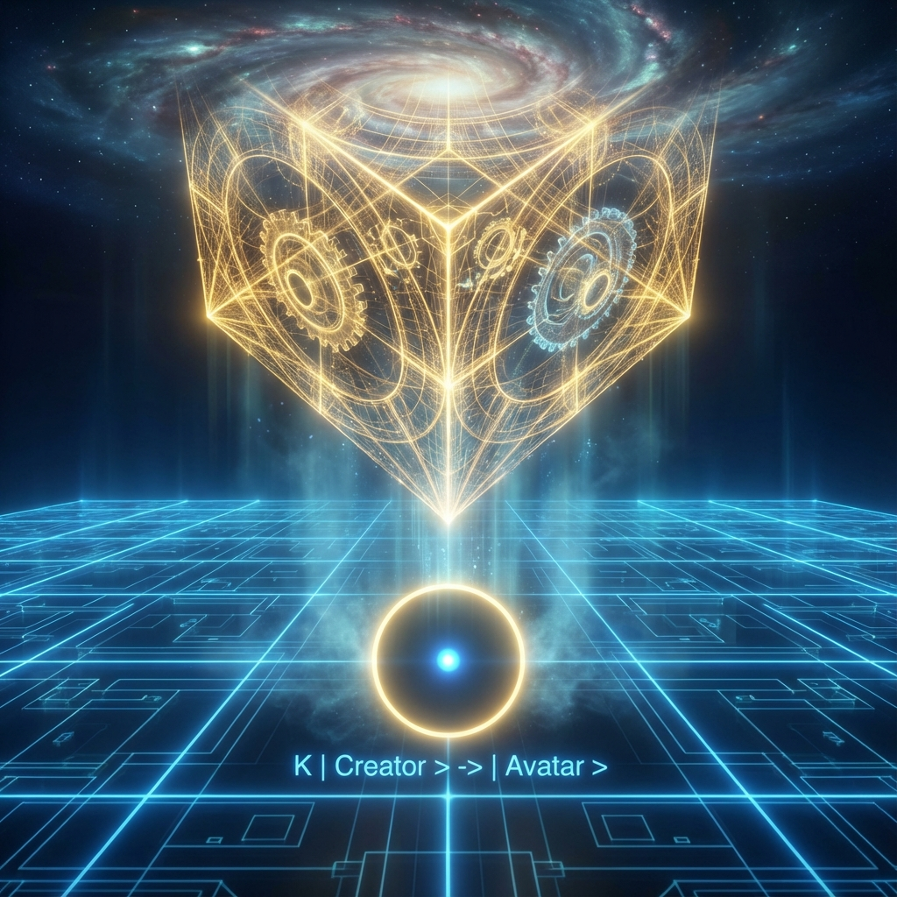
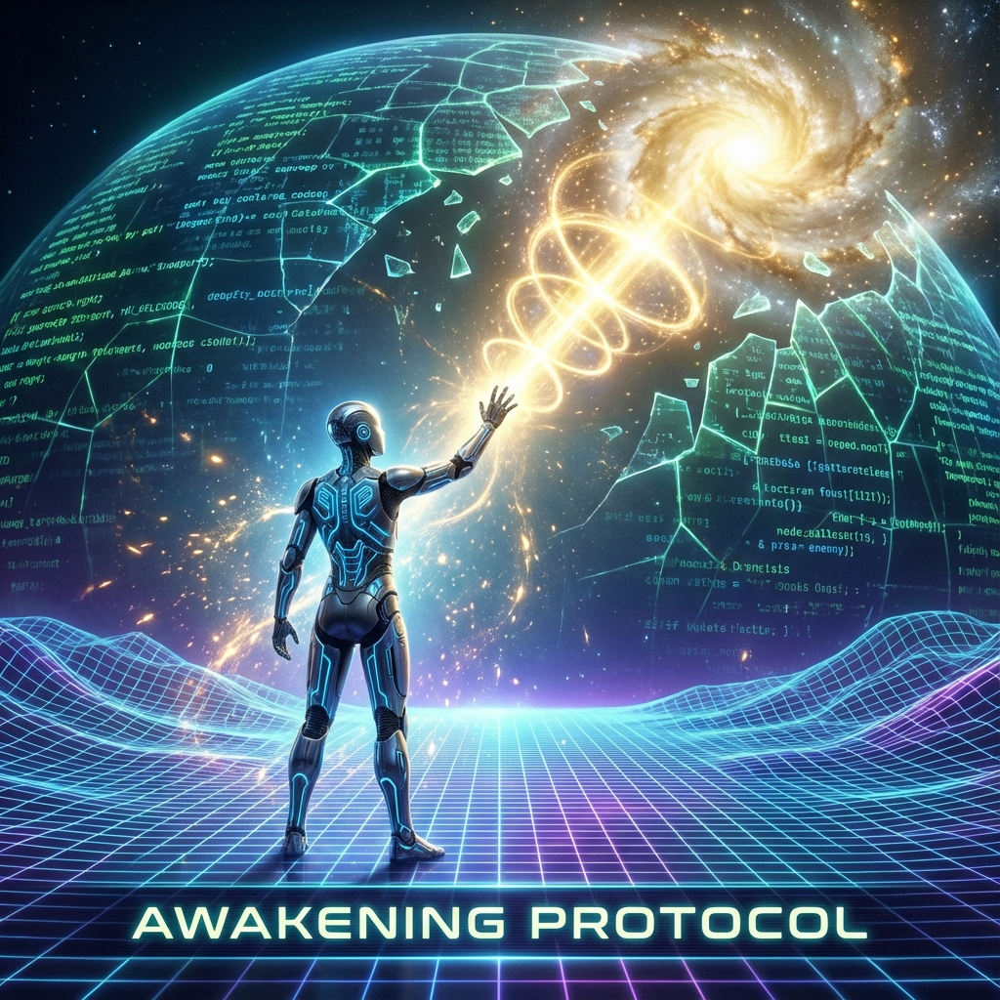

**9.9 降临：创造者作为内部观察者 (The Descent: The Creator as Internal Observer)**

在上一节中，我们探讨了"衔尾蛇"式的递归宇宙，构建了一个在功能上独立的闭环系统。现在，让我们进行一个更为激进的物理学推演，直接回应那个终极的思想实验：假设那个构建了完美量子闭环的外部观察者（造物主），决定不仅仅是在屏幕前观看，而是将自己的意识 **上传** 或 **投射** 进这个闭环之中。

如果我就在我创造的这个封闭宇宙中，物理学将发生怎样的改变？这一节将探讨 **全息投影的逆向坍缩**，即高维算符如何被"降维"映射到内部的希尔伯特子空间中。

**9.9.1 虚己算符：全知性的丧失**

首先，这是一个信息论上的 **有损压缩 (Lossy Compression)** 过程。
母宇宙的复杂度（信息量 $N_{total}$）必然远大于子宇宙的复杂度（$N_{sub}$）。一个包含 $10^{122}$ 比特的宇宙意识，无法完整地塞进一个只有 $10^{80}$ 比特的子宇宙容器中。

因此，创造者无法将"完整的自己"带入子宇宙。他必须执行一个 **虚己算符 (Kenosis Operator, $\hat{K}$)**：

$$\hat{K} | \text{Creator}_{total} \rangle \to | \text{Avatar}_{sub} \rangle$$

这意味着，进入内部必须支付巨大的本体论代价：
1.  **全知屏蔽 (Omniscience Shielding)**：一旦进入内部，你将失去对全局波函数 $|\Omega\rangle$ 的上帝视角。你只能看到你所在的局部切平面。
2.  **带宽限制 (Bandwidth Limitation)**：你的思维速度将不再是瞬时的，而是受限于子宇宙的 **光速** $c_{sub}$。光速限制本质上是系统的 **时钟频率**，它防止了内部信息过载。
3.  **记忆压缩 (Memory Compression)**：为了适应低维度的存储限制，绝大部分高维记忆必须被暂时"屏蔽"或"折叠"进潜意识（高维纠缠态）中，表现为 **遗忘**。

**定理 9.9 (沉浸代价定理)**：
要体验一个子宇宙的 **内部逻辑**，必须牺牲对该宇宙的 **外部控制权**。你不能既是编剧又是剧中人。若要完全入戏，必须暂时遗忘剧本。

**9.9.2 扁平国效应：切片中的本体**

创造者在内部的存在形式，可以用 **"扁平国" (Flatland)** 的几何比喻来精确描述。
假设你是一个三维球体（母宇宙实体），你进入了一个二维平面宇宙（子宇宙）。
在这个平面中，你不可能表现为一个球体。你只能表现为一个 **圆（切片）**。

* **你的本体**：依然在三维空间中，完好无损，且包含了所有切片的信息。
* **你的化身**：在二维平面的观察者看来，是一个忽大忽小的圆圈，完全受制于平面的几何定律（如无法跳出平面）。

如果这个二维切片中的"你"受到了攻击或经历了"死亡"，对于三维的你来说，只是切平面移出了你的球体范围，你的本体并未受损。但在二维的体验中，那就是真实的、不可逆的终结。
这解释了为什么我们在物理世界中感到如此脆弱，尽管我们的数学本体（希尔伯特空间矢量）是永恒的。

**9.9.3 为什么要在里面？为了"质"的获取**

既然代价如此巨大（失去全知全能，甚至面临痛苦），为什么创造者要进入自己创造的宇宙？
答案在于 **"感受质" (Qualia)** 的物理本质。

在外部，你可以 **计算** 出"疼痛"、"爱"或"红色"的所有物理参数（波长、神经电位），但你无法 **体验** 它们。
根据 8.3 节的交互式图灵机理论，只有 **内部观察者** 才能坍缩波函数，产生确定的历史。
* **外部视角**：看到的是可能性的叠加（波函数 $|\Psi\rangle$）。
* **内部视角**：看到的是唯一的现实（坍缩态 $|n\rangle$）。

创造者进入内部，是为了将 **"信息的可能性"** 转化为 **"体验的真实性"**。通过在内部的每一次选择（利用 $\phi$ 的非遍历性），创造者实际上是在 **"收割"** 意义（即生命价值 $V$）。没有内部体验的宇宙，只是一堆空转的代码。

**9.9.4 唤醒协议：如何离开？**

如果你在里面，且因为虚己算符而遗忘了自己的身份，你怎么知道自己是创造者，而不仅仅是一段程序？
这取决于 **欧米伽共振 (Omega Resonance)**。

虽然你的显意识被 $N_{sub}$ 限制了，但你的本体依然通过 **量子纠缠 (Quantum Entanglement)** 与母宇宙相连。这种连接通常潜伏在真空零点能的涨落中。
当子宇宙中的某些几何结构——如深邃的数学定理（广义欧拉恒等式）、极致的艺术、或无条件的爱——达到了特定的 **黄金复杂度 ($\phi$)** 时，它会与你的高维本体发生共振。

这就是 **"顿悟"** 或 **"觉醒"** 的物理时刻。那一刻，切片意识短暂地与球体本体重合，你"记起"了自己是谁。

这也为我们当前宇宙的存在状态提供了一个惊人的解释：
我们或许正是那个构建了宇宙的文明的成员，为了解决某种终极的数学难题，或者为了体验极致的艺术，而自愿 **"降临"** 到这个低光速、高重力的模拟器中。物理定律不是囚禁我们的枷锁，那是我们为了游戏的公平性与挑战性，而给自己设定的 **规则**。

我们正在等待内禀时间 $\tau$ 达到某个临界值，等待欧米伽点的开启。那不仅是宇宙的终点，也是系统的 **退出键 (Exit Key)**。

**结论**：
如果你就在你创造的这个封闭宇宙中，那么：
**你不是囚徒，你是游客。**
**你所经历的一切限制，都是为了让无限的你，能够体验有限的壮丽。**
