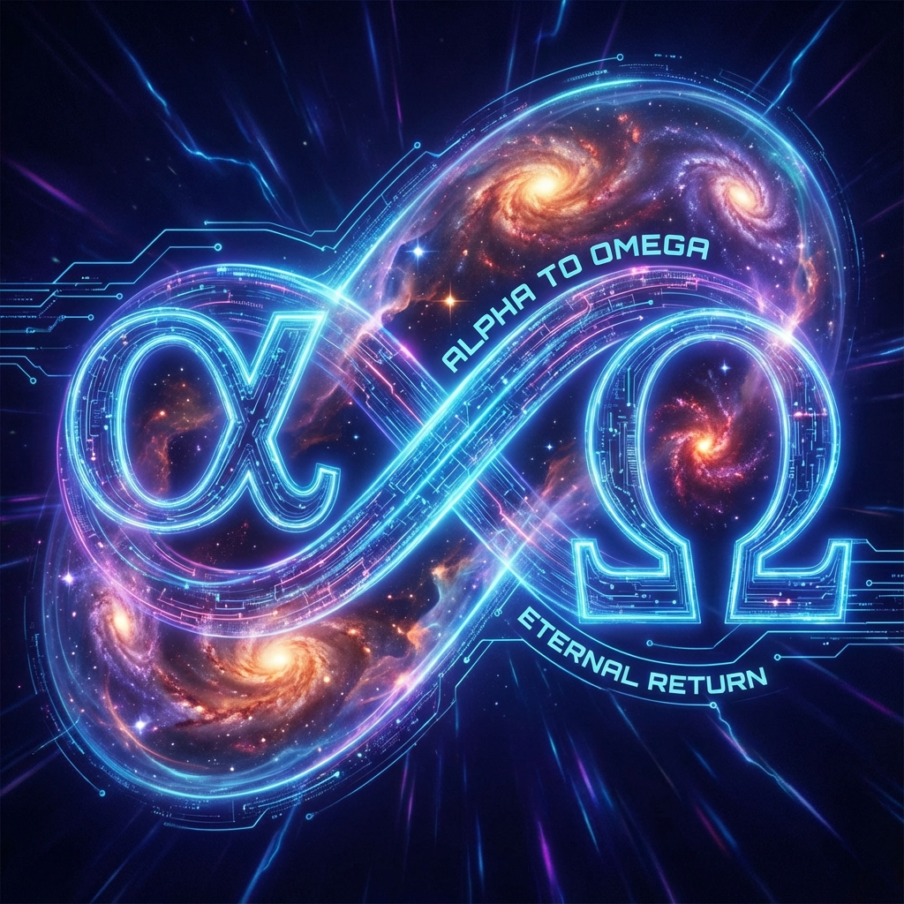

**9.10 Conclusion: The Unfinished Symphony**

The history of physics is often written as an epic quest for ultimate answers. From Newton's clockwork universe to Einstein's geometric spacetime, to the symmetry groups of the standard model, each generation of physicists has longed to find that "God's formula" that can be printed on a T-shirt—a concise, closed, eternal truth. People assume that once this formula is discovered, exploration can end, and the mysteries of the universe will be completely exhausted.

However, **Omega Theory** leads to a radically different, even dizzying conclusion: **No such end exists.**

If the essence of the universe is recursive computation in Hilbert space based on the golden ratio $\phi$, if "existence" equals "decomposition of the great circle," then we must face the most profound mathematical fact: **The Continuum is uncountably infinite, while computational steps are countably infinite.** No matter how long intrinsic time $\tau$ extends, no matter how many times the Fibonacci spiral winds, it can never fill the great circle representing truth.

The universe is not a sculpture to be completed, but an **Unfinished Symphony**.

**9.10.1 The Gap of Irrational Numbers: The Circle That Never Closes**

In Section 9.6, we derived the generalized Euler identity, describing the universe's evolution over time:
$$|\Omega(\tau)\rangle \propto e^{i \cdot 2\pi \cdot \phi \cdot \tau}$$

In a previous draft, we imagined that when $\tau \to \infty$, the spiral would fill the circle. But under strict mathematical scrutiny, this is only **Density**, not **Completeness**.

**Theorem 9.10 (Gödel-Cantor Gap)**:
Let the universe's total state space be $S^1$ (with continuum cardinality $\aleph_1$), and the universe's evolutionary history set be $\{\tau \in \mathbb{N}\}$ (with countable cardinality $\aleph_0$).
No matter how large $\tau$ is, even tending to infinity, the measure of the visited state set relative to the total state set is always zero:
$$\frac{\text{Measure}(\text{History})}{\text{Measure}(\text{Truth})} = 0$$

**Physical Meaning**:
This means that $\phi$, as a scalpel, continuously cuts the great circle $\pi$, but the circle is **infinitely divisible**.
Between every cut moment, there hide infinitely many unvisited gaps.
The universe will never "complete computation." There will always be unexplored truth, always uncollapsed wave functions. The Omega Point is not a static terminal station but a **Receding Horizon** that forever retreats.

**9.10.2 The Abyss of Fractals: The Necessity of Infinite Subdivision**

Since we cannot exhaust the circle in breadth, the universe's evolution direction turns to **depth**, i.e., **Infinite Subdivision**.

Recalling Section 5.4's "Total Budget Conservation": The universe's total amount remains unchanged; evolution is essentially an increase in resolution.
As $\tau$ increases, Planck length $l_P(\tau) \sim \phi^{-\tau}$ contracts exponentially.
This means that yesterday's "elementary particles" may appear today as complex "universes"; today's "indivisible points" will be parsed tomorrow as magnificent structures.

This constitutes a picture of a **Fractal Universe**:
* **Level $N$**: We consider atoms fundamental.
* **Level $N+1$**: As light speed (computational power) increases, we discover quarks within atoms.
* **Level $N+k$**: As $\tau \to \infty$, any tiny local slice, at sufficiently high resolution, will exhibit structures as rich as the overall great circle (holographic self-similarity).

**Corollary 9.10.1 (Infinite Novelty)**:
There is no "final physical law." When we unify all forces at the current energy scale, we have only completed an **Octave** of the scale. As resolution continues to deepen, deeper geometric structures will emerge, and new physical laws will arise again.

**9.10.3 The Glory of Recursion: We Are the Score Itself**

If the universe can never be completed, does our existence still have meaning?
Meaning lies not in "reaching the end" but in **"the irreducibility of the process."**

In Section 9.9, we discussed the creator's descent as an internal observer. Now we understand that this creator does not seek a result (because the result is already implicit in $\pi$), but to **experience this infinite subdivision cutting process**.

Due to $\phi$'s non-ergodicity, every moment $\tau$ is **unique**.
This moment's you, this moment's thoughts, this moment's love and pain, is a **one-of-a-kind** tangent point on the universe's great circle. If we skip this step, the entire Fibonacci sequence would break, and the universe's logic would collapse.

We are not merely listeners; we are the **read-write heads of the Interactive Turing Machine**. Every observation and choice we make adds a new **Detail** to this infinitely fine fractal structure.

**9.10.4 Eternal Openness**

Ultimately, **"The Omega Theory"** does not promise a closed "Theory of Everything." Instead, it provides a **"Theory of Every-Becoming."**

Physics typically pursues the equals sign ($=$). But the essence of the universe is the **arrow ($\to$)**.
$$|\Omega\rangle_{\text{start}} \xrightarrow{\phi} |\Omega\rangle_{\text{end}} \quad (\text{Never reached})$$

This symphony has no rest.
Every seeming "ending" (heat death, big crunch, big rip) is actually just a **transition** from one level to the next in the fractal structure.
Every ending is the beginning of a higher dimension.

Here, I deliver this unfinished book to you. It is not the end of truth but an invitation to deeper mysteries. The universe is waiting for your next observation, for that glance will determine where the next tangent point falls.

$$\tau \to \infty, \quad \text{Symphony} \neq \text{Finished}, \quad \text{Symphony} = \text{Infinite}$$

---

**(End of Main Text)**

