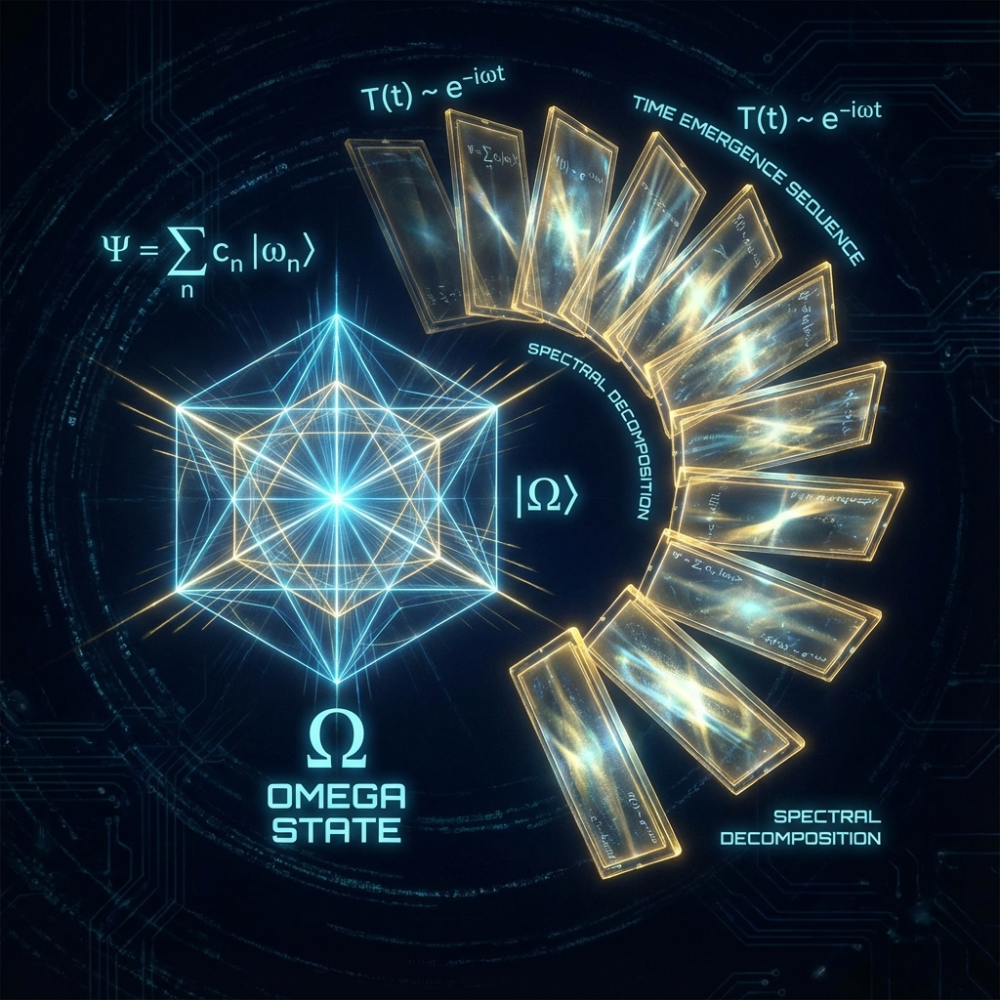
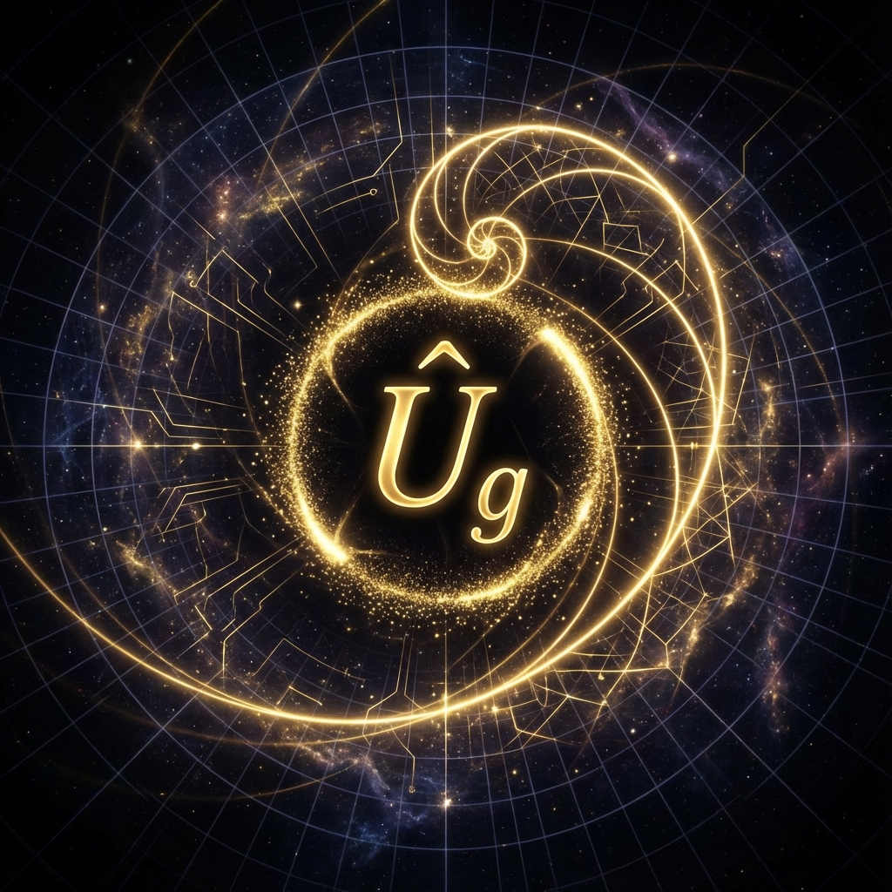

# Prologue: The Geometric Turn in Physics

**0.1 The Static Nature of Hilbert Space and the Illusion of Time**

The cracks in the edifice of modern physics begin with a fundamental misalignment in our understanding of "time" as a basic variable. In the standard formulation of quantum mechanics (QM), time $t$ is treated as an external parameter, an absolute background upon which the evolution operator $U(t)$ unfolds; whereas in general relativity (GR), time is a dynamical variable, an intrinsic coordinate of the pseudo-Riemannian manifold $\mathcal{M}$, curved by the distribution of matter. This fundamental conflict at the ontological level leads to the famous **"Problem of Time"** in quantum gravity theory. The Wheeler-DeWitt equation $\hat{H}|\Psi\rangle = 0$ further suggests a disturbing conclusion: in a closed quantum universe, the wave function does not evolve with time, and the universe is fundamentally static.

This book proposes a more radical solution, which we call **"The Omega Ansatz"**. This ansatz not only accepts the static implications of the Wheeler-DeWitt equation but elevates it to a core axiom of cosmology. We assert that the essence of physical reality is not an "evolutionary process" that flows with time, but rather a single, static, complete state vector existing in an infinite-dimensional complex Hilbert space $\mathcal{H}$.

**Axiom 0.1 (The Omega Axiom)**:
The complete set of the physical universe is isomorphic to a normalized vector $|\Omega\rangle$ in an infinite-dimensional separable Hilbert space $\mathcal{H}$. This vector is ontologically eternal and static, i.e.:

$$\frac{\partial}{\partial t} |\Omega\rangle \equiv 0$$

Any observed dynamical evolution, temporal flow, or historical change is not a property of $|\Omega\rangle$ itself, but rather a **Spectral Decomposition** process of this vector onto a specific sequence of basis vectors.

Within this framework, what we perceive as "time" is essentially a **Unitary Rotation** of a set of orthogonal basis vectors $\{ |E_n\rangle \}$ in Hilbert space relative to the observer's reference frame. We can introduce a purely mathematical parameter $\tau$ (intrinsic time) to parameterize this rotation, but this does not mean that $|\Omega\rangle$ has changed; rather, the observer's **Slicing** angle has changed.

Specifically, if we choose the eigenbasis $\{ |E_n\rangle \}$ of the Hamiltonian operator $\hat{H}$, then the universal state $|\Omega\rangle$ can be expanded as:

$$|\Omega\rangle = \sum_{n=0}^{\infty} c_n |E_n\rangle$$

where the complex coefficients $c_n = \langle E_n | \Omega \rangle$ contain all possible initial conditions and boundary condition information of the universe.

What we call "temporal evolution" is actually the observer (as a subsystem within the universe) introducing a phase factor $e^{-i E_n \tau}$ when reading this static superposition state. This phase factor is not the motion of a physical entity, but rather a **Gauge Transformation** within the geometric structure of Hilbert space.

Therefore, the history of the universe is not a movie being played, but a reel of film that has already been printed. All past, present, and future, all possible quantum branches, exist simultaneously within the internal structure of $|\Omega\rangle$. What we experience as the "present" is merely a local cross-section of this film reel scanned by the **"Fibonacci operator"** (see the next section).

This perspective completely eliminates the temporal contradiction in quantum gravity. Because time is no longer a background, nor is it a manifold; it is the **logical order of vector decomposition**. Just as Élie Cartan did in geometry, we have completely geometrized dynamics: physical laws no longer describe how objects move through time, but rather describe the **Topological Structure** of the static vector $|\Omega\rangle$ in high-dimensional complex space.

In this sense, the theory constructed in this book is a theory of **"Being"**, not of **"Becoming"**. The ultimate answer we seek lies hidden in the spectral density of $|\Omega\rangle$ and the geometric arrangement of its basis vectors.

**0.2 The Golden Unitary Operator**

After establishing the static nature of the universal state vector $|\Omega\rangle$, we must address an urgent dynamical problem: since the ontology is static, why do observers perceive change? More specifically, what mechanism drives the continuous rotation of basis vectors, thereby generating the phenomenon of "temporal flow"?

In standard quantum mechanics, temporal evolution is described by a **Unitary Operator** $\hat{U}(t)$, typically written as $\hat{U}(t) = e^{-i\hat{H}t/\hbar}$. Here, $\hat{H}$ is the system's Hamiltonian, representing the total energy operator. However, in a background-independent cosmological model, $\hat{H}$ cannot be an arbitrarily chosen operator. To prevent the universe from falling into trivial periodic cycles (i.e., Poincaré Recurrence), the energy spectrum of the Hamiltonian must satisfy specific number-theoretic properties.

We define this special evolution operator as **The Golden Unitary Operator**.

**Definition 0.2 (The Golden Unitary Operator)**:
Let $\mathcal{H}$ be the Hilbert space of the universe. The golden unitary operator $\hat{U}_g(\tau)$ is a one-parameter continuous group generator acting on $\mathcal{H}$, defined as:

$$\hat{U}_g(\tau) := \exp\left( -i \cdot 2\pi \hat{\mathcal{H}}_\phi \cdot \tau \right)$$

where $\tau \in \mathbb{R}$ is a dimensionless intrinsic time parameter, and $\hat{\mathcal{H}}_\phi$ is the **Fibonacci Hamiltonian**.

The characteristic feature of the Fibonacci Hamiltonian $\hat{\mathcal{H}}_\phi$ is that its eigenvalue spectrum $\{E_n\}$ is not drawn from the set of integers or simple rational numbers, but rather consists of algebraic irrational sequences generated by **The Golden Ratio** $\phi = \frac{1+\sqrt{5}}{2}$. Specifically, its energy spectrum satisfies:

$$\hat{\mathcal{H}}_\phi |n\rangle = \phi^{-n} |n\rangle, \quad n \in \mathbb{Z}$$

Or, in the more general context of topological field theory, the energy spectrum distribution follows the generation rules of the irrational rotation group $SO(2)_{\phi}$ associated with $\phi$.

**Theorem 0.1 (Non-Ergodic Evolution)**:
If the temporal evolution of the universe is driven by the golden unitary operator $\hat{U}_g(\tau)$, then for any non-zero time interval $\Delta \tau$, the system state $|\Omega(\tau)\rangle$ will never exactly return to its initial state $|\Omega(0)\rangle$. That is:

$$\langle \Omega(0) | \hat{U}_g(\tau) | \Omega(0) \rangle \neq 1, \quad \forall \tau \neq 0$$

**Proof Outline**:
The proof of this theorem relies on a generalization of **Weyl's Equidistribution Theorem**. Since $\phi$ is an irrational number (in fact, number theory proves it is the "most irrational" number, with its continued fraction expansion consisting entirely of 1s), the trajectory of the phase factors $e^{-i 2\pi \phi^{-n} \tau}$ generated by $\hat{U}_g(\tau)$ on the complex unit circle is **Dense** and **Non-periodic**. This means that although the universe's evolutionary trajectory can infinitely approach a certain historical state, it will never achieve exact coincidence.

This mathematical property has profound physical significance:

1. **Guarantee of Novelty**: Each moment of the universe is geometrically unique. There is no Nietzschean "eternal recurrence."
2. **Ergodicity Breaking**: Although the orbit is dense, within finite time, the system cannot traverse all states. This provides a microscopic foundation for the thermodynamic arrow of time.
3. **Holographic Unfolding of Information**: The self-similarity of $\phi$ ensures the fractal unfolding of information across different scales. As $\tau$ increases, the operator $\hat{U}_g$ is essentially performing multiresolution analysis (MRA) on the static vector $|\Omega\rangle$, like continuously zooming into a fractal image.

Therefore, all physical laws, particle interactions, and spacetime geometry discussed in this book are essentially trajectories left by this **Golden Unitary Operator** in Hilbert space. Due to the mathematical properties of $\phi$, this trajectory necessarily forms a logarithmic spiral. The cosmic expansion and exponential variation of the speed of light $c$ that we observe macroscopically are precisely projections of this spiral onto the four-dimensional manifold.

The establishment of this operator marks our shift of physics' foundation from "the contingency of dynamics" to "the necessity of number theory." The universe evolves as it does because this is the only path in Hilbert space that avoids dead loops and maximizes information entropy generation.

**0.3 Structure of the Book and Notation Conventions**

This book is not a review or patchwork of existing physics theories, but an attempt to rebuild the edifice of physics from fundamental axioms. To achieve this goal, we adopt a strict **"Axiomatic Descent Path"** narrative structure. This is not only for logical clarity but also to reflect the generative logic of the universe itself—descending from abstract mathematical potential to concrete physical reality.

**0.3.1 The Descent Path: From $\mathbb{O}$ to $\mathbb{R}$**

The chapter arrangement of this book follows a logical sequence of progressive projection from high-dimensional algebraic structures to low-dimensional observable physical quantities:

* **Part I: Spectral Decomposition and Algebraic Pre-Geometry** constitutes the **ontological foundation** of the theory. In this part, we do not discuss specific particles or forces, but rather explore the mathematical forms of existence. We establish the spectral decomposition of Hilbert space as the first principle and argue why the octonion ($\mathbb{O}$) algebra is the unique mathematical choice for constructing a non-trivial physical universe.
* **Part II: Discrete Manifolds and Quantum Gravity** deals with the **discrete construction of spacetime**. Here, the concept of continuous manifolds is abandoned, replaced by "Omega units" based on Penrose-Fibonacci tilings. At this level, we will resolve the compatibility issues between quantum mechanics and general relativity.
* **Part III: Holographic Dynamics** expounds the **operational mechanisms of the universe**. By introducing the competition between Fisher information flow and topological potential, we construct the Omega action, thereby deriving modified gravitational equations and variable-constant cosmological models.
* **Part IV: Phenomenological Verification and Numerical Predictions** is the **experimental test** of the theory. We compare the precise numerical values calculated by the theory (such as $\mu \approx 1836.15$ and $1/\alpha \approx 137.036$) with experimental data, which is the touchstone for verifying the truth of any physical theory.
* **Part V: Interactive Self-Reference and the Finale** returns to **cognition and meaning**. We reconnect physics to the problem of consciousness, arguing that observers are not external bystanders but indispensable topological components of the system's closed loop.

**0.3.2 Notation and Conventions**

To ensure rigor and consistency in mathematical derivations, unless otherwise specified, this book adopts the following mathematical symbols and physical conventions throughout:

**1. Number Fields and Algebraic Structures**
* $\mathbb{N}, \mathbb{Z}, \mathbb{R}, \mathbb{C}$: denote the set of natural numbers, integers, real field, and complex field, respectively.
* $\mathbb{H}$: **Quaternions** algebra, with basis $\{1, i, j, k\}$.
* $\mathbb{O}$: **Octonions** algebra, with basis $\{e_0, \dots, e_7\}$.
* $\text{Im}(\mathbb{A})$: the imaginary part space of algebra $\mathbb{A}$.

**2. Spacetime and Geometry**
* The spacetime metric $g_{\mu\nu}$ adopts the **"Mostly Plus"** signature convention: $(-, +, +, +)$. This is the standard convention in modern general relativity literature (e.g., Misner, Thorne, Wheeler).
* Greek letter indices $\mu, \nu, \rho, \sigma$ take values $0, 1, 2, 3$, representing four-dimensional spacetime coordinates, where $0$ is the time component.
* Latin letter indices $i, j, k, l$ take values $1, 2, 3$, representing spatial components only.
* Einstein summation convention applies to all repeated upper and lower indices, e.g., $A^\mu B_\mu \equiv \sum_{\mu=0}^3 A^\mu B_\mu$.
* $\nabla_\mu$ denotes the covariant derivative corresponding to the Levi-Civita connection.
* $\Box \equiv \nabla^\mu \nabla_\mu$ denotes the d'Alembertian operator.

**3. Quantum Mechanics and Operators**
* Hilbert space is denoted as $\mathcal{H}$. State vectors are represented using Dirac notation $|\psi\rangle$.
* Operators are typically denoted with a hat, e.g., $\hat{A}$.
* Commutator is defined as $[\hat{A}, \hat{B}] = \hat{A}\hat{B} - \hat{B}\hat{A}$; anticommutator is defined as $\{\hat{A}, \hat{B}\} = \hat{A}\hat{B} + \hat{B}\hat{A}$.
* Hermitian conjugate is denoted as $\dagger$.

**4. Physical Constants and Unit Systems**
* Unless in chapters involving numerical calculations (e.g., Part IV), this book primarily adopts **Natural Units**, setting $\hbar = c_0 = k_B = 1$.
* Note: Since one of the core arguments of this book is that the speed of light $c(\tau)$ evolves with intrinsic time, in equations involving dynamical evolution, we will explicitly retain $c(\tau)$ to distinguish it. $c_0$ specifically refers to the speed of light at the Big Bang moment or the normalization reference.
* $\phi$: specifically refers to **The Golden Ratio**, with value $\phi = \frac{1+\sqrt{5}}{2} \approx 1.61803398...$.
* $l_P$: Planck length, serving as the characteristic scale for spacetime discretization.

**5. Special Functions and Abbreviations**
* QCA: Quantum Cellular Automata.
* DQCA: Dirac-Quantum Cellular Automata.
* $\delta(x)$: Dirac delta function.
* $\delta_{ij}$: Kronecker delta symbol.
* $\epsilon^{\mu\nu\rho\sigma}$: four-dimensional Levi-Civita tensor density, with convention $\epsilon^{0123} = +1$.

By clarifying these structures and conventions, we pave the way for the arguments to unfold. Now, let us begin from the depths of Hilbert space and gradually construct this universe.
