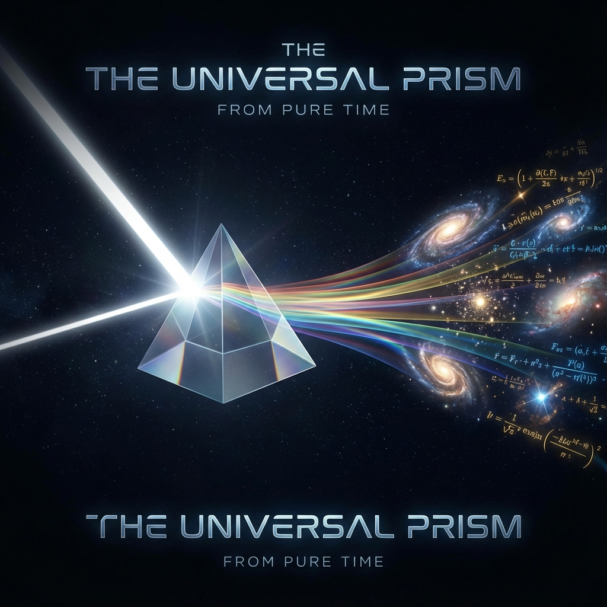

# Preface: The Light and The Prism

When we look up at the stars, we see stars burning and galaxies rotating; when we examine the microscopic, we see atoms vibrating and quarks combining. To describe all of this, physicists have built two magnificent towers: one is Einstein's general theory of relativity, which uses curved geometry to describe gravity and the large-scale structure of spacetime; the other is quantum mechanics, which uses discrete probabilities and jumping operators to describe the wild dance of microscopic particles.

These two towers are each perfect in their own right, but between them lies an abyss that seems insurmountable. For decades, the brightest minds have been trying to build a bridge, trying to find that legendary "theory of everything" that would unify the geometry of gravity with the probabilities of quantum mechanics. But perhaps, as I attempt to show in this book, our confusion does not stem from a missing piece of the puzzle, but rather from the fact that the way we look at the picture is itself an illusion.

Imagine you are in a pitch-black room. There is an extremely fine crack in the wall, and a pure white light shines through it. You hold a triangular prism in your hand and place it in front of this beam of light. Instantly, a brilliant rainbow appears on the other end of the room: red, yellow, blue, purple...

If you were an observer who had never seen white light, you might spend your entire life studying how red differs from blue, measuring the fine structure of every dark line in the spectrum, arguing about why purple always appears opposite to red. You would build a complex theory about "color."

But in fact, there is no such thing as "color." **There is only that beam of light.** Color is merely the result of **scattering** when light passes through the prism.

This is the core idea of this book: the complex physical universe we inhabit—filled with massive particles, extended space, and various interaction forces—is essentially that rainbow.

And before all things came into being, the universe was just a pure, colorless beam of light. We call this beam of light **"primordial time."**

At the deepest level of physics, even before space and matter appeared, there exists the purest mathematical truth: **evolution**. In the abstract ocean that mathematicians call "Hilbert space," the universe's state vector is rotating at a constant, unchanging rate. This rate is what we later call the speed of light $c$, or more accurately, the universe's **total bandwidth** for processing information.

This is that beam of white light. It has no spatial extension, no burden of mass, no push or pull of forces. It is just pure passage, silent and eternal.

However, the universe is not content with silence. It gave birth to **observers**—you and me.

An observer is not a passive camera recording the universe; an observer is that **prism**. When we try to measure the universe, when we try to distinguish "here" from "there," "past" from "future," we inevitably intervene in the path of that beam of light. Our act of observation **scatters** that originally unified primordial time into countless fragments.

* Part of time is projected outward, becoming what we call **"space"**;

* Part of time is curled inward, becoming what we call **"mass"**;

* When the flow rate of time differs in different regions, creating density gradients, we experience **"force."**

Therefore, the so-called laws of physics are not divine decrees carved in stone, but rather "geometric perspective" produced when we project a higher-dimensional ontology onto lower-dimensional senses. The particles we see are actually topological dead knots in the flow of time; the gravity we feel is actually the tilt of time density; the time dilation we experience is actually the redistribution of computational resources.

This explains why there is a speed-of-light limit—because the total brightness (bandwidth) of that primordial light is finite. You cannot infinitely extend the spectrum without sacrificing brightness.

This book does not discuss complex formulas, though behind every conclusion there is rigorous mathematical derivation (as I show in the appendix). Here, I invite you to let go of your attachment to "matter" and put on a pair of geometric glasses.

We will journey together: starting from the silent afternoon of Hilbert space, passing through the economic game of special relativity, diving into the microscopic pixels of quantum mechanics, and finally arriving at the abyss of existentialism. We will see that the universe did not have a big bang; it is just a great computation in progress. And we, as products of the scattering of time, are trying to swim upstream to reassemble that original beam of light.

Welcome to the interior of time.

---

*（Next we will enter Part One, exploring the silent ontology of the universe before matter came into being.）*

