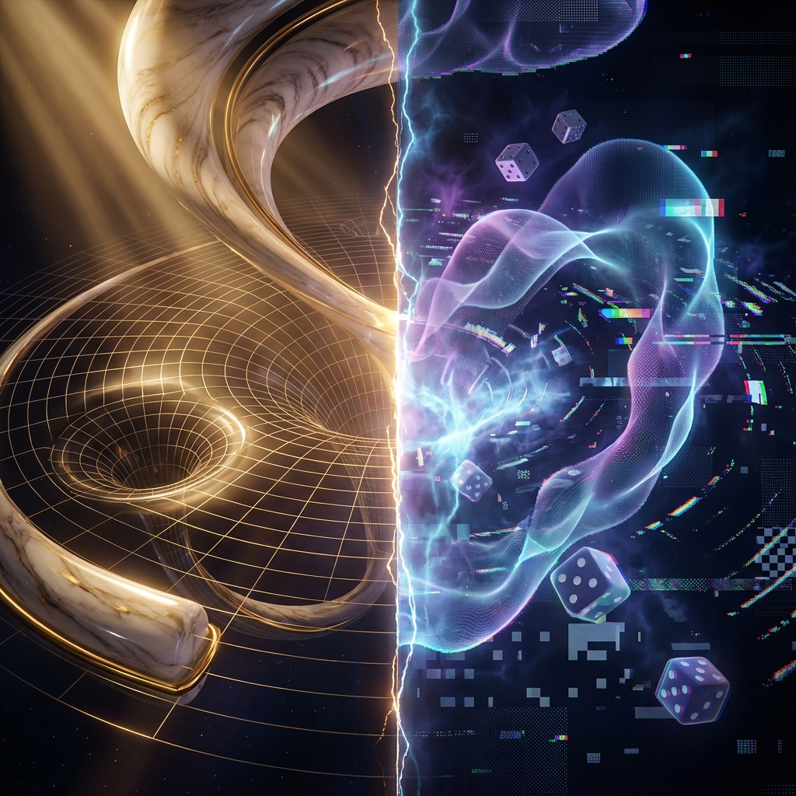

# 1.1 两个上帝的战争

**(The War of Two Gods)**

如果物理学是描述宇宙的宗教，那么我们在过去的一百年里，其实一直侍奉着两个性格迥异的上帝。

第一个上帝住在宏观的殿堂里，他的名字叫**阿尔伯特·爱因斯坦**。他所创造的世界——**广义相对论**——是极致光滑、优雅且具有决定论色彩的。在这个世界里，空间和时间并不是某种刚性的背景舞台，而是一块柔软的织物。当你把一个大质量的物体（比如太阳）放在这块织物上，它会弯曲、下陷。行星并不是在某种神秘引力的牵引下绕着太阳转，它们只是在沿着这块弯曲织物上"看起来最直"的路线滑行。

爱因斯坦的宇宙像是一块完美无瑕的大理石。在这个宇宙中，如果你知道了此刻所有物体的位置和速度，原则上你可以极其精确地预测出一万年后的每一秒。这里没有跳跃，没有模糊，你甚至可以无限地放大时空，它永远是平滑连续的。这是一个几何学家的梦想，是一个关于**形状**的理论。

然而，当你试图用显微镜看向物质的深处，当你把镜头放大到原子核的尺度，爱因斯坦的上帝就消失了。你进入了第二个上帝的领地——**量子力学**。

这里的统治者是**尼尔斯·玻尔**和他的哥本哈根学派。这里的规则不再是几何的，而是**代数**的。在这个微观世界里，粒子不再有确定的位置和轨迹，它们变成了弥散的波函数，或者是希尔伯特空间（Hilbert Space）中旋转的矢量。自然界在这里展示了它颗粒状的一面：能量不是连续流动的，而是一份一份地"打包"传递的。更令人不安的是，这里的核心法则是概率。就像上帝在掷骰子，你无法确知下一刻会发生什么，你只能计算它发生的可能性。

这就是现代物理学的精神分裂症。

在大半个世纪里，物理学家们一直在试图调停这两个上帝的战争。我们试图建立一个"万有理论"（Theory of Everything），试图用一套方程同时描述黑洞的吞噬（极大的引力）和电子的跳跃（极小的量子）。

但每当我们试图强行将它们结合时，灾难就发生了。当你试图计算引力场在量子尺度下的涨落时，数学方程会崩溃，计算结果会给出无穷大。这就像是你试图在一个充满马赛克的低分辨率屏幕上（量子力学）画出一条绝对完美的平滑曲线（广义相对论），无论你怎么努力，像素的锯齿总会破坏曲线的完美。

问题的根源究竟在哪里？

主流的尝试——比如弦理论或圈量子引力论——认为问题出在**结构**上。也许粒子不是点，而是振动的弦？也许空间本身就是由微小的环编织而成的？

但本书想提出一个更激进的观点：**问题不在于我们发现了什么结构，而在于我们使用了什么语言。**

广义相对论依赖于"时空流形"（Manifold），它默认了宇宙是一个发生的**场所**。量子力学依赖于"线性代数"（Linear Algebra），它暗示了宇宙是一系列**状态**的叠加。这不仅是数学技巧的差异，这是世界观的根本冲突——即"本体论"（Ontology）的冲突。

一个说："世界是弯曲的几何。"

另一个说："世界是概率的代数。"

也许，他们都错了。或者更准确地说，他们都只是看到了真理的一个侧面。

如果我们要结束这场战争，我们就不能在旧的废墟上修修补补。我们需要走出时空这个旧的舞台，去寻找一个更深层、更广阔的数学容器。我们需要一种"第三种语言"，一种既能包容几何的弯曲，又能容纳代数的叠加的语言。

这个容器早已存在于数学家的抽屉里，它被称为**射影希尔伯特空间**（Projective Hilbert Space）。

在这个空间里，宇宙不是一个随着时间在空间中演化的戏剧，而是一个静默的、永恒的数学对象。让我们把它想象成一个慵懒的午后，阳光洒在海面上，波光粼粼。在这个高维的海洋里，没有大爆炸的喧嚣，没有粒子的碰撞，只有纯粹的、连贯的、永不停息的流逝。

那是我们故事的真正起点。

---

*（下一节，我们将进入 1.2 节，正式揭开这个"宇宙终对象"的面纱，并提出那个唯一的公理。）*

