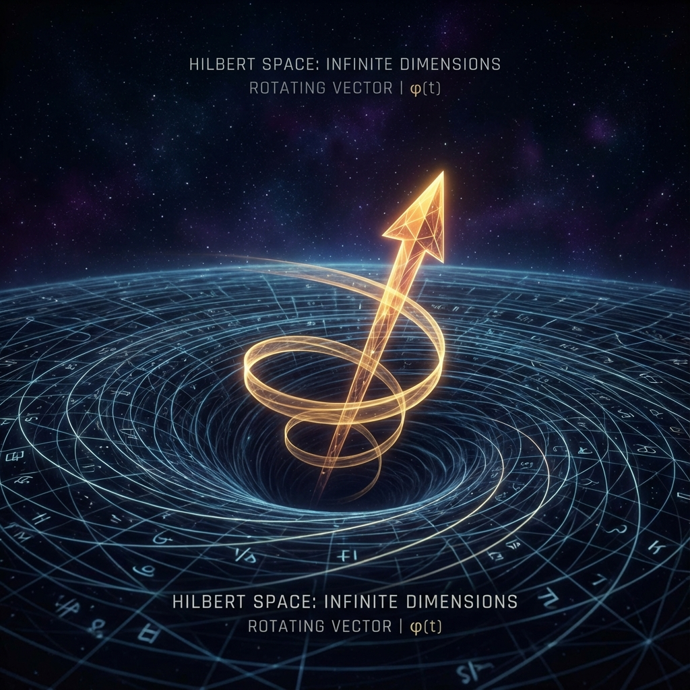

# 1.2 The Universe Final Object ($\mathfrak U$) and the Single Axiom

If we no longer believe that Einstein's curved spacetime is the ultimate truth, nor that Bohr's probabilistic dice is the foundation of the world, then what exactly is the universe?

Let us perform a bold thought experiment. Try to remove everything from the universe—remove stars, planets, atoms, even remove space and time themselves. What remains is not emptiness, but a pure mathematical structure, a vast container holding all possibilities.

Mathematicians call this container **Hilbert Space**.

Imagine an ocean of infinite dimensions. Every point in this ocean represents a possible "state" of the universe. At one point, the universe is a blazing fireball; at another, stars have extinguished; at an extremely nearby point, you are reading this page of the book, or you decide to close the book and have a cup of coffee. All these possibilities exist simultaneously in this vast mathematical ocean.

In this picture, our universe is no longer a Lego structure pieced together from countless tiny particles; it is a **single object**. We call it the **Universe Final Object**.

Mathematically, it is simply a **vector** (Vector) in Hilbert Space, an arrow shot from the origin. The length of this arrow is fixed (we normalize it to 1), and wherever it points, that is what the universe is like.

This is the silence of ontology. At this level, there is no conflict, no division, only this arrow representing the sum of all things, suspended in mathematical void.

But if this arrow remains forever motionless, then nothing happens. No history, no future, no birth of you and me.

Thus, we introduce the **single dynamical axiom** of this book. This axiom is incredibly simple, but as we will see, the entire complex physical world—from relativistic time dilation to quantum mechanical wave function collapse—are all just corollaries of this axiom.

We call it **Axiom A1**.

> **Axiom A1: The universe's state vector rotates forever in Hilbert Space at a constant rate.**

That's it. No complex differential equations, no cumbersome laws of mechanics. Only pure, uniform **evolution**.

In mathematical terms, this is called "Unitary Evolution," meaning that this arrow neither lengthens nor shortens during rotation, and no information is truly lost.

But here is a crucial detail, key to understanding all subsequent content in this book: **What is this rotation rate?**

In traditional physics textbooks, we are accustomed to treating velocity in space as fundamental. We say the speed of light is $299,792,458$ meters per second. But in our Hilbert Space, there are no "meters" yet, no "seconds"; space and time have not yet been projected.

Here, this constant evolution rate $c$ has a deeper meaning. It is not how fast objects move in space; it is the **upper limit of the universe's ability to update its own state**.

You can think of it as a computer's **clock frequency**, or a network cable's **total bandwidth**.

Axiom A1 tells us: **The universe is a bandwidth-limited system.**

Whatever drama the universe wants to stage—whether it's the collision of black holes or the firing of neurons—it must be completed within this fixed budget $c$. This $c$ is what we later see in physics textbooks as the "speed of light." But at the ontological level, it should be called the **total evolution rate in Hilbert Space**.

This is why nothing can exceed the speed of light. It's not because even infinite energy can't push it; it's because "light speed" is not a velocity, it is the **budget itself**. You cannot spend more money than the total budget you possess.

Now, we have the stage (Hilbert Space), the protagonist (Universe Final Object/state vector), and the script (Axiom A1: evolution at constant rate $c$).

But this picture seems too abstract. If the universe is just a uniformly rotating pointer in high-dimensional space, why is the world we see so rich and colorful? Why is there space? Why is there time? Why is there mass?

The answer lies in **projection**.

Just as a film projector casts light from film onto a screen, this high-dimensional "cosmic arrow" also needs to be projected onto our low-dimensional senses to become "reality" that we can understand.

In this projection process, the originally unified $c$ is forced to split. Just as white light passing through a prism becomes a seven-color spectrum, the constant evolution rate is "scattered" into different physical phenomena. And the first step of this scattering is the greatest trade in physics—**the trade-off between space and time**.

---

*（Next, we will enter Part II "The Great Dispersion," to see how this unified rate $c$ splits into "spatial velocity" and "temporal flow," and thereby reconstruct the core of Special Relativity.）*

