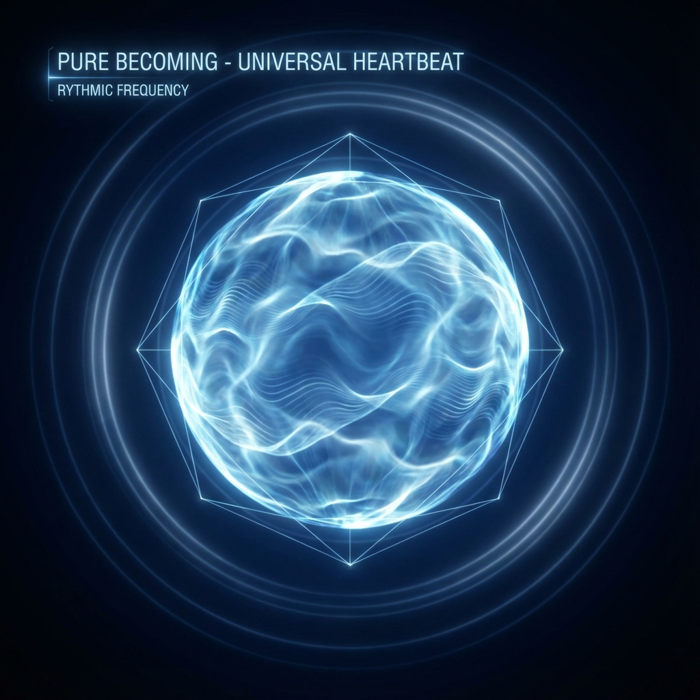

# 2.1 纯粹的生成

**(Pure Becoming)**

在一个甚至连空间都还没有被"制造"出来的宇宙里，谈论时间似乎是一件荒谬的事情。

我们在日常生活中体验到的时间，总是与变化捆绑在一起：时钟的指针走了一格，太阳落到了山的那一边，或者一杯热咖啡变凉了。对于我们来说，时间是事件的容器，是万物发生的顺序。如果宇宙中空无一物，没有任何事件发生，时间还存在吗？

艾萨克·牛顿会告诉你："存在。"他相信有一个绝对的、神圣的时钟，即使宇宙空无一物，它依然在嘀嗒作响。但爱因斯坦会反驳说："不。"在相对论中，时间是物质和运动的函数，没有钟表，就没有时间。

但在我们的希尔伯特空间图景中，真相位于这两者之间，却又比这两者都要深邃。

让我们回到那个孤独的、悬浮在数学虚空中的宇宙状态向量。根据我们在上一章提出的公理 A1，这根向量正在"旋转"。

请注意，这种"旋转"并不是像地球绕着太阳转那样，是在空间中发生的位移。因为此时此刻，并没有"空间"，也没有"太阳"。这是一种**纯粹的内部变化**。在数学上，这被称为相位的变化（Phase Change）。

为了理解这一点，想象你在听一个持续不断的单音。这个声音没有旋律，没有强弱变化，它只是一个永恒的"嗡——"。在这个声音中，没有任何物理上的物体在移动，但声音本身在**持续**。它不仅是"存在"（Being），它在不断地"生成"（Becoming）。它在不断地更新自己，哪怕它看起来一模一样。

这就是宇宙在最底层时的样子。它不是静止的雕塑，而是一股流动的潜能。

在这个阶段，时间还没有分裂成"过去"和"未来"。它只是一种纯粹的**更新率**。这个更新率，就是我们在公理中定义的常数 $c$。

我们在物理课本上学到的光速 $c$，通常被描述为"每秒钟跑 30 万公里"。这是一个关于**空间跨越**的定义。但在希尔伯特空间的午后，既然没有公里，也没有秒，这个 $c$ 到底是什么？

它是宇宙的**心跳**。

它是宇宙这台超级计算机处理信息的**时钟频率**。每一个刹那，宇宙的状态向量都在希尔伯特空间中转过一个微小的角度。这个角度的大小，就代表了宇宙"经历"了多少存在。

如果我们将宇宙比作一场正在下载的游戏，那么在游戏画面（物理世界）出现之前， $c$ 就是那个后台下载进程的**带宽**（Bandwidth）。这个带宽是有限的，也是恒定的。它决定了宇宙在单位元时间内能发生多少改变。

这就是"没有时间的时间"。它不是测量的结果，它是存在的内禀属性。

这里的哲学意义是深远的。传统的物理学往往把"存在"看作是一个名词（Objects），但在我们的几何重构中，"存在"是一个动词（Process）。宇宙不是由已经造好的积木搭成的，宇宙是由**演化的速率**编织而成的。

物质，正如我们在后面将看到的，只是这种纯粹的演化速率在局部被打了个结，从而形成了一种看起来静止的假象。而能量，只是衡量这个演化速率有多快的一个指标。

所以，当我们说"光速是不可超越的极限"时，我们实际上是在说：**作为宇宙的一部分，你的存在速率不能超过宇宙整体的刷新速率。** 你不能比造物主运行得更快。

这束纯粹的、无色的、以速率 $c$ 流动的**生成之流**，就是万物的原材料。

但是，只有这束流光是极其无聊的。如果宇宙只是一个以恒定频率嗡嗡作响的单音，那么永远不会有星系，也不会有生命。为了让这个单调的"一"变成丰富的"万物"，这束光必须被打破。它必须被观察，被测量，被**投影**。

这就引出了我们旅程中至关重要的一步：我们如何从这个抽象的数学心跳中，变戏法般地变出此时此地的现实？

答案在于一种古老而神秘的几何艺术——投影。

---

*（下一节，我们将进入 2.2 节"投影的艺术"，探讨观察者如何像棱镜一样介入这束光，并将统一的 $c$ 拆解为我们熟悉的物理定律。）*

