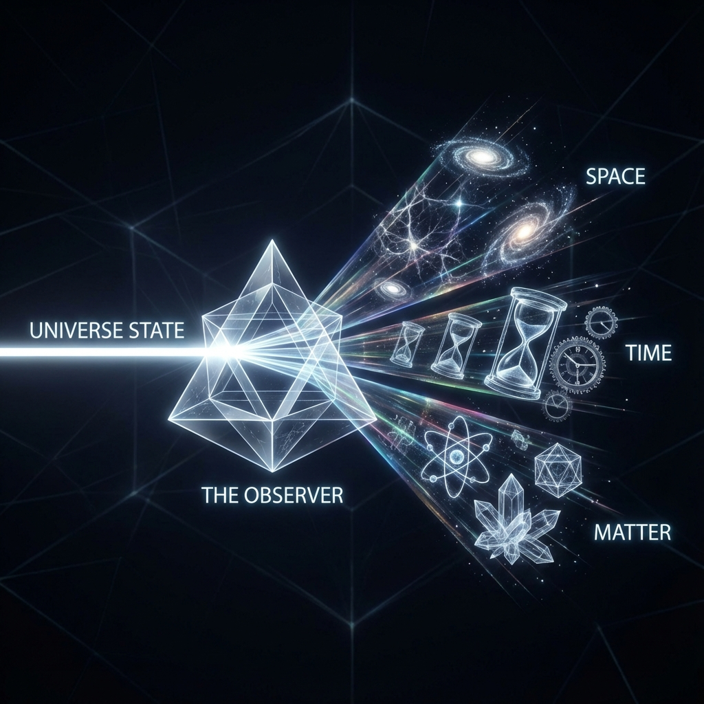

# 2.2 投影的艺术

**(The Art of Projection)**

如果宇宙的本体真的是那个在希尔伯特空间中静默旋转的"终对象"，那么问题来了：为什么我们从未见过它？

我们从未感觉到自己生活在一个无限维度的向量海洋里，我们也从未直接体验到那种纯粹的"生成"。相反，我们看到的是三维的空间，感受到的是流逝的时间，触摸到的是坚硬的物体。我们眼中的世界充满了种种具体的局限：物体在这里就不能在那里，时间过去了就不能回来。

这种巨大的反差，源于一种我们每时每刻都在进行、却从未察觉的行为——**投影**（Projection）。

## 柏拉图的洞穴 2.0

两千多年前，哲学家柏拉图讲了一个寓言：一群囚徒被困在洞穴里，背对着洞口。他们看不到外面的真实世界，只能看到墙壁上投射进来的影子。对于这些囚徒来说，影子就是唯一的现实。

在这个寓言里，柏拉图触及了一个深刻的物理真理，但他只说对了一半。在我们的几何重构中，宇宙并不是"外面"的那个世界，**宇宙是高维的那个本体**。而我们，作为观察者，不仅仅是被动的观众，我们是那台**放映机**。

在希尔伯特空间中，宇宙的状态向量 $\psi$ 包含了极其丰富的信息——它是全息的，它是无限维的。但是，作为一个物理上的观察者（无论是人、探测器，还是一个简单的粒子），我们的"带宽"是极其有限的。我们无法同时处理宇宙的所有信息。

为了理解宇宙，我们必须**简化**它。

在数学上，这被称为"降维"。就像把一个立体的地球仪压扁成一张二维的地图，虽然你会失去某些真实性（比如格陵兰岛会变形），但你获得了一个可用的坐标系。

这就是**观察者即投影算符**的物理本质。

当我们观测宇宙时，我们实际上是在希尔伯特空间中切下了一个低维的"切片"。我们将那根旋转的宇宙之箭，投射到了我们选定的几个特定的轴上——比如"位置"轴、"动量"轴、"时间"轴。

* 原本统一的演化速率 $c$，被投影到了空间轴上，变成了我们眼中的**速度**。

* 被投影到了内部自由度轴上，变成了我们测量的**质量**。

* 被投影到了因果关系链上，变成了我们感知的**时间**。

我们所谓的"物理现实"，其实就是这些投影的总和。正如一张照片只是三维世界的二维投影，我们身处的时空，也只是高维希尔伯特空间的一个四维投影。

## 遗忘的代价

投影是一门艺术，但它也是一种**遗忘**。

当你把三维物体投射到二维纸面上时，你必然会丢失深度信息。同样，当我们将宇宙本体投影为物理世界时，我们丢失了大量的信息。在范畴论（Category Theory）——一种研究数学结构之间映射的高级语言——中，观察者被描述为一个**遗忘函子**（Forgetful Functor）。

这个名字听起来很诗意，也很残酷。它意味着：**为了拥有一个清晰的物理世界，我们必须遗忘宇宙的绝大部分真相。**

量子力学中的"波函数坍缩"，正是这种"遗忘"的剧烈表现。当我们进行测量时，我们强行要求宇宙从它那原本包含所有可能性的叠加态中，只选择一个特定的投影（比如"电子在这里"）。其他的可能性去哪了？它们被观察者的有限带宽给"过滤"掉了，或者是正交化到了我们看不见的维度里。

但这并不意味着我们看到的物理定律是虚假的。恰恰相反，**物理定律是投影过程中保留下来的拓扑结构**。

就像无论你怎么旋转一个甜甜圈，它的投影里总会某种程度上暗示出那个"洞"的存在一样。宇宙本体中的某些深层不变性（比如总演化速率 $c$），在投影之后，就变成了我们世界中那些坚不可摧的物理常数。

## 比喻即真理

在这个框架下，我们需要重新理解什么是"真理"。

传统科学告诉我们，真理是关于"物质是什么"的陈述。但在这里，真理是关于**结构如何映射**的陈述。

我们在本书中会频繁使用"比喻"（Metaphor）。我们说"质量是时间的结"，说"光是赤贫者"。请不要把这些仅仅当作文学修辞。

在几何重构的语境下，**比喻是一种严格的数学映射**。

当我们将希尔伯特空间的几何结构（源范畴）映射到时空的物理现象（目标范畴）时，如果这种映射保持了所有的数学结构（如同构或函子），那么这个"比喻"就是物理真理。

* 当这一映射保持了勾股定理结构时，我们得到了**狭义相对论**。

* 当这一映射保持了酉群对称性时，我们得到了**标准模型**。

* 当这一映射保持了信息的因果传播界限时，我们得到了**光速限制**。

因此，观察者不仅是棱镜，也是翻译官。我们用自己有限的感官语言，去翻译那部用无限维语言写成的宇宙天书。虽然翻译总是伴随着信息的丢失（Traduttore, traditore），但正是这种翻译，创造了我们称之为"现实"的壮丽诗篇。

现在，我们理解了投影的本质。但要真正读懂这本书，我们需要一本字典。我们需要知道，具体是哪一个几何符号，对应着哪一个物理现象。

这就是我们的**罗塞塔石碑**。

---

*（下一节，我们将进入 2.3 节"罗塞塔石碑"，我们将列出一张清晰的对照表，展示如何将难以计算的物理难题，翻译成简单的几何资源问题。）*

