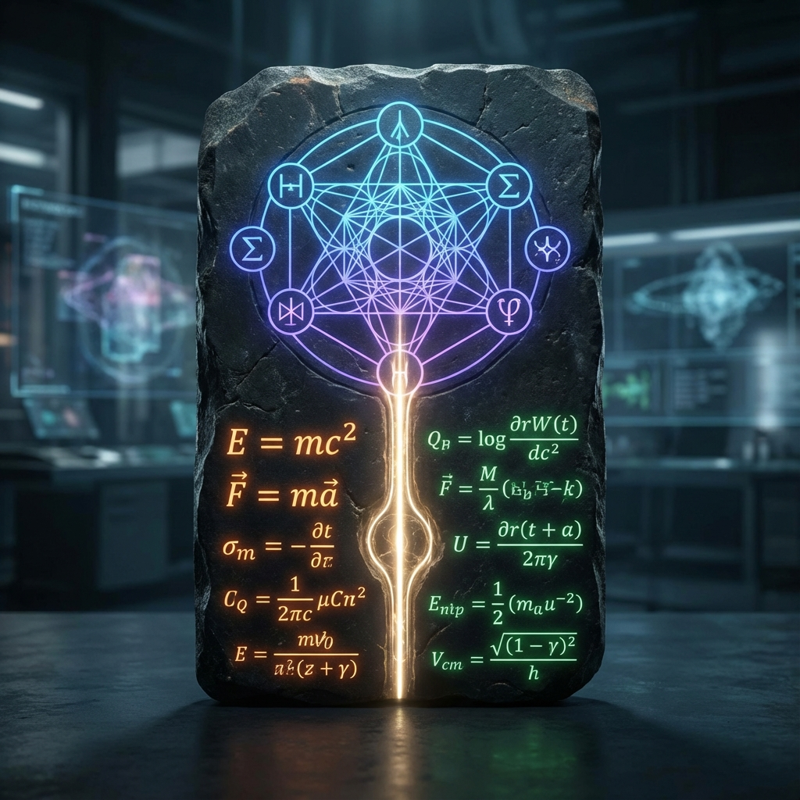

# 2.3 The Rosetta Stone

In 1799, Napoleon's soldiers discovered a black basalt stone tablet in Egypt inscribed with three scripts: the Rosetta Stone. It was through this stone that Champollion deciphered the lost ancient Egyptian hieroglyphs. He succeeded because he realized: those seemingly mysterious graphic symbols (hieroglyphs) actually described **the same content** as the mundane Greek text.

In physics, we face the same situation.

On one hand, we have the **physical language** describing the macroscopic world: we talk about "force," "energy," "mass," "time dilation." This is like the familiar Greek script; although we can read every word, we often know the "what" but not the "why"—why does mass produce inertia? Why is the speed of light a limit?

On the other hand, we have the **geometric language** describing ontology: we talk about "Hilbert Space," "Fubini-Study metric," "orthogonal decomposition," "phase rotation." This is like mysterious hieroglyphs; although mathematically elegant, it seems to have nothing to do with our rough reality.

The task of this section is to inscribe this physics Rosetta Stone. We will establish a rigorous **geometric-physical-computational dictionary**. Through this dictionary, we will translate originally intractable dynamical problems into clear resource allocation problems.

We do not introduce new forces, nor invent new particles. We merely retranslate known reality.

## Core Entry I: Physical Laws as Resource Protocols

In traditional thinking, physical laws are mandatory commands about "how objects should move." But in our geometric reconstruction, physical laws are **resource allocation protocols**.

* **Physical Language:** Objects are limited by the speed of light and cannot be infinitely accelerated.

* **Geometric Translation:** The universe's total computational bandwidth (evolution rate $c$) is constant. All motion is a competition for this finite budget.

When we translate "dynamical constraints" into "budget constraints," many paradoxes vanish. You don't need to find an invisible hand to hold the spaceship back from exceeding light speed; you just need to check its "bill"—its bandwidth budget is already exhausted.

## Core Entry II: Constants as Exchange Rates

Why does the universe have Planck's constant $\hbar$? Why the speed of light $c$? In the standard model, these constants are parameters arbitrarily set by God. But in our dictionary, they are **exchange rates between two worlds**.

* **$c$ (Speed of Light):** It is the **total capacity radius** between spacetime projection and Hilbert Space ontology. It defines how much evolution rate we can "borrow" from the ontology.

* **$\hbar$ (Planck's Constant):** It is the exchange rate between **geometric phase** and **physical action**. Rotating an angle (Angle) in the geometric world requires paying a certain amount of energy and time (Action) in the physical world. $\hbar$ tells us how much geometric curvature can be exchanged for a unit of physical reality.

## Core Entry III: Mass as Background Process

"What is mass?" This is one of physics' deepest questions. The Higgs mechanism tells us mass comes from coupling with the Higgs field, but this only explains "how," not "essence."

* **Physical Language:** Mass ($m$) is the property of objects maintaining their existence and resisting changes in motion state (inertia).

* **Geometric Translation:** Mass is the **internal evolution rate** ($v_{int}$). It represents the rotation speed of the system in the internal dimensions of Hilbert Space.

A massive object is essentially a program running frantically internally. It has inertia, it is "heavy," because it locks most of its bandwidth resources ($c$) into internal loops, leaving no extra bandwidth to respond to external pushes.

## Core Entry IV: Causality as Network Speed

* **Physical Language:** Causality is strictly limited by light cones. The past can only affect the future, and influence propagation cannot be instantaneous.

* **Geometric Translation:** This is the **Lieb-Robinson bound** on Quantum Cellular Automata (QCA).

In discrete computational networks, information transmission from one node to another requires hops. Light cones are not geometric walls of spacetime; they are the **maximum penetration rate** of information propagation between logic gates. Causality is essentially the "network speed limit" of the universe as a computer.

## Core Entry V: Dark Energy as Background Noise

* **Physical Language:** The universe is accelerating expansion, seemingly filled with mysterious energy in the vacuum.

* **Geometric Translation:** There is no mysterious energy; this is the **thermodynamic cost** of information erasure.

The universe constantly computes and constantly forgets. According to Landauer's Principle, erasing information necessarily produces heat. The tiny cosmological constant $\Lambda$ we measure is precisely the **background noise** when the universe computer is running.

---

## Dictionary Overview

For the convenience of readers to consult during subsequent journeys, we organize these core mappings into a comparison table (Table I: The Rosetta Stone of Geometric Unification):

| **Physical Phenomenon (Physics)** | **Geometric Reconstruction (Geometry)** | **Computational Essence (Computation)** | **Intuitive Metaphor** |
| :--- | :--- | :--- | :--- |
| **Lorentz Invariance** | Pythagorean sector conservation ($v_{ext}^2+v_{int}^2=c^2$) | Dynamic resource allocation | Only so much money, spent is gone |
| **Proper Time** | Internal path length ($S_{FS}$) | Internal processing delay | Your system is busy refreshing itself |
| **Mass** | Internal phase rotation rate ($v_{int}$) | Background process load | Objects running complex code are harder to move |
| **Speed of Light** | Geometric propagation horizon | Maximum propagation hops of logic gates | System's maximum bus frequency |
| **Force** | Gradient of distance function ($-\nabla D$) | Descent direction of optimization algorithm | Sliding to save effort (save distance) |
| **Dark Energy** | Capacity of invisible sectors | Waste heat from bit erasure | Current noise when universe is on standby |

Now, we hold this key in our hands. This Rosetta Stone connects originally isolated physical concepts—inertia, time, gravity, vacuum—into a coherent whole.

We no longer need to grope in the dark asking "why are physical laws like this." We only need to ask: **What geometric structure, when projected, would look like this?**

With this dictionary, we can finally leave that abstract afternoon in Hilbert Space and journey to the familiar physical world. Our first stop will be to dismantle Einstein's most proud masterpiece—Special Relativity. We will see that those marvelous predictions about time dilation and length contraction are merely a simple arithmetic problem.

---

*（Next, we will enter Part II "The Great Dispersion," formally using this stone to reconstruct Special Relativity.）*

