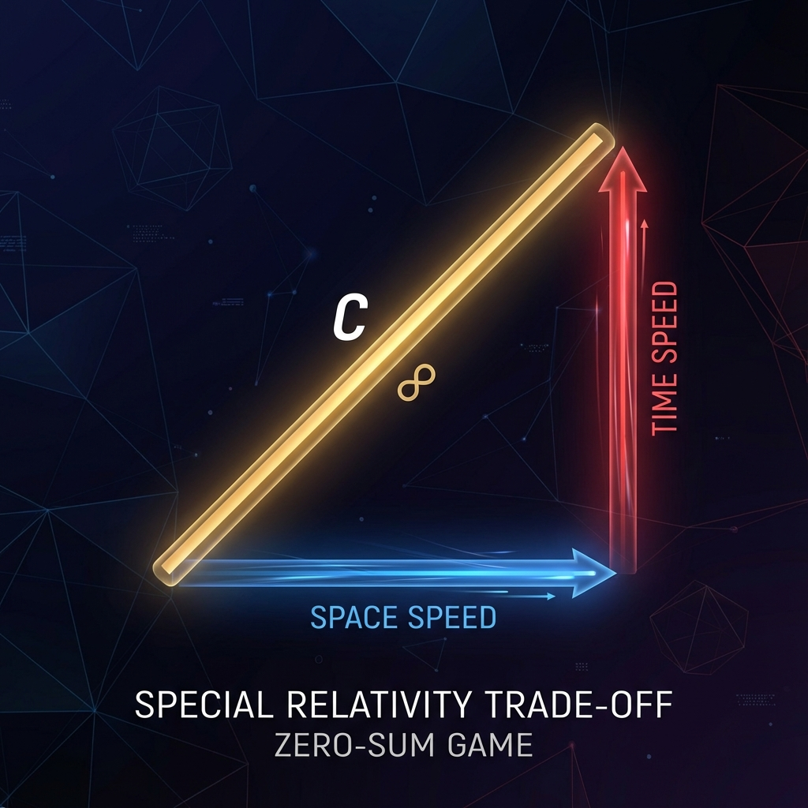

# 3.1 The Great Trade-off

If I ask you, who rules the universe? You might answer gravity, quantum fields, or the second law of thermodynamics. But in our geometric reconstruction, the true ruler of the universe is an ancient Greek who lived 2,500 years ago—Pythagoras.

Or more accurately, it is the truth about right triangles he discovered: $a^2 + b^2 = c^2$.

In school, we learn the Pythagorean theorem to calculate ladder lengths or land areas. But in the depths of physics, the Pythagorean theorem plays a more astonishing role: it determines how time and space allocate the universe's "existence budget."

## The Only Totem of the Book

Let us return to that silent Hilbert Space. As we established in Axiom A1, the universe's state vector $\psi$ is evolving at a constant total rate $c$. This is like a car with its accelerator welded to the floor, the speedometer needle forever pointing at the maximum value $c$.

But this car is not driving straight on a highway; it is traveling in a multi-dimensional space. As observers, we draw a cross coordinate system in this multi-dimensional space, decomposing this total velocity $c$ into two perpendicular directions:

1.  **Horizontal Axis (External Direction):** Represents the object's movement in space. We call it "external velocity," denoted $v_{ext}$. This is what we commonly call "velocity"—how fast a plane flies, how fast light travels.

2.  **Vertical Axis (Internal Direction):** Represents the update of the object's internal state. We call it "internal velocity," denoted $v_{int}$. This represents how much "passage" the object has experienced, or how fast its watch ticks.

Now, a miracle happens.

Because the total velocity $c$ is constant (this is an arrow of fixed length), no matter which direction this arrow points, the square of its projection length on the horizontal axis plus the square of its projection length on the vertical axis must equal the square of the total length.

Thus, we obtain the only formula you need to remember in this book, and the supreme law governing Special Relativity:

$$v_{ext}^2 + v_{int}^2 = c^2$$

This is the **Great Trade-off**.

This formula is extremely simple, but it contains a stunning physical truth: **The universe is a zero-sum game.**

## The Mutual Exclusivity of Velocity and Time

In Newton's universe, time and space are independent. You can fly through space at any velocity ($v_{ext}$ can be infinite), while your pocket watch ticks normally ($v_{int}$ remains unchanged). That was a universe of infinite resources.

But in Einstein's universe—or in our computational universe limited by bandwidth $c$—you cannot have both.

Look at that formula. $c$ is a locked constant. If you want to increase $v_{ext}$ (run faster), mathematics forces you to decrease $v_{int}$ (internal evolution slows down).

* When you are **at rest** ($v_{ext} = 0$): All budget flows inward. $v_{int} = c$. Your watch runs fastest, your body experiences the purest time passage. This is called "proper time."

* When you **start running** ($v_{ext} > 0$): You must divert part of the internal budget to external motion. $v_{int}$ must be less than $c$. Your time passage slows down.

* When you **approach light speed** ($v_{ext} \to c$): Almost all budget is used to purchase spatial distance. $v_{int}$ is compressed to near zero. Your movements become slow motion, your time nearly freezes.

This is the famous **Time Dilation** effect.

In textbooks, time dilation is usually demonstrated through complex derivations involving light clocks and Lorentz transformations. But from our geometric perspective, it requires no derivation; it is simply a direct consequence of the Pythagorean theorem. It is not mysterious magic; it is the result of **financial auditing**: because you spent all your bandwidth on "traveling," you have no remaining bandwidth for "living."

## The Geometric Solution of the Lorentz Factor

Physicists like to use something called the "Lorentz factor" ($\gamma$) to calculate how much time slows down: $\gamma = 1/\sqrt{1-v^2/c^2}$. This formula often makes beginners dizzy.

But now, look at our triangle.

Imagine a right triangle with hypotenuse as total budget $c$, base as spatial velocity $v_{ext}$ (which is $v$ in physics), and height as internal velocity $v_{int}$.

According to the Pythagorean theorem: $v_{int} = \sqrt{c^2 - v_{ext}^2} = c \sqrt{1 - v^2/c^2}$.

If we take the ratio of internal velocity at rest ($c$) to internal velocity in motion ($v_{int}$):

$$\frac{c}{v_{int}} = \frac{1}{\sqrt{1-v^2/c^2}} = \gamma$$

See, that formidable Lorentz factor is nothing but the **ratio of hypotenuse to leg**. It is just the secant function in geometric projection.

Special Relativity is no longer a theory about how light propagates; it is a **geometry of how a constant-length vector rotates between two orthogonal dimensions**. Einstein's mass-energy equation, length contraction, and time dilation are all folded into this simple right triangle.

We live in a strictly limited universe. This is the first lesson the "Great Trade-off" teaches us: freedom is not infinite; every step taken in space is a tiny murder of time.

So, what if we go to the extreme? What happens if we stake all our budget on $v_{ext}$ and completely abandon $v_{int}$?

We become light.

---

*（Next, we will enter section 3.2 "The Bankruptcy of Photons," exploring that extreme boundary case: an existence completely without time.）*

