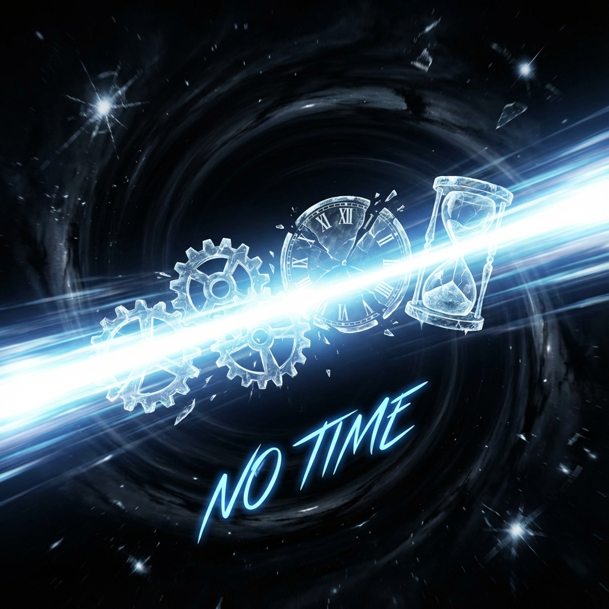

# 3.2 光子的破产

**(The Bankruptcy of the Photon)**

在上一节中，我们确立了宇宙的最高财务法则：$v_{ext}^2 + v_{int}^2 = c^2$。每一个物体，无论是你、我，还是遥远的恒星，都在小心翼翼地在这个公式中平衡着自己的开支。我们保留了一部分预算给内部演化（让我们经历时间、维持生命），只用剩下的一小部分预算去换取空间上的移动。我们是谨慎的投资者。

但是，宇宙中存在着一种极端的实体，它们拒绝这种平衡。它们把手里所有的筹码——那个总额为 $c$ 的全部预算——孤注一掷地全部押在了"空间移动"这一侧。

这种实体，就是**光子**（Photon）。

## 极致的贫困与极致的速度

让我们看看当一个物体决定"All in"时会发生什么。

当外部速度 $v_{ext}$ 被推到极限，达到了总带宽 $c$ 时，根据我们的勾股定理，内部速度 $v_{int}$ 必须变为零：

$$c^2 + 0 = c^2$$

这就引出了一个在物理学和哲学上都令人震撼的结论：**光没有时间。**

在我们的几何字典里，$v_{int}$ 代表着内部演化的速率，也就是"经历时间"的能力。对于光子来说，这个数值是零。这意味着，光子虽然在我们的眼中以每秒 30 万公里的速度飞驰，但在它自己的参考系里，时钟从未走动过哪怕一微秒。

光子是一个**计算上的赤贫者**。它把所有的资源都花在了赶路上，以至于它没有任何剩余的带宽来处理自己的内部状态。它没有多余的算力来让自己"变老"，也没有多余的内存来记录"流逝"。

这就是为什么光子是永生的。从大爆炸那一刻诞生的光子，在那一瞬间和今天抵达我们视网膜的这一瞬间，对它自己来说是**同时**的。它穿越了 138 亿年的浩瀚空间，但在它的体验里，并没有时间流逝。它从未衰变，从未改变，因为它破产了——它穷得连一秒钟都买不起。

## 零延迟的信使

为什么宇宙要允许这种极端的存在？为什么不强制所有东西都保留一点时间预算？

这涉及到宇宙作为一台计算机的通信需求。如果所有的粒子都有质量（都有 $v_{int} > 0$），那么所有的粒子在传输信息的过程中都会"分心"。它们会在赶路的同时，忙着处理自己的内部相位旋转（Aging）。这就好比一个邮递员，在送信的路上不断地修改信件的内容。

为了构建一个稳定、刚性的因果结构，宇宙需要一种**零内部处理延迟**的信使。

光子正是这样的信使。因为它的 $v_{int}=0$，它在传输过程中不会积累任何内部相位。它就像是一个绝对透明的管道，或者一条超导导线，将信息从宇宙的一端传到另一端，而不在途中对信息进行任何"加工"或"污染"。

正是因为光子的"破产"，才保证了我们看到的遥远星系是它原本的样子，而不是被邮递员篡改过的版本。无质量（Masslessness）并不是一种缺失，它是**零计算延迟**的物理表现。

## 速度的铁壁

现在，我们终于可以从一个全新的角度来回答那个老生常谈的问题：**为什么没有什么能超过光速？**

在传统的解释里，你可能会听到"质量随速度增加，加速需要无穷大的能量"这样的说法。这听起来像是一道不可逾越的物理墙壁。

但在我们的"资源视角"下，这根本不是墙壁，这是**预算耗尽**。

光速 $c$ 并不是一个用来阻挡你的路障，它只是你口袋里所有钱的总和。当你把所有的钱都花在 $v_{ext}$ 上时，你就达到了光速。你不能跑得比光更快，原因和你不能花比你拥有的钱更多的钱是一样的——**你透支了**。

宇宙没有禁止超光速的法律，宇宙只有一条关于带宽守恒的**财务纪律**。

## 存在的代价

光子的故事告诉我们，极致的速度是有代价的，那个代价就是**存在感的丧失**。

光子虽然连接了万物，但它自己却像是一个幽灵。它没有静止质量，无法停下来，无法构建结构，无法形成记忆。它是纯粹的关系，而非实体。

那么，如果我们反其道而行之呢？如果我们不把预算花在赶路上，而是把它们囤积在内部，用来构建复杂的内部结构，用来"存在"，会发生什么？

那时，我们会从光变成物质。我们会从"信使"变成"拥有者"。我们会获得一种被称为**质量**的沉重属性。

---

*（下一章，我们将进入第四章"时间的重量"，去探究勾股定理的另一端：当时间被锁死在微小的空间里，它如何变身为坚硬的物质。）*

