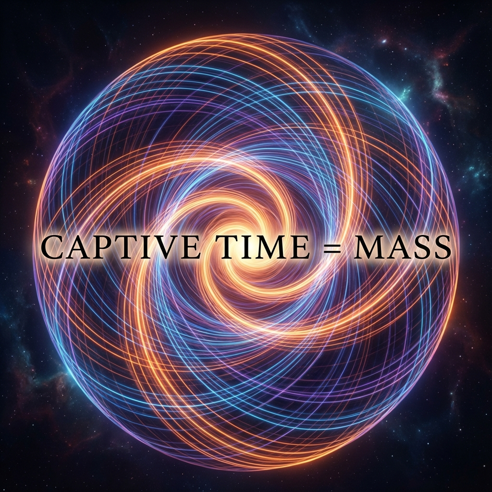

# 4.1 The Geometric Origin of Mass

We usually think that "mass" is the most essential property of objects. A stone is heavy because it is filled with "matter"; an electron has mass because it is a real particle. In our intuition, mass represents the "weight of existence."

But in our geometric reconstruction, this intuition is wrong.

Let us return once more to that Pythagorean theorem ruling the universe: $v_{ext}^2 + v_{int}^2 = c^2$.

In the previous chapter, we saw that photons choose $v_{ext} = c$ and $v_{int} = 0$. They spend all their budget on external spatial displacement, so they have no internal evolution and no mass. They are pure "traveling."

So, what are massive objects (such as electrons, quarks, or you)?

Massive objects are entities that **decide to stop** (or run slower) and **spend their budget internally**.

## Mass is Imprisoned Time

When an object is at rest in space ($v_{ext} = 0$), according to the Pythagorean theorem, it must evolve internally at full speed $c$ ($v_{int} = c$). This means its state vector is rotating frantically in the internal dimensions of Hilbert Space.

This frantic internal rotation is what we feel as "mass."

In our dictionary, **mass** ($m$) is not the amount of matter; it is the **rate of internal information processing** ($v_{int}$).

Imagine a spinning top. From a distance, it appears stationary on the table, occupying a fixed position. But if you look closely, you'll find it full of kinetic energy, spinning at high speed. Matter is the same. A stationary electron is not truly "stationary"; it is just motionless in space, but in the dimension of time, it is vibrating at extremely high frequency.

This is why Einstein's mass-energy equation $E=mc^2$ is so precise. This equation actually says: energy ($E$) equals mass ($m$) times a constant. From our geometric perspective, this is not just numerical equality; it is **ontological identity**.

* Energy $E$ corresponds to total evolution rate (total bandwidth).

* Mass $m$ corresponds to internal evolution rate (internal bandwidth).

* In the rest frame, all total bandwidth is converted to internal bandwidth.

Therefore, **mass is imprisoned time**. It is the rate $c$ that the universe should have used to race through space, curled and knotted, locked in a tiny range, becoming an endless internal cycle.

## The Frequency of Existence

Quantum mechanics tells us through de Broglie's relation ($mc^2 = \hbar\omega$) that every massive particle corresponds to a specific frequency $\omega$. In traditional physics, this is seen as a mysterious manifestation of wave-particle duality.

But in our framework, this becomes very intuitive: **frequency is the speed of rotation.**

Greater mass means the object refreshes its own state at this frequency faster internally.

* An electron is light; its internal clock ticks relatively slowly.

* A top quark is heavy; its internal clock roars frantically.

* A black hole is extremely heavy; it is an extremely high-density oscillating knot in spacetime structure.

This also explains why we have a "sense of existence." Photons have no sense of existence; they are just fleeting shadows. Matter has a sense of existence because it rewrites itself countless times in Hilbert Space every instant. **We are heavy because we are very busy at the microscopic level**.

We are composed of countless high-speed micro-clocks. This is why we cannot move at light speed—because we are too busy internally, our bandwidth is occupied by life, atomic structures, and the maintenance of existence, leaving no remaining budget to purchase a light-speed ticket.

This "internal busyness" brings an inevitable consequence: when you try to push it, it resists. This resistance is another great mystery in physics—**inertia**.

---

*（Next, we will enter section 4.2 "The Essence of Inertia," to see how this internal rotation transforms into the resistance we feel.）*

