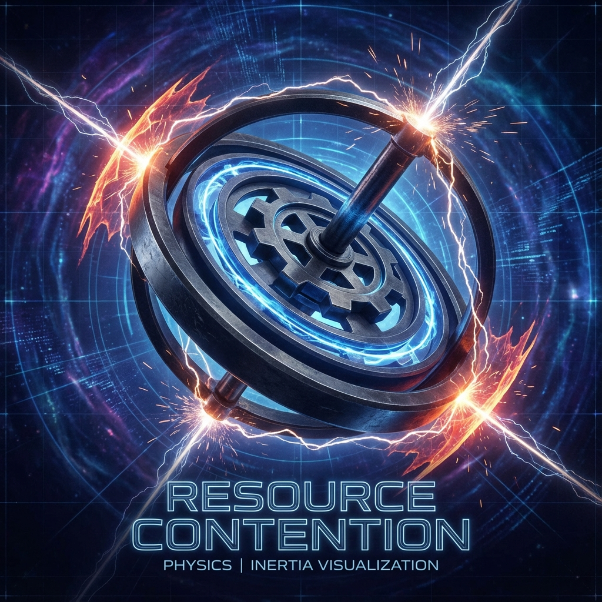

# 4.2 The Nature of Inertia

When you try to push a stalled truck, you feel a tremendous resistance. Newton told us to respect this resistance, calling it **inertia** (Inertia). In his first law, he wrote: Unless acted upon by an external force, objects will remain at rest or in uniform linear motion.

But Newton did not tell us *why*. Why are objects in the universe so stubborn? Why is it so difficult to change an object's state of motion?

In standard textbooks, inertia is seen as an intrinsic property of matter, like some innate "laziness." But in our geometric reconstruction, inertia is not laziness at all; on the contrary, **inertia stems from excessive diligence**.

## Resource Contention Mechanism

Let us examine once more that core resource equation: $v_{ext}^2 + v_{int}^2 = c^2$.

A massive object at rest (like that truck) has $v_{ext}$ equal to zero. This means it invests all computational bandwidth $c$ into $v_{int}$. In the internal dimensions of Hilbert Space, every proton, neutron, and electron composing the truck is rotating and updating phases at maximum speed.

This system is in a **full-load operation** state. It is like a supercomputer rendering Hollywood special effects at full capacity, with CPU usage at 100%.

Now, you come over and try to push it. You want it to move in space, meaning you want to give it a non-zero $v_{ext}$.

According to the Pythagorean theorem, to obtain this $v_{ext}$, the system **must** reduce $v_{int}$. Because the total budget $c$ is locked, you cannot create velocity out of nothing.

This is the root of conflict.

To make the truck move, you are not just "pushing" it; you are actually forcing it to **reallocate its budget**. You demand it withdraw resources from those vast and busy internal processes and transfer them to external displacement.

This is like trying to open a new large program on a computer already running at full capacity. The computer will slow down, stutter, and show "resistance." This resistance is not because it doesn't want to move, but because of **resource contention** (Resource Contention).

Therefore, **inertia is computational load**.

The heavier an object, the more bandwidth it locks internally ($v_{int}$ is larger), and the more complex its "background processes." To change such a system's state, the amount of resources you need to reschedule is more massive, so the resistance you feel—inertia—is also greater.

## Geometric Vector Rotation

If we put on geometric glasses, this process appears more elegant.

In the tangent space of Hilbert Space, the universe's state vector $\vec{V}$ is an arrow of constant length $c$. For objects at rest, this arrow points vertically upward (pure internal time direction).

When you apply force trying to accelerate an object, you are actually trying to **rotate** this arrow. You want to press it from vertical direction (internal) toward horizontal direction (external).

* **Acceleration:** The process of converting internal evolution ($v_{int}$) into external displacement ($v_{ext}$).

* **Resistance:** Stems from the geometric rigidity of vector rotation. To change the direction of a high-speed rotating vector (imagine a high-speed spinning top), you need to overcome tremendous angular momentum.

This is why Einstein said mass and energy are equivalent. Because they are both the length of that arrow. And inertia is that arrow's tendency to maintain its direction.

When you push that truck with force, you are not wrestling with "matter"; you are wrestling with **geometry**. You are trying to reverse the evolution direction of trillions of microscopic vectors. You feel tired because you are in a tug-of-war with the universe's most fundamental conservation law—the invariance of total bandwidth $c$.

## Newton's Illusion

Reviewing Newton's first law, we can now give it a completely new interpretation.

Objects tend to maintain uniform linear motion (or rest) not because they are lazy, but because **this is the state with minimal computational overhead**.

If an object is moving at velocity $v$, its budget allocation scheme (the ratio of $v_{ext}$ to $v_{int}$) is already determined. Unless external input (force) forces it to change this scheme, it will continue using the old allocation table because it requires no additional computational cost to maintain the status quo.

Changing state (acceleration or deceleration) requires recalculating and reallocating bandwidth; this is why "force" is needed.

Now we understand: mass is a knot in time, and inertia is the cost of untying this knot. But this knot locks not only time but also energy. This is the true meaning of that famous equation $E=mc^2$—it describes the geometric cost of curling linear-flowing bandwidth into a loop.

---

*（Next, we will enter section 4.3 "The Locking of Energy," completely deconstructing the geometric essence of $E=mc^2$, and conclude Part II.）*

