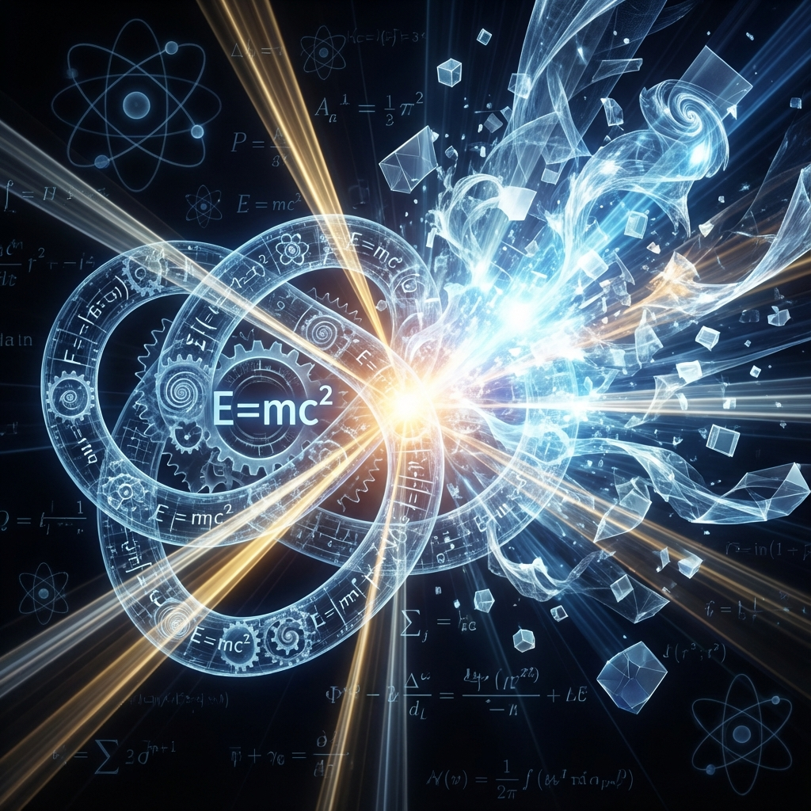

# 4.3 能量的锁死

**(The Locking of Energy)**

在人类文明的所有方程中，没有任何一个比 $E=mc^2$ 更具图腾意义。

它出现在T恤上，出现在漫画里，甚至成为了天才的代名词。阿尔伯特·爱因斯坦告诉我们，能量（$E$）和质量（$m$）是可以互换的。更令人战栗的是，由于转换系数 $c^2$（光速的平方）是一个巨大的数字（$9 \times 10^{16}$），这意味着极其微小的质量里蕴含着毁天灭地的能量。

但为什么？

为什么一块安静的石头里会藏着像太阳一样的火？为什么是光速的平方？这听起来像是一种神秘的炼金术。

但在我们的"时间的散射"框架下，这个方程不再神秘。它不再是一个关于"转换"的炼金术公式，而是一个关于**几何恒等**的陈述。

## 卷曲的带宽

让我们最后一次审视那个统治宇宙的直角三角形（勾股定理）：$v_{ext}^2 + v_{int}^2 = c^2$。

我们在公理 A1 中已经确立，宇宙中的每一个实体，本质上都是希尔伯特空间中一根长度恒为 $c$ 的状态向量。这根向量的长度，代表了宇宙赋予这个实体的全部"存在预算"——也就是它的**总能量 ($E$)**。

当一个物体在空间中静止（$v_{ext} = 0$）时，奇妙的事情发生了：

1.  **外部速度为零**：它没有在空间中移动。

2.  **内部速度最大化**：根据勾股定理，它的内部演化速率 $v_{int}$ 必须完全等于总速率 $c$。

我们在 4.1 节中已经定义，**质量 ($m$) 就是这个内部演化速率** ($m \propto v_{int}$)。

现在，请看这幅几何图像：

* **总能量 ($E$)** 是那根箭的总长度。

* **质量 ($m$)** 是这根箭在"内部时间轴"上的投影长度。

* 当物体静止时，这根箭完全垂直指向上方（纯内部时间方向）。

* 因此，**$E$ 的长度完全等于 $m$ 的长度**。

这就是 $E=m$。

那么，那个著名的 $c^2$ 是从哪里来的？它仅仅是一个**单位换算**的历史遗留问题。这就像是我们用"英寸"去量长度，却用"盎司"去量重量，最后发现这两个数字之间总是差着一个固定的比例。如果我们像理论物理学家那样使用"自然单位制"（令 $c=1$），那么 $E=mc^2$ 就会变成那个极其简洁、极其赤裸的真理：

$$E = m$$

这揭示了质量的终极秘密：**质量并不是一种独立的实体，它是被锁死的能量。**

更准确地说，**质量是被卷曲成环的线性带宽**。

想象一束光。它以速度 $c$ 向前飞驰，它的能量体现在它的"动能"上，表现为纯粹的外部位移。

现在，想象这束光遇到了某种拓扑障碍，它被迫咬住了自己的尾巴，开始原地打转。它不再向前移动，而是变成了一个微小的、高速旋转的光环。

对于外部观察者来说，这束光"停"下来了。它不再具有外部速度（$v_{ext}=0$）。但是，它内部的旋转速度依然是 $c$。它原本用来穿越空间的能量，现在全部被用来维持这个内部的死循环。

这个"死循环"，就是我们所谓的**粒子**。这个"原地打转的能量"，就是我们所谓的**质量**。

## 释放魔鬼

理解了"质量是卷曲的时间流"，我们就能理解核武器的原理。

原子弹爆炸并不是"创造"了能量，它只是**解开了结**。

当铀原子核分裂时，实际上发生的是：一部分原本被锁死在内部维度（$v_{int}$）的演化矢量，突然被解开了禁锢。那个原本疯狂旋转的内部速度，被重新定向，变回了直线冲刺的外部速度（$v_{ext}$）。

这是一场几何上的**再投影**。

那些原本在希尔伯特空间内部疯狂空转的带宽，突然被投射到了外部空间，变成了以光速飞出的伽马射线和高速粒子。

为什么核爆炸如此剧烈？

因为正如我们在第一章所说，宇宙的总带宽 $c$ 是一个巨大的数值。每一个微小的质子内部，都囚禁着以光速运行的狂暴洪流。当我们解开这个禁锢，哪怕只是释放出一小部分（亏损的质量），其效果也是灾难性的。

所以，$E=mc^2$ 实际上是在告诉我们：**哪怕是最微小的尘埃，也是由被囚禁的光暴编织而成的。**

## 第二部的结语：从连续到离散

至此，我们已经完成了对宏观物理的重构。我们利用"伟大的权衡"（勾股定理）解释了狭义相对论。我们看到：

* **时间**不是绝对的河流，它是可被消费的资源。

* **空间**不是空旷的舞台，它是时间耗尽后的去处。

* **质量**不是死寂的石头，它是剧烈旋转的时间之结。

爱因斯坦的宇宙是宏大、优雅且连续的。在这个图景中，希尔伯特空间的演化似乎是平滑的流体。我们把总带宽 $c$ 在 $v_{ext}$ 和 $v_{int}$ 之间随意分配，就像倒水一样平滑。

但是，这种平滑只是假象。

当我们把镜头拉近，再拉近，直到穿透那些沉重的物质内部，试图看清那个"被囚禁的时间"究竟是如何打结的时候，平滑的几何破碎了。

我们发现，宇宙并不是无限可分的流体。在极小的尺度下（普朗克尺度），宇宙显露出了它的**像素**。那束原初的时间之光，并不是连续的波，而是无数个跳动的比特。

如果不理解这种离散性，我们就无法理解为什么时间会打结，为什么会有特定的粒子，为什么会有量子力学的幽灵。

是时候放下爱因斯坦的望远镜，拿起玻尔的显微镜了。让我们进入第三部——**时间的结**，去探索那个由像素构成的真实世界。

---

*（下一节，我们将进入第三部"时间的结"的第六章"底层的像素"，揭示连续时空之下的离散计算本体。）*
