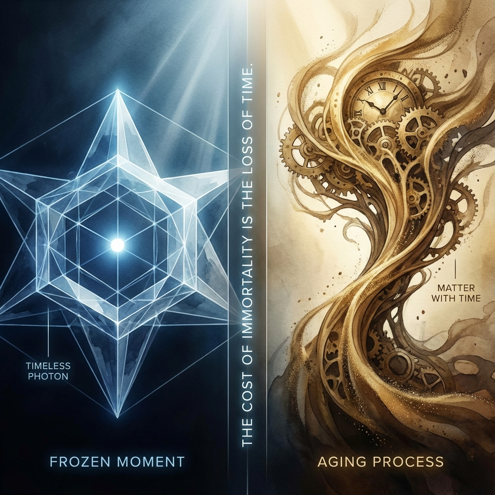

# 5.1 永生的代价

**(The Cost of Immortality)**

人类自古以来就梦想着永生。神话里的英雄寻找青春之泉，科幻小说里的富豪冷冻自己的身体，我们渴望让时间的车轮在自己身上停止转动，渴望将刹那化为永恒。

在物理学的世界里，确实存在一种"永生"的状态。但这并非上帝的恩赐，而是一场冷酷的几何交易。它的代价之大，超乎任何诗人的想象。

让我们再次拿出那个统治宇宙的账本——勾股定理：

$$v_{ext}^2 + v_{int}^2 = c^2$$

对于一个大质量物体（比如一块石头，或者你），大部分的预算 $c$ 都花在了 $v_{int}$（内部演化）上。这意味着你在经历时间，你在衰老，你在记忆，你在**变化**。这是作为"物质"的代价——你拥有了丰富多彩的内部生活，但你被禁锢在低速的牢笼里。

但是，光子做出了一个截然不同的选择。它像是一个决绝的赌徒，将手里所有的筹码——那个总额为 $c$ 的全部预算——孤注一掷地全部押在了 $v_{ext}$（外部位移）这一侧。

当 $v_{ext}$ 被推到极限，达到了总带宽 $c$ 时，数学公式无情地宣判了结果：

$$c^2 + v_{int}^2 = c^2 \implies v_{int} = 0$$

这意味着什么？

在我们的几何字典里，$v_{int}$ 代表着内部时钟的走动速率。对于光子来说，这个数值是零。这意味着，光子的**内部时钟彻底停止了**。

这就引出了相对论中最令人眩晕的推论：**光没有时间**。

想象一个光子，它在大爆炸后不久的时刻诞生，穿过漆黑的虚空，飞行了 138 亿年，最终撞击在你的视网膜上，让你看到了微波背景辐射的余晖。

在我们的参考系里，这个光子经历了一段漫长得令人绝望的旅程。它见证了星系的诞生，目睹了恒星的死亡。

但在光子自己的参考系里，**没有时间流逝**。它没有经历过路途，它没有"老去"。在它的体验里，它诞生的那一瞬间，和它死亡（被吸收）的那一瞬间，是**完全重合**的。

这就是**永生的代价**：为了获得在空间中跨越一切的自由（光速），你必须牺牲掉在时间中体验一切的权利（生命）。

光子是永恒的，但这种永恒不是"无限的时间"，而是**无时间**（Timelessness）。它就像一张被封印在琥珀里的照片，永远保持着它诞生那一刻的模样。它没有历史，也没有未来，它只有仅仅属于它的那个永恒的"现在"。

这也是为什么光子不能有质量。正如我们在上一章所见，质量是内部演化的速率 ($m \propto v_{int}$)。如果光子想要拥有哪怕一点点质量，它就必须从外部速度 $v_{ext}$ 中撤回一部分预算来维持内部循环。那一刻，它就不再是光，它将不得不减速，跌落凡尘，开始经历生老病死。

所以，当我们仰望星空，看到那些以光速飞驰而来的信使时，我们看到的不仅是速度的极限，更是**存在的极限**。光子向我们展示了宇宙最边缘的真理：如果你想拥抱整个空间，你就必须放弃整个时间。

它是一个**计算上的赤贫者**，因为它把所有的资源都用来赶路了，以至于它没有任何剩余的带宽来处理自己的内部状态。它一无所有，所以它快如闪电。

---

*（下一节，我们将进入 5.2 节"计算上的赤贫者"，探讨为什么这种"一无所有"的状态对于宇宙的因果结构至关重要。）*

