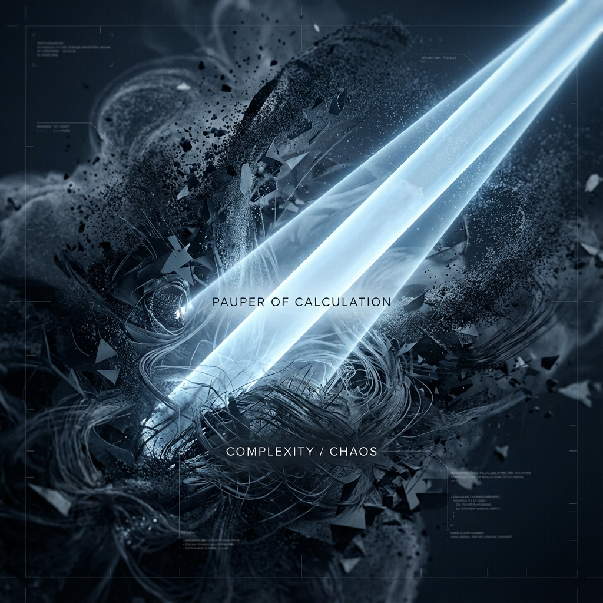

# 5.2 The Pauper of Calculation

Why did I name this chapter "The Bankruptcy of the Photon"? This sounds like an emotional metaphor, but in our geometric reconstruction, this is a precise physical description.

In our model, the universe is a resource-limited computational system. Total bandwidth $c$ represents the "computational ability" the universe grants every entity. Having resources means having the ability to process information—to change states, to record history, to perform complex internal cycles.

In this sense, matter is the "wealthy" in the universe.

Look at an electron in your body. It has mass, meaning it retains enormous internal bandwidth ($v_{int} \approx c$). Using these resources, it can perform complex spin operations in Hilbert Space, it can entangle with other particles, it can jump from one energy level to another. It is a tiny, fully functional quantum computer. It is "wealthy" because it has **internal life**.

In contrast, photons are complete **paupers**.

Because they exchange all computational ability for external displacement ($v_{ext} = c$), their account has no balance left, not even one bit, to maintain internal state.

* **They have no "rest mass":** This means they have no capital to stop and think. If they stop, they disappear.

* **They have no "internal evolution":** They cannot change their essence during flight. A red photon, if it doesn't collide with the outside world, remains red forever; it cannot decide halfway to become blue.

Photons can run so fast precisely because they **have nothing**. They have no internal baggage to carry.

## The Zero-Latency Messenger

You might ask: Why does the universe allow this "poverty" to exist? Why not force all particles to retain a bit of internal bandwidth, so everyone can fairly have time?

The answer lies in **communication integrity**.

If photons had mass, if they had internal time, then they would be complex processors, not just messengers. This means during their 8-minute journey from the Sun to Earth, they would undergo "internal evolution." They might "age," might experience phase drift, even might "change their mind."

Imagine if the mail carrier delivering your letter couldn't resist opening it on the way, modifying the content based on their mood. Then when you receive the letter, what you read is no longer the sender's original intent, but information "processed" by the mail carrier.

To build a logically rigorous causal universe, we need an **absolutely transparent messenger**. We need a mechanism that can transmit events (causes) from one end of spacetime to the other (effects) completely unchanged.

This requires the messenger itself to be "dead"—it cannot have any internal computational activity.

Photons exist precisely to satisfy this harsh condition. Because their $v_{int}=0$, they accumulate no internal geometric phase (Internal Phase Accumulation) during transmission. For photons, the transmission's start and end points are **directly connected** logically, with no processing steps in between.

This is the physical essence of **masslessness** (Masslessness): it is the manifestation of **zero computational latency** (Zero Computational Latency).

## The Uninhabitable Ship

This also explains why we can never "ride" on a light beam to travel, like Einstein's fantasy at age 16.

In science fiction, we often imagine spaceships accelerating to light speed. But from our geometric perspective, this is not only engineering impossibility, but logical paradox.

If you reach light speed, your $v_{int}$ must be zero. Your thinking, your heartbeat, the motion inside your atomic nuclei—all these processes requiring internal bandwidth consumption—must stop.

You cannot "sit" on a photon because photons have **no internal space**. They are flattened singularities with no internal dimensions to accommodate a complex observer. To be an observer, to have consciousness, you first must be "wealthy"—you need sufficient computational resources to maintain the "self" background process.

Therefore, photons are destined to be lonely wanderers. They are pipes connecting all things, yet can never become part of all things. They sacrifice their sense of existence to connect the world.

Thus far, we have completed the exploration of the two poles of the "Great Trade-off":

* One pole is **matter**, the hoarder of time, heavy because wealthy, slow because heavy.

* The other pole is **light**, the conqueror of space, fast because poor, eternal because fast.

But this picture is still built on Einsteinian smooth geometry. We talk about continuous "flows," smooth "rotations."

If we want to understand not only macroscopic motion, but also why there are specific types of particles—why electrons, quarks, neutrinos? Why do they have fixed charges and spins?—we must upgrade our microscope once more.

We need to penetrate those smooth curves and see the universe's bottommost **pixels**.

---

*（Next, we will enter Part III "The Knot of Time," starting from Chapter 6 "The Pixels at the Bottom," revealing the discrete computational ontology beneath continuous spacetime.）*

