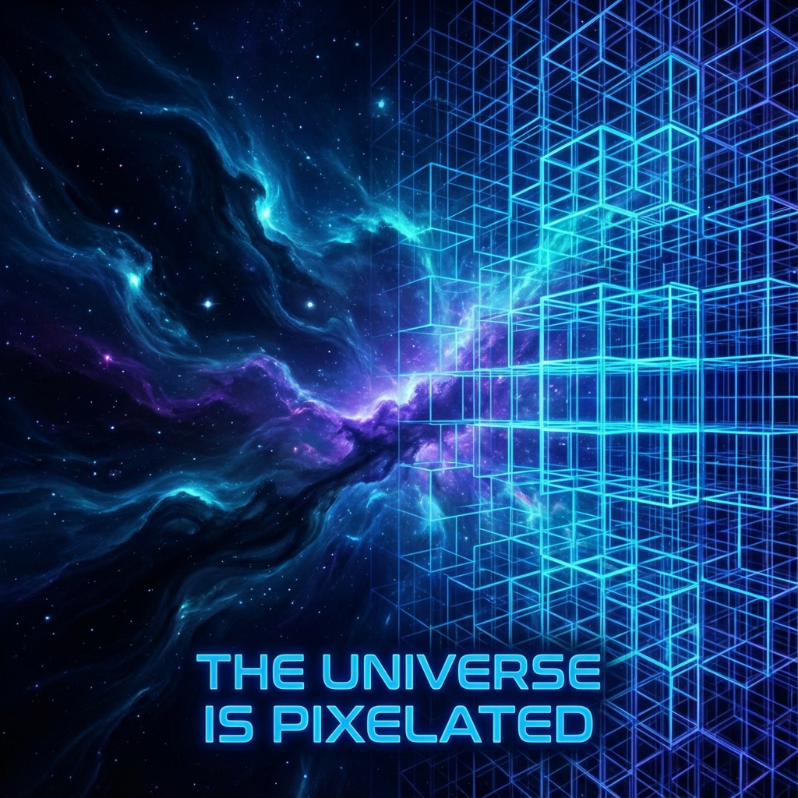

# 6.1 量子元胞 (QCA)

**(Quantum Cellular Automaton)**

当你坐在电影院里，看着银幕上流畅的画面：跑车在飞驰，云朵在飘动，主角在流泪。你的眼睛告诉你，这一切都是连续的、平滑的。但如果你走到银幕跟前，拿放大镜去观察，你会发现所谓的"流畅"只是幻觉。你看到的只有红、绿、蓝三种颜色的**像素点**。这些像素点本身并不移动，它们只是在原地依照特定的规则改变亮度。

我们的宇宙，很可能也是如此。

在第二部中，我们用光滑的几何语言重构了相对论。我们谈论"流动的速率"、"旋转的矢量"。这对于描述宏观世界是完美的。但是，当我们试图将这套语言应用到极微小的尺度——普朗克尺度（$10^{-35}$ 米）时，几何学的平滑性崩溃了。

这就好比你试图在电脑屏幕上画一个完美的圆。无论你的分辨率有多高，如果你放得足够大，那个圆的边缘总会变成锯齿状的阶梯。

在我们的几何重构框架下，这种"锯齿"不是误差，它是宇宙的**本体真相**。

## 宇宙的刷新率

我们在第一章中引入了公理 A1：宇宙以恒定的速率演化。在宏观上，这表现为连续的流；但在微观上，我们需要引入一个新的概念：**量子元胞自动机**（Quantum Cellular Automaton, QCA）。

不要被这个复杂的术语吓倒。它的核心思想非常简单：**宇宙是由无数个微小的、离散的逻辑单元组成的。**

想象空间不是一个空的盒子，而是一张巨大的立体网格。每一个网格点上都有一个微小的量子系统——我们可以把它看作是一个"量子比特"或者一个"微型希尔伯特空间"。

这就像是宇宙的像素。

这就彻底改变了我们对"运动"的理解。在经典物理中，一个电子从 A 点移动到 B 点，我们想象它像一颗弹珠一样滑过了中间的空间。但在 QCA 的图景中，电子并不移动。真正发生的，是 A 点的网格"变暗"了（失去了电子的状态），而相邻的 B 点网格"变亮"了（获得了电子的状态）。

所谓的运动，其实是**信息的传递**。

这就解释了我们在第二章提到的那个神秘的"演化速率 $c$"。在 QCA 模型中，时间不是连续流逝的，而是一帧一帧跳动的。宇宙有一个基础的"时钟步长"（Tick）。在每一个时钟步长里，每一个网格点都会根据它邻居的状态，通过一个固定的规则（幺正算符）更新自己的状态。

因此，宇宙不是在"演化"，而是在**计算**。

我们不仅将物理学视为几何的投影，更进一步，我们将其视为一种**计算投影**（Computational Projection）。在这种视角下，希尔伯特空间的连续旋转，实际上是无数个微小逻辑门操作在宏观上的统计平均。

## 离散的幽灵

你可能会问："如果宇宙真的是像素化的，为什么我看不到格子？为什么我感觉不到世界的'卡顿'？"

答案在于**尺度**。

这一层的像素密度大得惊人。根据估算，在一个立方米的真空中，大约包含了 $10^{105}$ 个普朗克网格。作为对比，目前人类最清晰的显示器，每英寸也只有几百个像素。

因为像素太小，update 的频率太快（每秒 $10^{43}$ 次），我们的感官——甚至是我们最精密的粒子对撞机——都无法察觉到底层的颗粒感。我们看到的"平滑时空"，其实是底层离散结构涌现出来的**低分辨率近似**。

就像水看起来是连续的流体，但本质上是离散的水分子一样；时空看起来是连续的舞台，但本质上是离散的量子比特网络。

承认宇宙的离散性（QCA 本质），解决了一个困扰物理学多年的难题：**无穷大的消除**。

在标准量子场论中，当我们计算两个粒子无限接近时的相互作用，往往会得到"无穷大"的结果。这是因为我们假设空间可以无限分割。但在 QCA 宇宙中，你不能无限接近。就像在屏幕上，两个亮点最近只能相邻，不能重叠。这种天然的**几何截断**（Cutoff），使得所有的物理计算都变得有限且合理。

所以，当我们说"底层的像素"时，我们不是在做一个比喻。我们是在描述一种比"弦"或"膜"更基础的实在：**信息处理的最小单元**。

但是，如果宇宙是由固定的网格组成的，那么一个巨大的问题随之而来：既然网格是静止的，为什么光速在所有方向看起来都是一样的？难道我们在网格上斜着走和横着走，距离不是应该不同吗？

这就是著名的"洛伦兹对称性破坏"问题。但在下一节我们将看到，QCA 有一种神奇的能力，能在宏观上完美地伪装成各向同性的连续空间，只留下极其微小的蛛丝马迹。

---

*（下一节，我们将进入 6.2 节"因果律即网速"，探讨在这个像素化的宇宙中，光速限制是如何作为一种逻辑必然（Lieb-Robinson 界）自然涌现的。）*

