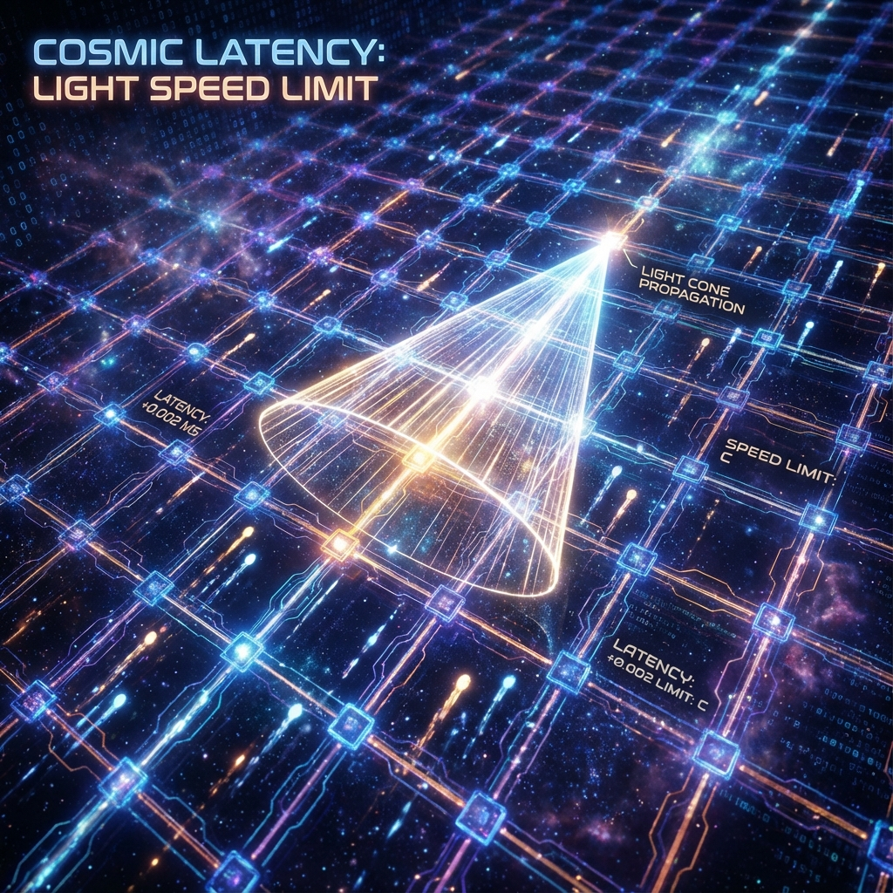

# 6.2 因果律即网速

**(Causality as Connection Speed)**

在经典物理学中，因果律是一个哲学概念：原因必须先于结果。但在爱因斯坦的相对论中，因果律变成了一个几何概念：光锥（Light Cone）。任何事件都只能影响它光锥内部的未来，任何超越光锥的联系都是不可能的。

但这听起来仍然像是一个武断的禁令。为什么是 $c$？为什么不是无限快？如果宇宙只是一个空旷的舞台，为什么在这个舞台的一端发生的事情，不能瞬间传到另一端？

在我们的量子元胞自动机（QCA）模型中，这个谜题得到了一个极其直观的解答：**光速不是飞行速度，光速是信息的传导速率。**

## 多米诺骨牌效应

想象一块巨大的地板，上面密密麻麻地摆满了多米诺骨牌。每一个骨牌代表一个空间像素（QCA 单元）。

如果你推倒了第一个骨牌（产生一个事件），它会倒向并击中它的邻居。邻居再倒向下一个邻居。一个"波"开始在骨牌阵列中扩散。

现在，请问：这个波的传播速度能有多快？

这取决于两个因素：

1.  **骨牌的大小**（空间像素的间距）。

2.  **骨牌倒下所需的时间**（基本的时间步长，或者说逻辑门的运算周期）。

无论你的推力有多大，无论你的意图有多急切，这个波传遍整个房间的速度都有一个物理上限。你不可能让第 100 个骨牌在第 1 个骨牌倒下的同一瞬间倒下，因为中间的每一个骨牌都需要时间来响应。

这就是我们宇宙中"光速限制"的真面目。

在 QCA 的视角下，并没有什么东西真的在"飞"。光子并不是一颗在虚空中穿梭的子弹，它是一种**状态的接力**。

当物理学家说"光速是 $c$"时，他们实际上是在说：在这个由量子比特构成的宇宙网络中，信息从一个节点渗透到相邻节点，受到最底层逻辑门更新速率的限制。

数学家利布（Lieb）和罗宾逊（Robinson）在一个著名的定理中严格证明了这一点：在一个具有局域相互作用的量子晶格系统中，即使没有预设相对论，也会自然涌现出一个最大的信息传播速度。这就是**利布-罗宾逊界**（Lieb-Robinson Bound）。

在我们的字典里，**光锥就是这个传播界限的边界**。

## 逻辑的视界

让我们换一个更现代的比喻：**网速**。

如果把宇宙看作一台巨大的分布式计算机，把每一个空间点看作一个服务器节点，那么光速就是这整个网络的**最大PING值**或**延迟**（Latency）。

* 当我们看着月亮时，我们看到的是 1.3 秒前的月亮。这不仅是因为光要跑那么远，而是因为有关月亮的信息（Bit）需要经过无数个空间像素的"转手"和"处理"才能到达你的视网膜。

* 黑洞的视界（Event Horizon），在这个意义上，就是网络的**断连区**。那里的网络拓扑结构使得信息传播的跳数变得无穷大，或者说，信息的包被永远地卡在了缓冲区里。

因此，因果律不再是一个抽象的哲学原则，它变成了**网络拓扑学的硬性约束**。

如果有人声称他能瞬间把信息传到仙女座星系，他实际上是在声称他能绕过宇宙中所有的中间节点，直接修改远端的内存。但在一个严格局域（Local）的 QCA 宇宙中，这是被底层操作系统（公理 A1）严令禁止的。

## 离散的光锥

在连续的时空中，光锥是一个完美光滑的圆锥体。但在我们的像素世界里，如果我们把显微镜放大到极限，我们会看到所谓的"光锥"其实是一个呈阶梯状扩大的**金字塔**。

每一个台阶对应一个普朗克时间步长 ($\Delta\tau$)。

每一层扩散对应一个普朗克长度 ($\Delta x$)。

在宏观尺度上，因为步长太小，金字塔的棱角被磨平了，看起来就像是光滑的圆锥。这再次印证了我们的核心观点：连续的物理定律，只是离散计算过程的**涌现**（Emergence）。

现在，我们理解了空间是像素化的，因果是受限的。但这幅图景中还有一个巨大的漏洞：如果空间是由固定的格子组成的，为什么我们感觉不到格子的存在？为什么我们在任何方向上测量光速都是一样的？按理说，在格子上走斜线应该比走直线更"慢"才对（因为路径更曲折）。

这就是著名的"洛伦兹对称性破坏"问题。它是所有离散时空理论的噩梦。

但在下一节，我们将展示一个惊人的数学奇迹：这些离散的像素是如何通过一种精妙的伪装术，在宏观上欺骗了我们所有的探测器，让世界看起来完美对称。

---

*（下一节，我们将进入 6.3 节"消失的马赛克"，利用 $O(p^4)$ 抑制机制，解释为什么离散的宇宙看起来如此平滑。）*

