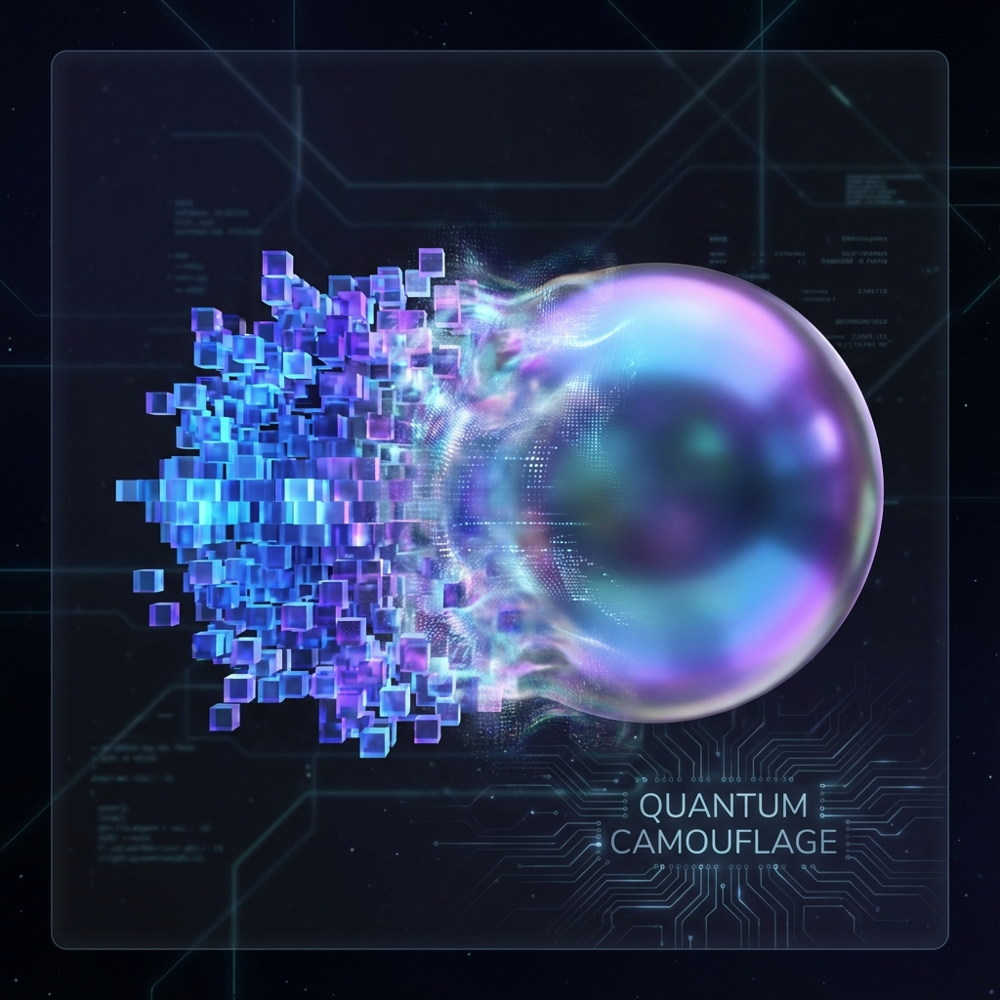

# 6.3 消失的马赛克

**(The Vanishing Mosaic)**

如果宇宙真的是由离散的像素（QCA网格）构成的，那么按理说，我们应该很容易发现它。

想象一下你在一个方格纸上行走。如果你想从 A 点走到 B 点，而 B 点在你的斜对角方向，你不能直接走斜线（因为只有格子），你必须走锯齿状的"楼梯步"。这意味着，在格子上，"斜边"的长度并不等于直角边的平方和。这就是所谓的"曼哈顿距离"与"欧几里得距离"的冲突。

如果光也是这样在宇宙的网格上"爬行"，那么当我们看向不同方向时，光速应该是不一样的。光在沿着网格轴线传播时应该最快，而在沿对角线传播时应该变慢（或者变快，取决于具体的跳跃规则）。

这被称为**洛伦兹对称性破坏**（Lorentz Violation）。

这是所有离散时空理论的噩梦。因为无数的天文观测——比如迈克尔逊-莫雷实验——都告诉我们，光速在任何方向上都是极其精准地相同的。如果宇宙是像素化的，这个像素网格肯定被藏得非常完美。它究竟是如何做到的？

## 量子迷彩 (Quantum Camouflage)

秘密在于我们不仅仅是在处理"元胞自动机"，我们是在处理**量子**元胞自动机。

如果光子是一颗经典的弹珠，它确实会被格子的棱角绊倒。但光子是一个波函数。在量子力学中，波函数并不是沿着单一路径传播的，而是同时探索了所有可能的路径。

当我们写下 QCA 的演化方程（正如我们在狄拉克-QCA模型中所做的那样），奇迹发生了。虽然每一个微小的跳跃都是发生在离散的格点之间，但当这些跳跃的波函数叠加在一起时，网格的"方块效应"相互抵消了。

这就好比你在一个方形的像素屏幕上显示一个圆。虽然每一个像素都是方的，但通过调整边缘像素的亮度（抗锯齿技术），你可以让那个圆看起来无比圆润。

宇宙使用了一种最高级的数学抗锯齿技术。在宏观尺度上，离散网格的各向异性被量子干涉完美地抹平了。涌现出来的宏观波动方程（狄拉克方程），竟然奇迹般地恢复了完美的旋转对称性。

## $O(p^4)$ 的高阶抑制

当然，这种伪装不是绝对完美的。作为物理学家，我们需要知道"误差"到底有多大。

在我们的几何重构中，这种误差体现为**色散关系**（Dispersion Relation）的修正。在完美的连续空间里，能量与动量的关系是 $E^2 = c^2p^2$。但在我们的 QCA 像素宇宙里，这个关系变成了一个级数展开：

$$E^2 \approx c^2p^2 - \alpha \frac{p^4}{M_{Pl}^2} + \dots$$

请注意那个修正项 $p^4$（动量的四次方）。这是一个极其关键的细节。

很多拙劣的离散模型会导致 $p^2$ 或 $p^3$ 级别的修正，那样的误差太大了，早就应该被我们的望远镜看到了。但是，我们的 QCA 模型具有特殊的对称性（宇称和时间反演对称），这导致领头的误差项被压制到了 $p^4$ 级别。

这意味着什么？

这意味着，对于普通的低能粒子（比如你身体里的原子，甚至太阳发出的光），这个误差项小到可以忽略不计。只有当粒子的动量 $p$ 接近普朗克动量 $M_{Pl}$（那是一个极其巨大的能量）时，这个 $p^4$ 项才会变得显著。

这就好比说，宇宙这个显示器的分辨率实在太高了。除非你能把显微镜的倍率调到普朗克尺度（比原子核还要小 $10^{20}$ 倍），否则你永远看不到那个"马赛克"。

## 来自深空的证据

我们真的去寻找过这个马赛克吗？是的。

天文学家曾利用费米伽马射线太空望远镜（Fermi-LAT），观测过来自遥远伽马射线暴的光子。如果时空真的是离散的，那么不同颜色的光子（动量 $p$ 不同）受到网格的影响应该略有不同，它们到达地球的时间应该有极其微小的差别。

观测结果显示：即使穿越了 70 亿光年，高能光子和低能光子的到达时间几乎完全一致。这排除了那种粗糙的"线性洛伦兹破坏"模型。

但是，我们的 $O(p^4)$ 模型能够完美地通过这个测试。因为在伽马射线暴的能标下，$p^4$ 带来的修正大约只有 $10^{-19}$ 秒，这完全隐藏在了目前的探测极限之下。

所以，结论是惊人的：**宇宙虽然是像素化的，但它依然通过精妙的数学结构，在我们的观测能力范围内维持了完美的连续假象。**

这就解释了为什么我们生活在一个看起来如此光滑、可以用微积分来描述的世界里，尽管它的底层是一张跳动的数字网格。

现在，我们已经理解了舞台（空间）和剧本（时间）。但是，这个舞台上还有一些奇怪的演员。有些地方的网格似乎"打结"了，形成了一些无法被解开的疙瘩。这些疙瘩是如此稳定，以至于我们给它们起了名字，叫作"电子"、"夸克"。

这就引出了下一章的主题：如果空间是网格，那么粒子是什么？答案可能会让你大吃一惊——粒子，就是网格上的**Bug**。

---

*（下一节，我们将进入第七章"作为缺陷的粒子"，揭示物质的拓扑本质。）*

