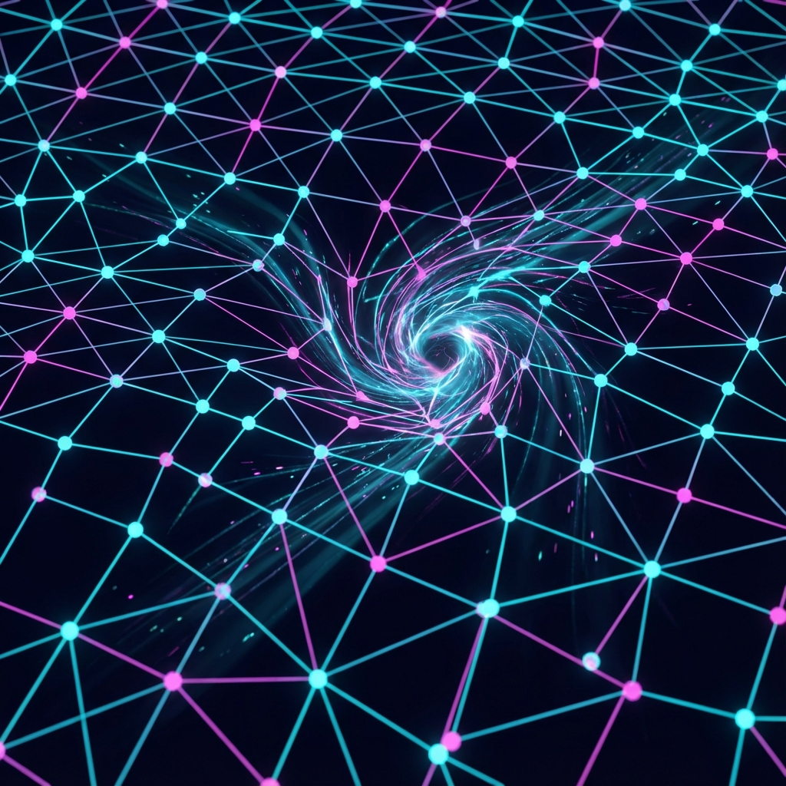

# 7.1 拓扑死结

**(Topological Knots)**

当我们想象一个电子时，我们脑海中通常会浮现出一个微小的、闪着光的小球，悬浮在空旷的空间里。这是一种非常经典的直觉：空间是舞台，粒子是演员。演员可以在舞台上随意走动，舞台和演员是截然分开的。

但在我们的量子元胞（QCA）宇宙中，这种区分消失了。

如果宇宙的底层真的只是一张巨大的、跳动的逻辑网格，那么"粒子"究竟是什么？既然网格本身是固定的，那是什么东西在从 A 点移动到 B 点？

答案是：**粒子是网格状态的一种特殊扭曲。**

## 地毯上的褶皱

想象你在铺一张巨大的地毯。如果地毯比房间稍微大了一点，或者铺的时候不小心，中间就会隆起一个褶皱。

你可以试着把这个褶皱踩平，但你往往会发现，褶皱并没有消失，它只是移动到了别的地方。你可以推着这个褶皱在地毯上到处跑。从远处看，这个褶皱就像是一个独立的"物体"，在地毯表面滑行。

在这个比喻中，地毯就是我们的宇宙空间（希尔伯特空间的底层网格），而那个褶皱，就是我们所谓的"粒子"。

这就是**拓扑场论**的核心思想：粒子不是上帝放入宇宙的弹珠，它是空间结构本身的一种**拓扑缺陷**（Topological Defect）。

## 无法解开的结

为什么电子是稳定的？为什么它不会像水波一样慢慢扩散、消失？

在第二部中，我们说质量是"被囚禁的时间"。现在，我们可以从拓扑学的角度更精确地描述这种囚禁：**粒子是时间流动的死结。**

在一个平滑的海洋中，波浪会随时间消散。但是，如果你在绳子上打了一个结，无论你怎么抖动绳子，那个结都会以此保持原状。除非你把绳子剪断，否则这个结所代表的结构信息——它的"结度"——是守恒的。

在我们的几何重构中，基本粒子（如电子、夸克）就是希尔伯特空间演化矢量场中的**拓扑非平凡类**。

* **真空**是平庸的，演化矢量整齐划一地指向同一个方向（纯粹的时间流）。

* **粒子**是扭曲的，演化矢量在局部形成了一个涡旋或纽结。

因为拓扑学的保护，这个纽结无法通过连续的形变被解开。这就是为什么电子极其稳定，它的寿命甚至比宇宙现在的年龄还要长。它不是不想解体，而是几何学禁止它解体。

## 创世与湮灭

这个模型完美地解释了物理学中另一个神奇的现象：**对产生与湮灭**。

你无法在绳子中间凭空制造出一个单独的结。但是，你可以通过扭转绳子，同时制造出一个"正结"和一个"反结"（在这个比喻中，它们看起来像是一对相互缠绕的环）。

同样，在宇宙中，你不能凭空创造一个电子。你必须同时创造一个电子（正结）和一个正电子（反结）。当你把它们放在一起时，它们的拓扑结构正好相反，相互抵消，纽结解开了，绳子恢复了平直。

这就是湮灭。

当我们看到正反物质相撞，爆发出巨大的能量（光子）时，我们实际上是目睹了一场**拓扑解锁**。那个原本被锁死在"死结"里的内部演化速率 $v_{int}$，因为结的解开，瞬间被释放成了直线传播的外部速率 $v_{ext}$。

## 只有背景，没有演员

这个观点彻底改变了我们的本体论。

宇宙中并没有"物质"这种实体，**只有结构**。

我们所谓的"物质"，其实是空间的**病变**。它是底层规则在执行过程中遇到的无法被抹平的奇点。正如我们在 QCA 模型中所见，粒子是演化规则的**合法缺陷**——它们不是程序运行的错误，而是程序允许存在的某种特殊的、自我维持的循环模式。

如果把宇宙看作一块完美的晶体，那么粒子就是晶格中的位错（Dislocation）。如果把宇宙看作显示屏，粒子就是那几个永远关不掉的坏点。

正是这些"缺陷"，构成了我们丰富多彩的世界。如果没有这些死结，宇宙将只是一片死寂的光滑流体，没有任何东西能停下来，没有任何东西能拥有记忆。

我们之所以存在，全靠宇宙没能把自己彻底熨平。

---

*（下一节，我们将进入 7.2 节"压缩残差"，从信息的角度探讨：为什么当我们用连续的数学去描述这些离散的死结时，它们会表现得如此奇怪？）*

