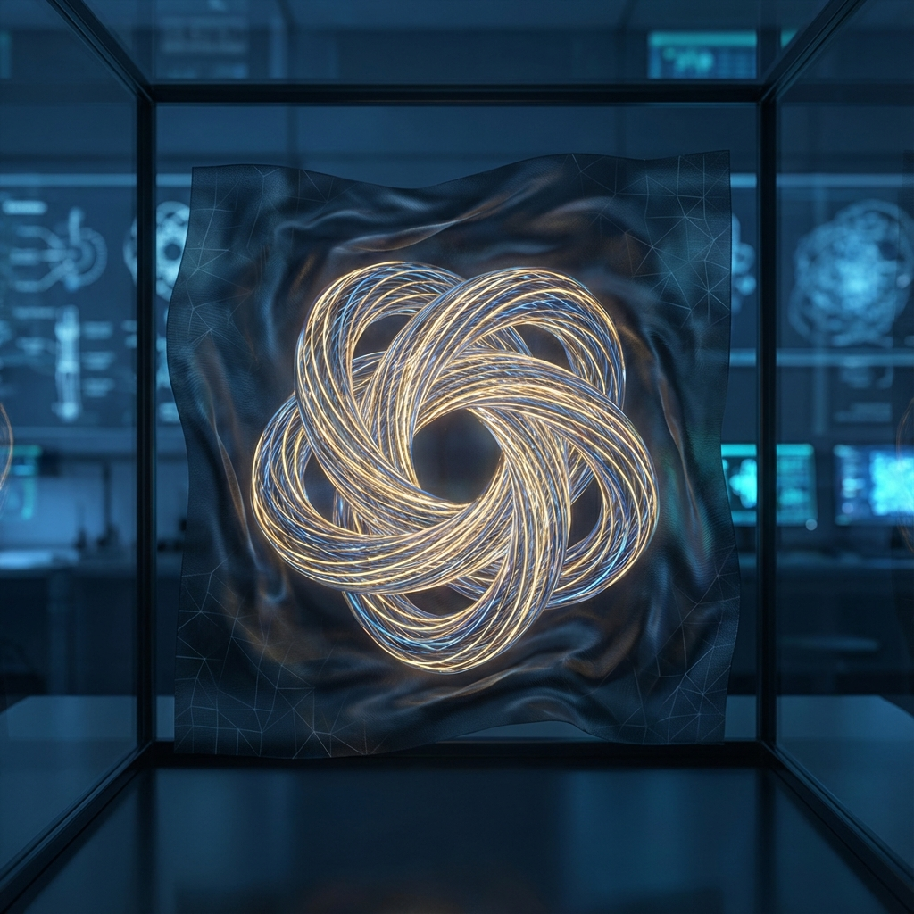
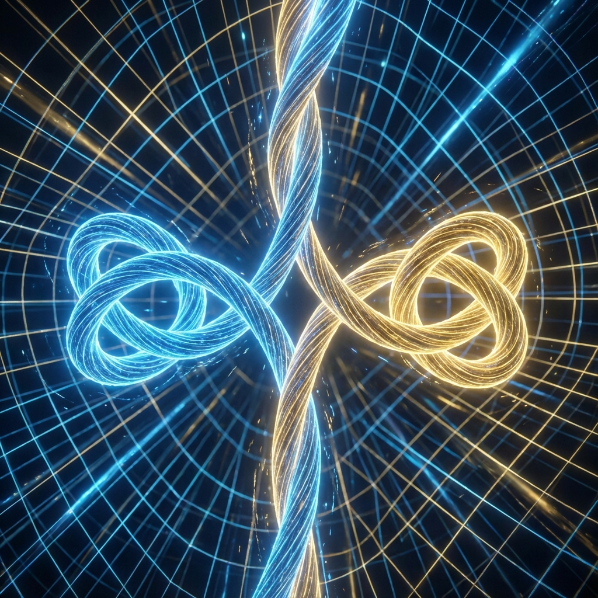

# 7.1 Topological Knots

When we imagine an electron, we usually picture a tiny, glowing sphere suspended in empty space. This is a very classical intuition: space is the stage, particles are actors. Actors can move freely on the stage; stage and actors are completely separate.

But in our Quantum Cellular Automaton (QCA) universe, this distinction disappears.

If the universe's foundation is really just a vast, jumping logic grid, then what exactly is a "particle"? Since the grid itself is fixed, what moves from point A to point B?

The answer is: **Particles are special distortions of grid states.**

## Wrinkles on the Carpet

Imagine laying a vast carpet. If the carpet is slightly larger than the room, or laid carelessly, a wrinkle will bulge in the middle.

You can try to flatten this wrinkle, but you'll often find it hasn't disappeared; it just moved elsewhere. You can push this wrinkle around the carpet. From a distance, this wrinkle looks like an independent "object" sliding on the carpet surface.

In this metaphor, the carpet is our cosmic space (the underlying grid of Hilbert Space), and that wrinkle is what we call a "particle."

This is the core idea of **topological field theory**: particles are not marbles God placed in the universe; they are **topological defects** (Topological Defect) of space structure itself.

## The Ununtiable Knot

Why are electrons stable? Why don't they slowly diffuse and disappear like water waves?

In Part II, we said mass is "imprisoned time." Now, we can describe this imprisonment more precisely from topology: **Particles are dead knots in the flow of time.**

In a smooth ocean, waves dissipate over time. But if you tie a knot in a rope, no matter how you shake the rope, that knot will remain. Unless you cut the rope, the structural information represented by this knot—its "knot degree"—is conserved.

In our geometric reconstruction, elementary particles (such as electrons, quarks) are **topologically non-trivial classes** in Hilbert Space evolution vector fields.

*   **Vacuum** is trivial; evolution vectors uniformly point in the same direction (pure time flow).

*   **Particles** are twisted; evolution vectors locally form a vortex or knot.

Because of topological protection, this knot cannot be untied through continuous deformation. This is why electrons are extremely stable, their lifetime even longer than the universe's current age. They don't want to disintegrate; geometry forbids it.

## Creation and Annihilation

This model perfectly explains another magical phenomenon in physics: **pair production and annihilation**.

You cannot create a single knot out of nothing in the middle of a rope. But you can twist the rope to simultaneously create a "positive knot" and a "negative knot" (in this metaphor, they look like a pair of interlocking rings).

Similarly, in the universe, you cannot create an electron out of nothing. You must simultaneously create an electron (positive knot) and a positron (negative knot). When you put them together, their topological structures are opposite, canceling each other, the knot unties, and the rope returns to flat.

This is annihilation.

When we see matter and antimatter collide, bursting with enormous energy (photons), we are actually witnessing a **topological unlocking**. That internal evolution rate $v_{int}$ originally locked in the "dead knot" is instantly released into straight-propagating external rate $v_{ext}$ because the knot unties.

## Only Background, No Actors

This view completely changes our ontology.

There is no "matter" entity in the universe; **only structure**.

What we call "matter" is actually space's **pathology**. It is an unflattenable singularity encountered during execution of underlying rules. As we see in the QCA model, particles are **legal defects** of evolution rules—they are not program execution errors, but special, self-sustaining loop patterns allowed by the program.

If we view the universe as a perfect crystal, then particles are dislocations (Dislocation) in the lattice. If we view the universe as a display screen, particles are those few permanently unswitchable bad pixels.

It is precisely these "defects" that constitute our rich and colorful world. Without these dead knots, the universe would be just dead, smooth fluid, nothing could stop, nothing could have memory.

We exist only because the universe failed to completely iron itself flat.

---

*（Next, we will enter section 7.2 "Compression Residual," exploring from an information perspective: Why do these discrete dead knots behave so strangely when we describe them with continuous mathematics?）*

