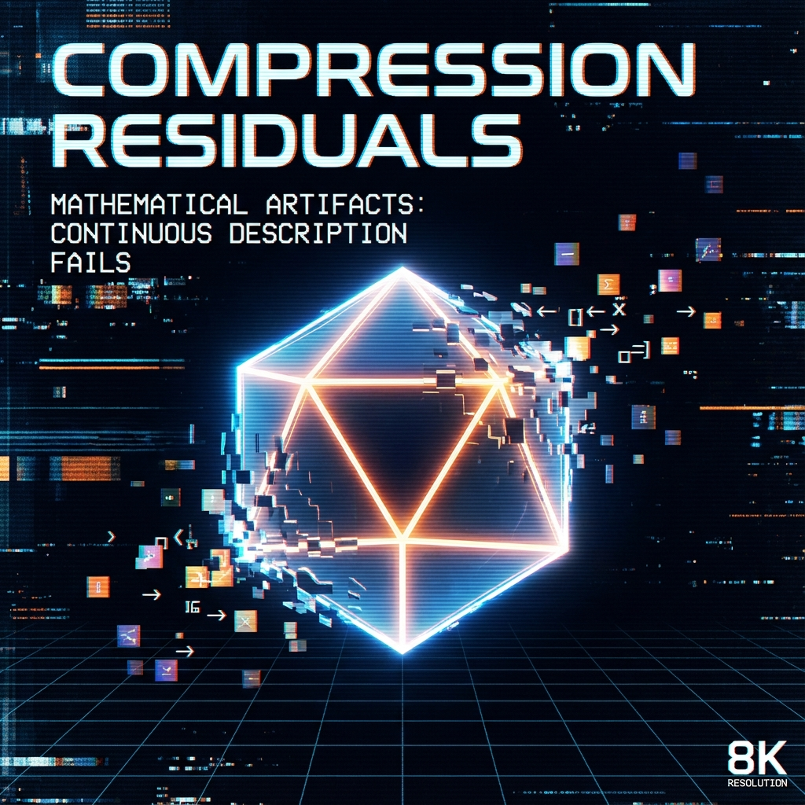

# 7.2 压缩残差

**(Compression Residuals)**

当我们用手机拍摄一张复杂的照片，并将其保存为 JPEG 格式时，发生了什么？手机的算法会丢弃那些人眼难以察觉的高频细节，用平滑的色块来近似复杂的纹理。这是一种**有损压缩**。通常情况下，这种压缩非常完美。但是，如果你拍摄的是一张充满了尖锐边缘和剧烈对比的黑白格图像，压缩算法就会崩溃。在黑白交界的地方，会出现奇怪的噪点和伪影。

这些伪影并不是真实存在的物体，它们是**用平滑的语言描述离散的现实**时必然产生的**残差**（Residuals）。

在我们的几何重构中，现代物理学——特别是量子场论——扮演的正是那个 JPEG 压缩算法的角色。而我们眼中的粒子，就是那些噪点。

## 连续性的幻觉

正如我们在第六章所展示的，宇宙的底层很可能是离散的量子元胞（QCA）网格。但是，作为宏观观察者，我们的感官和仪器分辨率极其有限。我们无法追踪每一个普朗克像素的跳动，我们只能看到它们宏观上的平均效果。

为了描述这种宏观效果，我们发明了**微积分**。我们用连续的场（Field）和光滑的波函数（Wavefunction）来近似底层的离散状态。

在大部分空旷的宇宙空间里，这种近似极其完美。因为在那里的网格状态变化很平缓，就像照片中的蓝天一样，用平滑函数描述毫无问题。这就是为什么真空看起来如此空旷、平滑。

但是，当我们遇到一个**死结**——也就是上一节提到的拓扑缺陷时，麻烦来了。

在这个死结的核心，网格的状态发生了剧烈的扭曲和翻转。这里的变化率太快了，空间结构太尖锐了。当我们试图强行用平滑的函数（连续场论）来覆盖这个区域时，数学描述就会失效。

为了强行维持"平滑"的假象，我们的方程被迫在这个点上吐出一个无穷大的值，或者一个无法定义的奇点。我们把这个数学上的尴尬点圈出来，给它贴上一个标签，说："这里有一个粒子。"

因此，**粒子是连续场论对离散拓扑缺陷的有损压缩残差。**

## 点粒子的悖论

这个观点完美解决了困扰物理学百年的"点粒子悖论"。

在标准模型中，电子被描述为一个没有体积的几何点。这导致了无穷大的灾难：如果电子真的只是一个点，它的电荷密度就是无穷大，它的自能也是无穷大。为了摆脱这些无穷大，物理学家不得不发明了复杂的"重整化"技术，实际上就是手动把这些无穷大减掉。

但在 QCA 的视角下，这完全是庸人自扰。

电子从来都不是一个点。它是一个在普朗克尺度上**拥有复杂内部结构的拓扑结**。它占据了若干个网格点，拥有有限的大小，有限的能量密度。

之所以我们在方程里把它写成一个点，是因为我们使用的"连续语言"分辨率太低，无法描述它内部那精妙的像素排列。我们被迫把它**压缩**成了一个没有任何内部几何结构的抽象点，然后不得不额外给这个点贴上"自旋 1/2"、"电荷 -1"这样的标签，来代表它丢失的内部几何信息。

这些量子数（Quantum Numbers），本质上就是**压缩包的元数据**。它们是对那些我们看不见的内部拓扑结构的简略编码。

## 不是 Bug，是 Feature

程序员都知道，当代码中出现无法处理的异常时，系统会抛出一个 Error。在某种意义上，粒子就是宇宙操作系统抛出的 **Error**。

但这并不是说宇宙出错了。宇宙运行得好好的。出错的是我们的**描述方式**。

* 宇宙本体（QCA）是离散的、完美的、没有任何奇点的。

* 物理模型（QFT）是连续的、近似的、充满奇点的。

粒子之所以表现得如此奇怪——既像波又像粒子，既在这里又不在这里——正是因为它们处于这两种描述体系的夹缝之中。它们是离散的幽灵在连续世界中的投影。

所以，当我们谈论"发现新粒子"时，我们并不是在宇宙的百宝箱里发现了新的积木。我们是在探索底层网格还能打出什么样的新奇的结。希格斯玻色子（Higgs Boson）不是上帝粒子，它是真空网格的一种特殊的振动模式，一种特殊的压缩残差。

这个视角让我们从对"物质实体"的迷信中解放出来。世界上没有"东西"，只有**信息的结构**。

现在，我们知道了粒子是空间结构上的死结。那么，既然是死结，为什么它们不是固定不动的？为什么它们会互相碰撞、反弹、甚至发生反应？

这涉及到了"时间"在微观层面的第二个秘密：当时间流经这些死结时，它不再是均匀流逝的。它被卷入、被延迟、被共振。

这就是我们下一章的主题——**时间作为频谱**。在那里，我们将看到微观粒子是如何通过"吞噬时间"来获得它们在宏观世界中的动力学行为的。

---

*（下一节，我们将进入第三部的最后一章——第八章"驻留与共振"，解开微观相互作用的时间本质。）*

