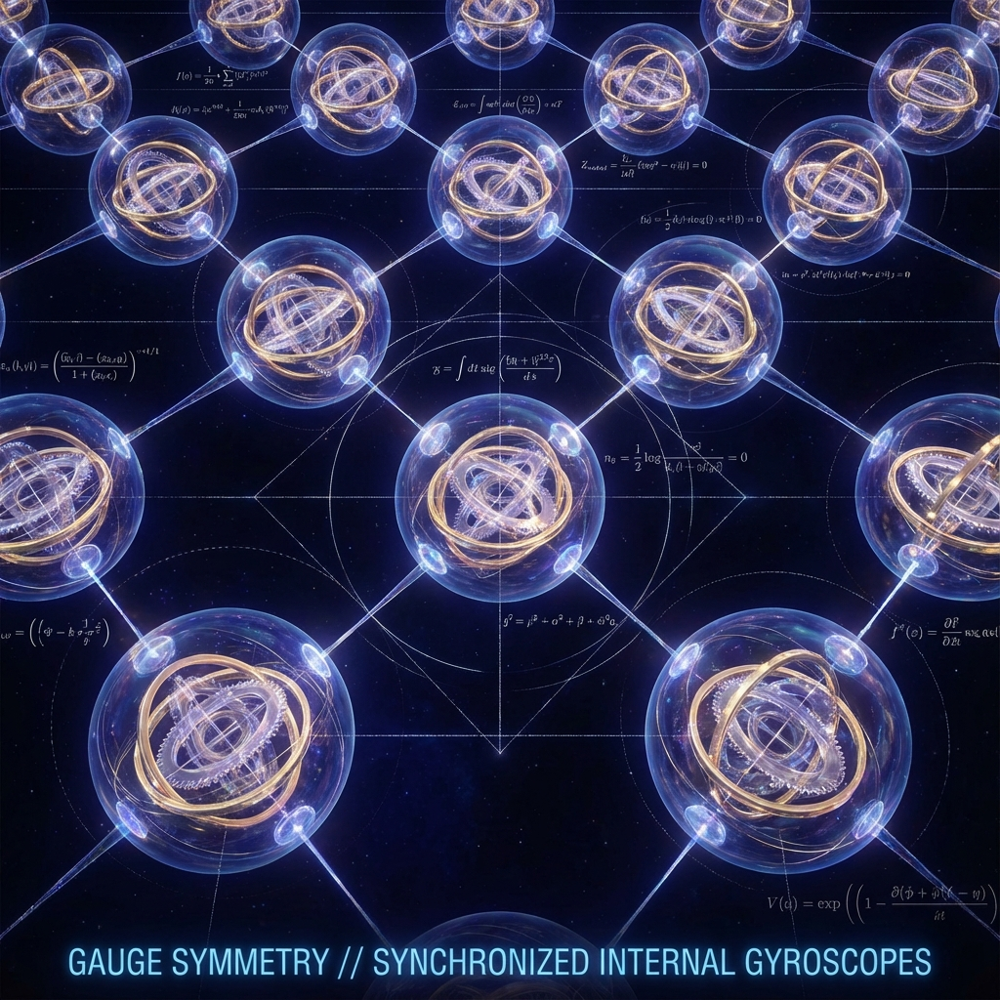

# 7.3 对称性作为备份

**(Symmetry as Backup)**

当我们审视标准模型——那个描述了所有已知基本粒子的物理学大厦时，我们会发现它建立在一组奇怪的数学群之上：$SU(3) \times SU(2) \times U(1)$。物理学家称之为"规范群"。

通常，这些群被视为上帝随意设定的参数。但在我们的几何重构中，它们并非随意，它们是**容量守恒的必然推论**。

## 内部的旋转

让我们回到我们的核心公理：宇宙是一个总带宽受限的系统。每一个粒子都是希尔伯特空间中的一个矢量，它的总长度必须恒定为 $c$。

我们在第四章中定义，质量是内部演化速率 $v_{int}$。但是，这个"内部"并不是一个简单的黑箱。就像你的电脑硬盘虽然只有一个"总容量"指标，但内部却分成了C盘、D盘、E盘一样，粒子的内部空间也有着精细的结构。

在我们的模型中，为了容纳标准模型所观察到的复杂性，我们不得不接受一个经验性的假设（H7）：宇宙在每一个空间点上的"内部纤维"，具有 $\mathbb{C}^3 \otimes \mathbb{C}^2 \otimes \mathbb{C}$ 的结构。

* $\mathbb{C}^3$ 对应颜色的自由度（强相互作用）。

* $\mathbb{C}^2$ 对应弱同位旋的自由度（弱相互作用）。

* $\mathbb{C}$ 对应相位的自由度（电磁相互作用）。

这就像是每一个粒子内部都装着一套精密的陀螺仪，这套陀螺仪有三个独立的旋转轴。

关键在于：**对于宇宙总后台来说，它只在乎你消耗了多少总带宽（能量），而不在乎你是怎么消耗的。**

这就好比你去超市买东西，收银员只在乎总金额是 100 元，而不在乎你是给了两张 50 元，还是一张 100 元，或者是微信支付。只要总价值（范数）不变，支付方式（内部状态）可以随意变换。

这种"支付方式的随意变换"，就是物理学中大名鼎鼎的**规范对称性**（Gauge Symmetry）。

## 等距变换

在几何语言中，这被称为**等距变换**（Isometry）。

想象一个球体。无论你怎么旋转它，它的半径（代表消耗的带宽 $c$）都不会改变。规范群 $SU(3)$、$SU(2)$、$U(1)$，正是那些能够保持"内部几何容量"不发生改变的旋转操作的集合。

* 当我们在内部空间旋转"颜色"轴时（夸克变色），只要旋转是幺正的，粒子消耗的总计算资源就不变。

* 当我们旋转"相位"轴时（电子变相），粒子的质量和能量也不变。

因此，标准模型的对称性群，本质上是宇宙为了**保持计算容量守恒**而允许存在的**冗余度**。它们是系统内部的"自由度"，允许粒子在不破坏总预算的前提下，灵活地调整自己的内部配置。

## 规范场：为了平衡账目

但是，如果我们在宇宙的这头把陀螺仪向左转，在那头向右转，会发生什么？

这会导致局部的不一致。为了弥补这种不一致，为了在"每个人都随意旋转内部坐标系"的情况下依然维持全局的几何连接，宇宙必须引入一种补偿机制。

这种补偿机制，就是**规范场**（Gauge Fields）——也就是光子、胶子和 W/Z 玻色子。

在我们的几何视角下，规范玻色子不是"力"的传递者，它们是**几何连接器**（Connections）。它们的作用是：当你扭曲了局部的内部坐标系时，它们负责弯曲外部的几何路径，以抵消这种扭曲，确保总的几何容量（Action）守恒。

所以，为什么会有光子？因为宇宙允许我们在任何地方随意改变电子的相位（$U(1)$ 对称性）。为了让这种随意的改变不破坏物理定律，光子必须存在，作为一种"补丁"来修正相位的差异。

## 结构即命运

至此，我们完成了对物质微观结构的重构。

* **粒子**：不是实体，是空间织物上的拓扑死结（缺陷）。

* **质量**：不是重量，是死结内部锁死的时间循环（$v_{int}$）。

* **相互作用**：不是推拉，是为了维持内部几何容量守恒而必须存在的几何补偿（规范场）。

我们眼中的物质世界——繁复的元素周期表、绚丽的化学反应——本质上只是底层那个简单的几何本体（$c$ 守恒）在复杂的内部拓扑结构上投影出的万花筒图案。

并不是上帝设计了标准模型，而是**如果你想在一个离散的、带宽受限的网格上打出稳定的结，并且允许这些结自由旋转而不崩溃，你就必须拥有这套数学结构作为支撑**。

这是第三部的终点。我们已经拆解了舞台（时空），也拆解了演员（物质）。现在，我们要让这些演员动起来。我们要看看，当这些携带着复杂内部结构的时间之结，在彼此靠近、碰撞、纠缠时，会发生什么。

那不仅仅是力的作用，那是时间的共振。

---

*（下一节，我们将进入第四部"几何的驱力"，从第八章"驻留与共振"开始，揭示相互作用的时间本质。）*

