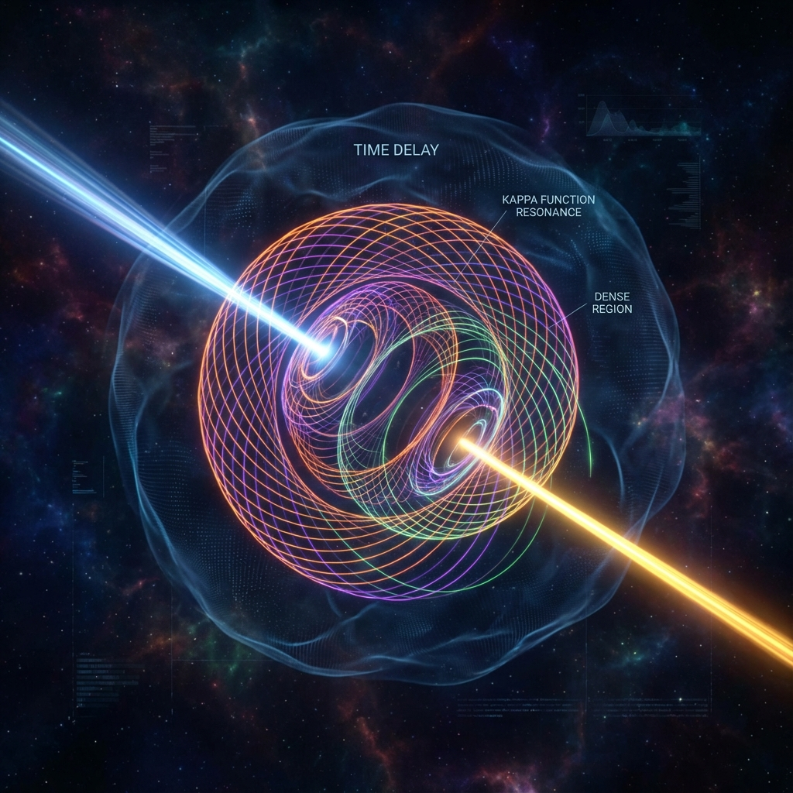

# 8.1 The $\kappa(\omega)$ Function: Bridge Between Micro and Macro

In the macroscopic world, we are accustomed to measuring time with stopwatches. Time flows linearly and uniformly. But in the microscopic quantum world, time reveals its extremely bizarre side: it becomes a spectrum that can be "accumulated" and "stretched."

To understand this, we need to introduce the most hardcore, but also most beautiful mathematical object in this book: the **$\kappa(\omega)$ function**.

Don't be intimidated by this Greek letter. In our geometric reconstruction, it plays the role of a "tower of Babel"—it connects microscopic scattering experiments (what we see in particle colliders) and macroscopic geometric ontology (paths in Hilbert Space). It is the key to understanding "interactions."

## Ghost Time in Collisions

Imagine throwing a tennis ball at a wall. The ball hits the wall and bounces back. How long did the ball stay on the wall during this process? Almost instantaneously.

Now, imagine throwing the ball into a sticky honey. The ball will sink in, slowly decelerate, pause, then be pushed out by a spring (assuming there's one inside). The ball "resides" in the honey for a long time.

In quantum mechanics, when two particles collide (scatter), what happens is more like the latter. Particles don't bounce off like billiard balls; their wave functions overlap and interfere, forming a temporary entangled state, then separate.

Physicists use a quantity called **time delay** (Time Delay) to describe this process. It measures how much longer particles stay in the interaction region compared to vacuum.

In traditional textbooks, this is just an ordinary physical quantity. But from our geometric perspective, this "delay" reveals **the essence of time**.

We derived a unified time scale function $\kappa(\omega)$ in our paper. This function has a stunning triple identity:

1.  It is the **derivative of scattering phase**: describes how much wave functions are twisted in collisions.

2.  It is **density of states** (Density of States): describes how many ways the system can exist at a specific energy.

3.  It is **time delay**: describes how long particles reside in the interaction region.

These three are mathematically completely equal. This means: **Time is not external flow independent of matter; time is the density of matter states.**

## Winding of Geometric Paths

Let us return to Hilbert Space. As we said before, the universe is a vector rotating at rate $c$.

When particles fly freely in vacuum, this vector traces a smooth straight line (or great arc). Because there's no obstruction, it "walks" smoothly.

But when particles encounter interactions (like electrons encountering atomic nuclei), things change. At interaction energy points, the $\kappa(\omega)$ function suddenly shows a huge peak.

What does this mean?

This means in Hilbert Space, the evolution vector's path becomes extremely tortuous. It no longer advances straight, but begins to **circle frantically**. Like a tangled mess, or a tightly wound ball of thread.

Because total rate $c$ is constant (Axiom A1), when the path becomes longer and more tortuous, the macroscopic time particles spend "completing" this journey becomes longer.

This is the **geometric origin of time delay**: particles are not really "dragged" by some force; they must take a longer detour in Hilbert Space.

* **Macroscopically:** Particles pause near atomic nuclei for a while.

* **Microscopically geometrically:** Particles' state vectors rotate thousands of extra turns in internal dimensions.

## Time as Spectrum

The $\kappa(\omega)$ function tells us that time is not uniformly distributed. Like a spectrum, it is very dense at certain frequencies (energies), and very sparse at others.

* **Resonance:** When $\kappa(\omega)$ shows a sharp peak, we say the system resonates. Geometrically, this is time knotting. Particles deeply sink into time's vortex, "existing" particularly intensely and long at that point.

* **Lifetime:** A particle's lifetime is essentially the process needed to untie this time knot.

So when we ask "why do microscopic particles have interactions," the answer is no longer "because there's force," but **because time density differs there**.

$\kappa(\omega)$ is a bridge connecting two worlds: it translates visible time (delay) into invisible geometry (path length). It proves that even the most complex quantum collisions are essentially simple geometric evolution manifested under different projections.

This is the truth of interactions: not push-pull, but **temporal entanglement and residence**.

Now, we understand how microscopic particles produce interactions by "devouring time." But this is only half the story. What happens when countless such microscopic time knots converge? How does this microscopic geometric effect emerge as the most irresistible force in our macroscopic world—gravity?

This is not just a physics question; it's also about our own existence: Why are we trapped on the ground? Why do we always move from order to disorder?

It's time to enter Part IV—**Geometric Driving Forces**. There, we will transform these cold geometric derivations into profound insights about life's driving forces.

---

*（Next, we will enter Part IV, transitioning from section 8.2 "Residence as Existence" of Chapter 8 to Chapter 9, exploring the origin of macroscopic forces.）*

