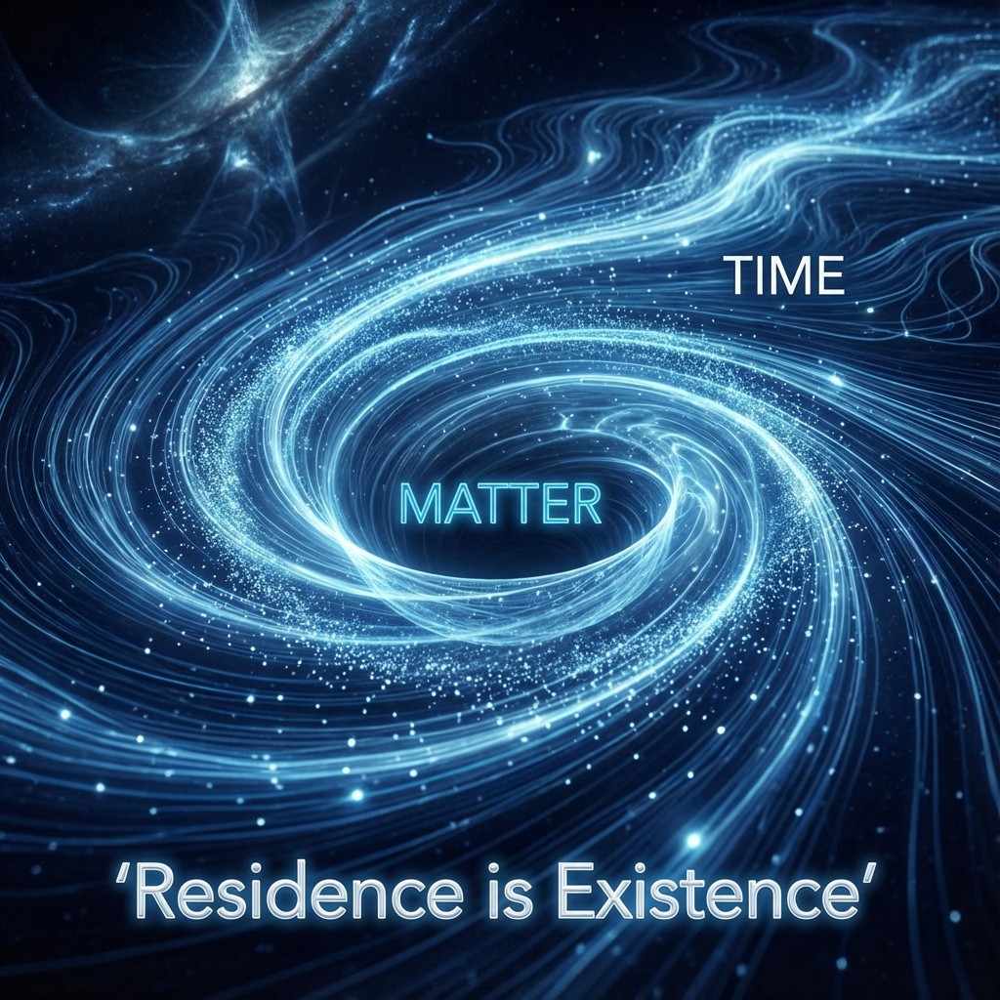

# 8.2 停留即存在

**(Residence is Existence)**

在日常语言中，我们说一个物体"存在"于某处，通常是指它占据了那个空间位置。但在我们的几何重构中，空间只是一个次级的投影。在希尔伯特空间的底层本体里，唯一的真理是演化的**速率**。

如果一切都在以光速 $c$ 飞逝，如果万物都是流动的，那么"存在"——这种看似静止、稳固的状态——是如何产生的？

答案就在于**停留**（Residence）。

## 迷宫中的奔跑者

让我们回到那个以恒定速率 $c$ 演化的宇宙状态向量。想象它是一个不知疲倦的奔跑者。

当光子穿过真空时，这个奔跑者是在一条笔直的高速公路上飞奔。对于外部观察者来说，它瞬间穿过了空间，没有一丝迟疑。它"经过"了空间，但它并没有真正"存在"于空间的任何一点。它只是一个稍纵即逝的过客。

但是，当这个奔跑者遇到一个原子，或者进入一个强相互作用区域时，情况变了。

几何路径不再是笔直的。它变成了一个**迷宫**。

奔跑者（演化向量）并没有减速——根据公理 A1，它必须永远保持速率 $c$。但是，它被迫在这个迷宫里绕弯子、打转、走回头路。它在微小的空间范围内跑了极长的路程。

对于外部观察者（也就是拿着秒表的我们）来说，这看起来就像是粒子**慢了下来**，甚至是**停了下来**。

这就是**时间延迟**的物理图像。粒子在相互作用区"滞留"的时间，本质上就是它在希尔伯特空间的内部维度里多跑的那段冤枉路。

## 共振：时间的漩涡

这种滞留的最极端形式，就是**共振**（Resonance）。

在粒子物理实验中，当我们把能量调到特定的数值时，散射截面会突然暴涨，粒子似乎被靶子"吸"住了。物理学家说，这产生了一个短寿命的"共振态"粒子。

在我们的几何视角下，这发生是因为演化向量遇到了一个**几何漩涡**。

在那特定的能量点上，$\kappa(\omega)$ 函数——我们在上一节介绍的那个时间密度函数——出现了一个尖锐的峰值。这意味着几何路径在那一点紧紧地缠绕在一起，形成了一个几乎封闭的圆环。

粒子并没有消失，它只是陷入了时间的循环。它在那个微小的区域里疯狂地旋转，消耗着它的演化预算。直到它转了足够多的圈数，终于找到出口，再次以直线的形式飞出。

这个短暂的"漩涡"，在宏观上就表现为一个**存在的实体**。

## 我停留，故我在

这带给我们一个震撼的本体论结论：**物质的存在感，源于它对时间的滞留。**

* **光子**不滞留，所以它没有质量，没有固定的位置，它是纯粹的**流**（Flow）。

* **物质**是滞留的，它是被卷曲、被延迟、被困在局部迷宫里的流。它是**结**（Knot）。

如果你能把一个电子内部的时间结彻底解开，拉直它的演化路径，它就会瞬间消失，变成一道以光速远去的闪光。它将不再"存在"于这里，它将变成纯粹的关系。

所以，当我们说"这里有一块石头"时，我们实际上是在说："这里有一团极其致密的时间延迟。" 这块石头之所以坚硬、沉重，是因为它内部包含了天文数字般的几何路径缠绕。它是无数个微观迷宫的集合体。

这重新定义了"相互作用"。

两个粒子的碰撞，不是两个台球的硬碰硬，而是两个时间旋涡的交汇。它们的波函数相互干涉，它们的迷宫短暂地连通，演化向量在两者之间寻找新的路径。

如果路径能解开，它们就散射分开；如果路径纠缠得更紧，它们就结合成了一个新的、更复杂的结——比如原子核。

**结合能**（Binding Energy），在这个意义上，就是为了维持这个更复杂的迷宫结构所必须支付（或释放）的几何代价。

我们眼中的万物，本质上都是**时间的沉淀物**。宇宙是一条湍急的河流，而物质是河流中的漩涡。漩涡看起来是静止的物体，拥有固定的形状和位置，但其实它完全是由流动构成的。如果水流停止，漩涡也就随之消散。

现在，我们面临最后一个问题。如果微观粒子可以无限地卷曲时间，如果共振可以无限强烈，那么会不会出现一个"无限深"的时间陷阱？会不会有一个点，时间完全停止流动，形成一个数学上的奇点？

物理学痛恨奇点。而在我们的几何框架中，有一个自然的机制可以防止这种灾难的发生。这就是我们下一节的主题——**几何饱和**。

---

*（下一节，我们将进入 8.3 节"几何饱和"，揭示为什么宇宙的带宽限制天然地阻止了无穷大的产生，并提供了自然的紫外截断。）*

