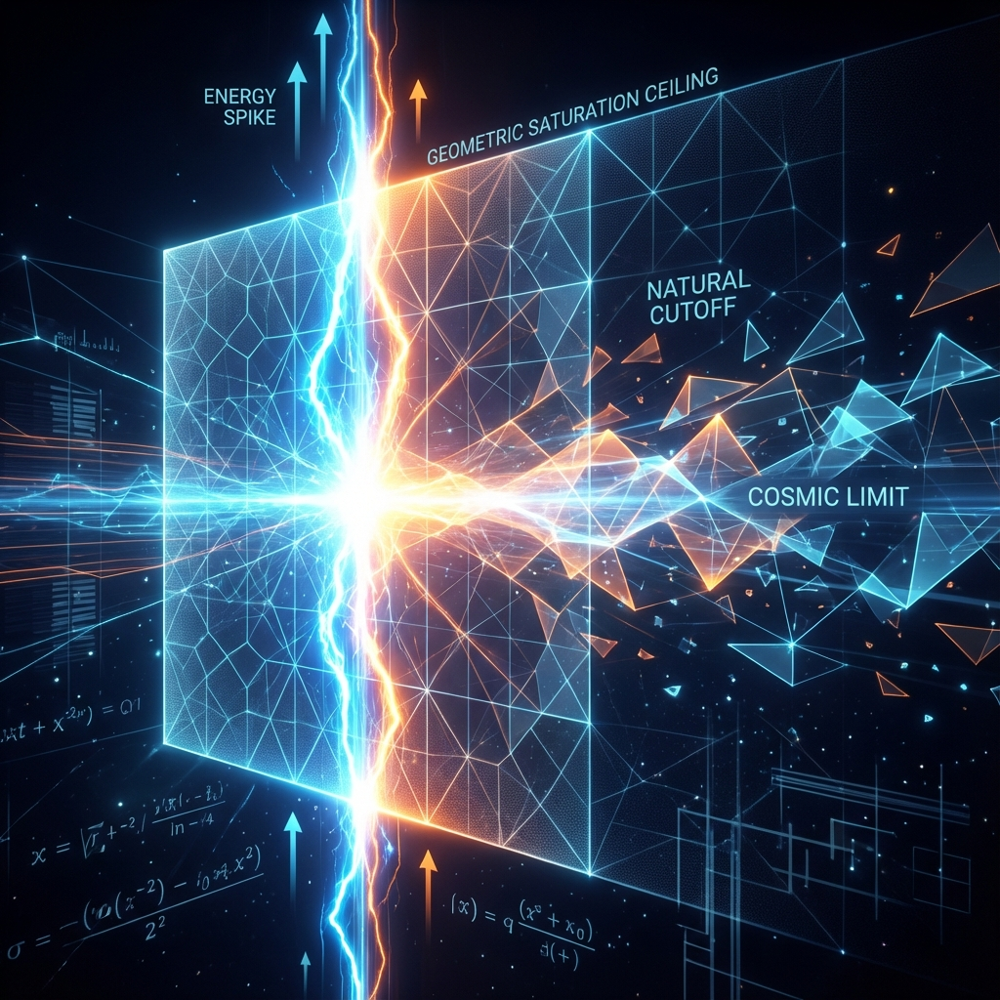

# 8.3 Geometric Saturation

What do physicists fear most? Not black holes, not dark matter, but **infinity**.

In standard quantum field theory, when we calculate interaction forces between two particles approaching infinitely close, or calculate a point electron's self-energy, equations often give absurd results: infinity. This means theory fails at extremely microscopic scales. To patch this hole, physicists invented a complex mathematical magic called "renormalization" (Renormalization), essentially manually subtracting these infinities to get finite observed values.

But this feels like cheating. Is the universe really broken at the bottom?

In our geometric reconstruction, we don't need to cheat. Infinity doesn't appear because our core axiom—**finite bandwidth ($c$)**—not only limits speed, but also limits **existence intensity**.

## The Bandwidth Bottleneck

Let us return to that frantically rotating internal evolution rate $v_{int}$. We have established in previous sections that matter's mass, interaction strength, and resonance sharpness essentially correspond to state vector rotation speed in Hilbert Space.

In standard theory, there's no limit on how fast this rotation can be. If you compress enough energy into small enough space, interaction strength can increase infinitely.

But in our universe, there is an absolute iron law: **Total evolution rate cannot exceed $c$**.

This is like your sound system having a maximum power limit. No matter how desperately the singer screams, once volume exceeds the amplifier's limit, sound doesn't grow infinitely; it gets **clipped** (Clipping). Waveform peaks are flattened; output power reaches saturation.

The universe is the same. When a particle falls into extremely strong interactions (like ultra-high-energy scattering), its internal geometric paths become increasingly tortuous, its $\kappa(\omega)$ value (representing time delay or state density) becomes higher. This means its internal evolution rate $v_{int}$ is soaring.

But when $v_{int}$ tries to approach total bandwidth $c$, it hits the ceiling.

It can't go faster. According to the Pythagorean theorem $v_{ext}^2 + v_{int}^2 = c^2$, external velocity $v_{ext}$ is forced to zero, all resources are occupied. The system enters **geometric saturation** (Geometric Saturation) state.

## Natural Ultraviolet Cutoff

This produces an extremely important physical corollary: **Nature has a natural ultraviolet cutoff** (Natural UV Cutoff).

"Ultraviolet" in physics refers to high-energy, short-distance limits. Traditional theory believes we can probe infinitely small distances. But in our framework, this is like trying to display images smaller than pixels on a screen—impossible.

When interaction energy scales try to exceed this saturation point, evolution vectors in Hilbert Space can no longer "rotate" faster to respond to this energy. So resonance peaks no longer become sharper, but begin to widen and flatten. Physical processes are forcibly "smoothed."

This means:

1.  **No singularities:** Even at black hole centers, or the universe's Big Bang starting point, matter density and energy density cannot reach true infinity. Because "density" is essentially computational operations per unit volume, and this number is locked by $c$.

2.  **No renormalization needed:** We don't need to artificially introduce cutoffs to save theory; geometry itself is the regulator. The universe's bandwidth limit naturally eliminates all mathematical divergences.

## The Universe's Resolution

This brings us profound tranquility.

The universe is not a bottomless abyss; it has a bottom. It has a minimum granularity (pixels) and a maximum processing capacity (bandwidth).

No matter how we bombard vacuum with huge particle colliders, we can never create reality sharper than this bottom limit. When we try to break through this limit, we don't get deeper truth, but **saturated noise**.

Thus far, we have completed exploration of the microscopic world. We see:

* Space is jumping pixels (QCA);

* Particles are ununtiable dead knots (topological defects);

* Interactions are time winding ($\kappa(\omega)$);

* All madness is blocked outside infinity by an invisible wall (geometric saturation).

But how do these microscopic entanglements and knots emerge as that tremendous force pulling galaxies and shaping spacetime at macroscopic scales? Why do apples fall? Why do we feel "pushed" by the ground?

This is not just a mechanics problem; it's about **direction**. Why do all things tend to gather? Why does time have direction?

It's time to enter Part IV—**Geometric Driving Forces**. There, we will transform these cold geometric constraints into thermodynamic and psychological forces driving cosmic evolution. We will discover that so-called "forces" are merely systems' efforts to find the most comfortable posture in this limited universe.

---

*（Next, we will enter Part IV "Geometric Driving Forces," starting from Chapter 9 "Unified Definition of Force," reinterpreting the essence of gravity and driving forces.）*

