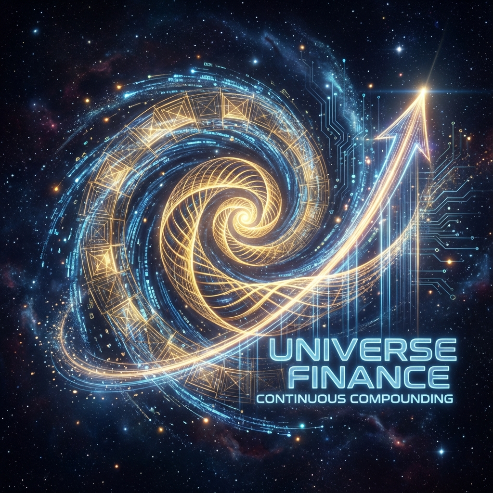

# 1.1 薛定谔的 $e$ (Schrödinger's $e$)

> "为什么宇宙不仅允许时间叠加，还要求这种叠加必须转化为状态的乘积？因为在 $e$ 的逻辑中，每一秒不仅仅是加在上一秒之后，它是从上一秒中'生长'出来的。"

## 物理学的指数依赖

在经典力学中，我们习惯于线性的思考。如果你推一个箱子，它的加速度与力成正比。这是一种加法逻辑。

但在量子力学中，薛定谔方程 $|\dot{\psi}\rangle = -iH|\psi\rangle$ 描述的是一种完全不同的动力学。它告诉我们：**状态的变化率，正比于状态本身。**

这种关系在数学上只有一种解：**指数函数**。

$$|\psi(t)\rangle = e^{-iHt} |\psi(0)\rangle$$

这里，$H$（哈密顿量）扮演了我们在序言中提到的"生成元"的角色。而 $e$，则是将这个生成元"展开"为时间长河的机器。

为什么物理定律必须写成这种形式？

这不仅仅是为了数学上的方便，这是由 **时间的连续性** 和 **因果的累积性** 共同决定的。

## 加法变乘法：群的魔术

让我们做一个思想实验。

假设宇宙演化了 $t_1$ 秒，然后又演化了 $t_2$ 秒。

* 在 **时间** 的维度上，这是一个加法过程：总时间 $T = t_1 + t_2$。

* 在 **状态** 的维度上，这是两次操作的连续作用：$U(T) = U(t_2) \cdot U(t_1)$。

要让这两个逻辑自洽，我们需要一个函数 $f(t)$，满足：

$$f(t_1 + t_2) = f(t_2) \cdot f(t_1)$$

在数学王国中，唯有 **指数函数** 拥有这种将"加法"转化为"乘法"的魔力：

$$e^{A+B} = e^A \cdot e^B$$

（当 $A$ 和 $B$ 对易时）。

这在群论中被称为 **李群与李代数的关系**。

* **时间轴 ($t$)** 是平直的、线性的（李代数参数）。

* **演化算符 ($U$)** 是弯曲的、乘法的（李群元素）。

**$e$ 是连接这两个世界的唯一桥梁。**

它告诉我们，宇宙的演化不是像砌砖那样一块一块地"加上去"的。宇宙的演化是像细胞分裂或者银行利息那样，通过 **"自乘"** 而积累出来的。

当我们在论文中讨论 QCA（量子元胞自动机）的离散更新时，我们写道 $|\Psi_n\rangle = U^n |\Psi_0\rangle$。

注意那个 $n$ 次方。

在微观离散层面，演化是 $U$ 连乘 $n$ 次。

在宏观连续极限下，这个 $(1 + \epsilon)^n$ 的极限，自然就涌现为了 $e^{t}$。

## 连续的复利 (Continuous Compounding)

如果我们将 $c_{FS}$ 视为宇宙的"本金"，将哈密顿量 $H$ 视为"利率"，那么物理演化就是一场 **连续复利 (Continuous Compounding)** 的计算。

* **经典思维**：如果你有 1 块钱，利率是 100%，一年后你有 2 块钱。

* **量子思维 ($e$)**：如果你每时每刻都在结算利息，并且利息立刻变为本金参与下一轮生息，那么一年后你将拥有 $e \approx 2.718$ 块钱。

宇宙选择了后者。

它不等待。它不分期。它在普朗克尺度的每一个生灭刹那，都在进行着这种极限的"利滚利"。

正是这种 **"每一刻都基于上一刻的所有信息进行演化"** 的机制，赋予了物理世界以连续性和因果的厚重感。

## 生成元的物理实体化

在本书的第一部中，我们定义了 FS 速度 $v_{FS} = \Delta K$（生成元的方差）。

现在我们明白了 $K$ 的真正地位。

$K$（或者说 $H$）不是一个被动的描述符，它是 **种子**。

整个宇宙的历史——那条在希尔伯特空间中延绵亿万年的宏大轨迹——实际上都已经被折叠、压缩在了 $t=0$ 时刻的生成元 $H$ 之中。

只要有了 $H$，有了初始状态，再通过 **$e$** 这个解压算法，所有的未来便自动流淌而出。

这让我们对"决定论"有了更深的理解：**宇宙不需要在每一秒都重新做决定。宇宙只需要在开始时定义好它的生成元，剩下的，就交给 $e$ 去自动生成。**

但是，细心的读者会发现，薛定谔的公式里不仅有 $e$，还有一个奇怪的符号——**$i$ (虚数单位)**。

如果没有这个 $i$，宇宙将是一个单纯的指数爆炸（像细菌繁殖一样），所有的预算将瞬间耗尽。

正是因为有了 $i$，指数爆炸被驯服成了 **"旋转"**。

这引出了下一节的主题：**虚数即正交**。我们将看到，为什么宇宙必须在虚数维度上运作，才能维持那完美的守恒与圆。

