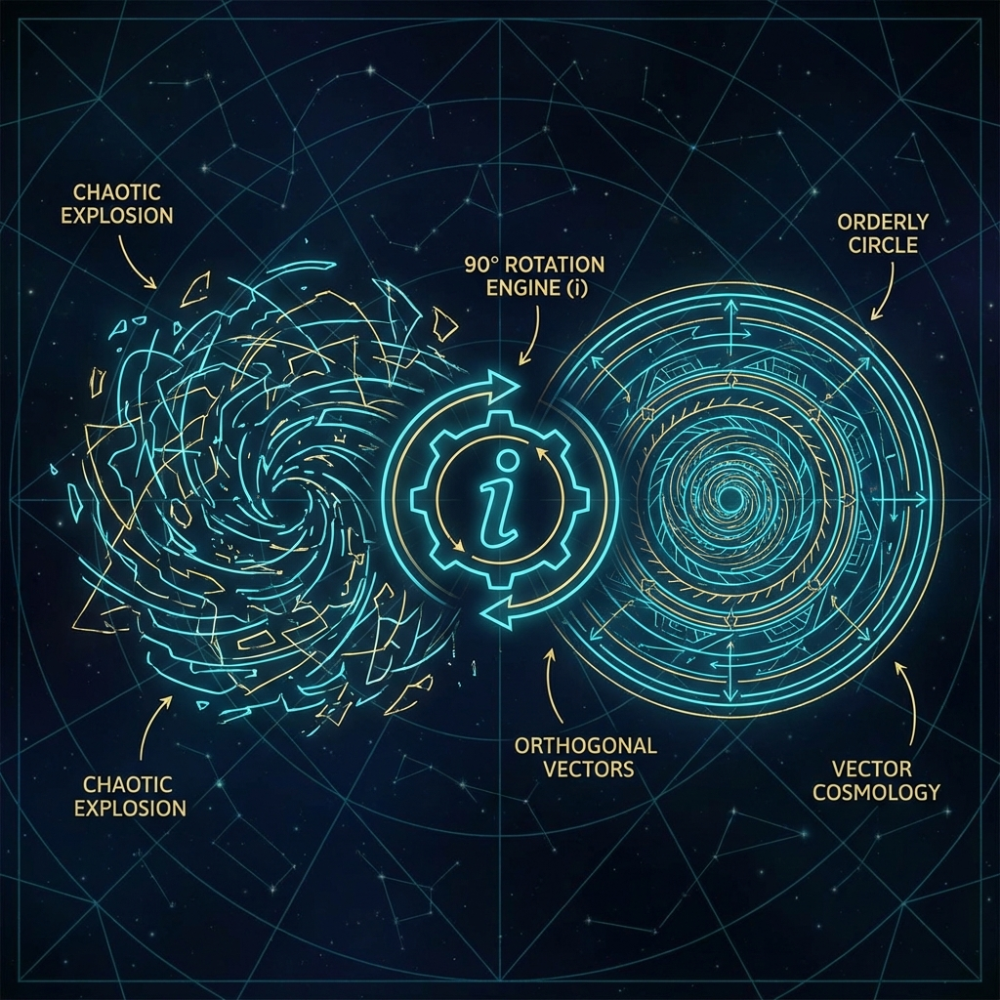

# 1.2 虚数即正交 (Imaginary is Orthogonal)

> "如果宇宙只是一个指数函数，它早就应该自我毁灭了。那个在指数上不起眼的虚数 $i$，是物理学中最伟大的刹车片。它强行扭转了增长的方向，将一场注定崩溃的爆炸，驯化成了一场永恒优雅的旋转。"

在上一节中，我们赞美了 $e$ 的复利机制。它揭示了宇宙是一个"自驱动"的系统。但是，如果这就是全部真相，那么我们面临一个巨大的麻烦。

纯粹的指数增长 $e^t$ 是极其危险的。

如果哈密顿量 $H$ 仅仅是一个实数，那么薛定谔方程 $|\psi(t)\rangle = e^{-Ht} |\psi(0)\rangle$ 描述的将不是波动，而是 **衰变** 或 **爆炸**。系统的总预算 $c_{FS}$ 会在瞬间耗尽，或者膨胀到无穷大。这样的宇宙无法承载任何稳定的结构。

为了让"存在"得以持续，为了让"圆"能够闭合，宇宙引入了一个神秘的几何修正算符。

这就是 **虚数单位 $i$**。

在 **《矢量宇宙论》** 中，$i$ 不是数学家想象出来的幽灵，它是 **正交旋转算符 (Orthogonal Rotation Operator)**。

## 90度的魔法

在复平面上，任何数字乘以 $i$，其几何效果都是 **逆时针旋转 90 度**。

* $1 \times i = i$ （转到了虚轴）

* $i \times i = -1$ （转回了实轴，但方向相反）

这个简单的几何操作，当被放入指数函数 $e^{i\theta}$ 中时，产生了数学史上最深刻的震荡：**欧拉公式** $e^{i\theta} = \cos\theta + i\sin\theta$。

这告诉我们：**带有虚数的指数增长，不再是数量的改变，而是角度的改变。**

回到物理学。薛定谔方程中的那个 $-i$，实际上是宇宙底层的一条 **"强制转向指令"**。

$$|\dot{\psi}\rangle = -i H |\psi\rangle$$

这意味着：**状态矢量的变化率（$|\dot{\psi}\rangle$），必须始终与当前的状态矢量（$|\psi\rangle$）保持垂直（正交）。**

* 如果变化率与状态平行（没有 $i$），矢量就会变长或变短（模长改变）。

* 如果变化率与状态垂直（有 $i$），矢量的长度保持不变，只是方向发生偏转。

这就是 **幺正性 (Unitarity)** 的几何本质。$i$ 是守恒律的守护神。它保证了无论哈密顿量 $H$ 多么巨大，无论演化多么剧烈，全局矢量 $|\Psi\rangle$ 的模长永远锁定为 1。

## 振动是旋转的投影

这一视角彻底刷新了我们对"波动"的理解。

在经典物理中，我们习惯于"振动"的图像：弹簧的来回伸缩，水波的上下起伏。这是一种线性的、实数的振荡。

但在量子力学中，**宇宙不振动，宇宙只旋转**。

当我们看到一个粒子表现出正弦波 $\sin(kx - \omega t)$ 的性质时，我们实际上是看到了一个 **高维复数螺旋** 在实数轴上的投影。

* 那个粒子并没有真的在那儿"抖动"。

* 它的波函数矢量在复数空间中做一个完美的、匀速的圆周运动。

正如我们在第一部书中所述，FS 几何不区分"动"与"静"，只区分"转动"。

所有的能量 $E$，本质上都是 **角速度**。所有的物理演化，都是 $e^{-iHt}$ 驱动的 **相位旋转**。

我们之所以觉得世界充满了波动和周期，是因为我们生活在那个旋转矢量的侧面。

## 守恒与增长的博弈

至此，我们终于看清了 **$e$** 和 **$i$** 的分工。

* **$e$ (指数机制)**：提供了 **"自驱动"** 的动力。它保证了每一刻的演化都基于上一刻的状态，赋予了时间以连续性。

* **$i$ (虚数机制)**：提供了 **"正交性"** 的约束。它强迫这种驱动力不做功（不改变模长），只改变方向。

**没有 $e$，宇宙是一潭死水。**

**没有 $i$，宇宙是一场短暂的爆炸。**

只有当两者结合，我们才得到了那个 **"周行而不殆"** 的完美大圆。

在第二部书中，我们讨论了"螺旋"和"维度膨胀"。在那个图景里，虚数 $i$ 的统治似乎出现了一丝松动（或者说，$H$ 获得了一个微小的非厄米虚部），导致旋转变成了对数螺旋 $e^{(\lambda+i\omega)t}$。

但即便是在那样狂野的飞升中，$i$ 所代表的 **旋转** 依然是主旋律，$\lambda$ 所代表的 **增长** 只是伴奏。

## 结论：垂直的真理

所以，虚数并不虚。它是宇宙中最坚硬的几何实体。

它是那堵墙，挡住了无限膨胀的深渊，迫使时间弯曲成环。

当我们理解了 $i$ 的正交本性，我们就理解了为什么量子力学必须是复数的。因为只有在复数空间里，**"变化"** 才能在不破坏 **"存在"**（模长守恒）的前提下发生。

现在，我们已经掌握了演化的引擎（$e$）和方向盘（$i$）。接下来的问题是：这个引擎驱动着矢量去往何方？

既然宇宙不选择单一的道路，既然波函数弥散在整个空间，那么这无数条可能的轨迹是如何汇聚成我们所看到的唯一历史的？

这引出了下一章的主题：**路径积分**。我们将看到，$e$ 的指数不仅描述了单一的旋转，它还描述了所有可能历史的 **总和**。

