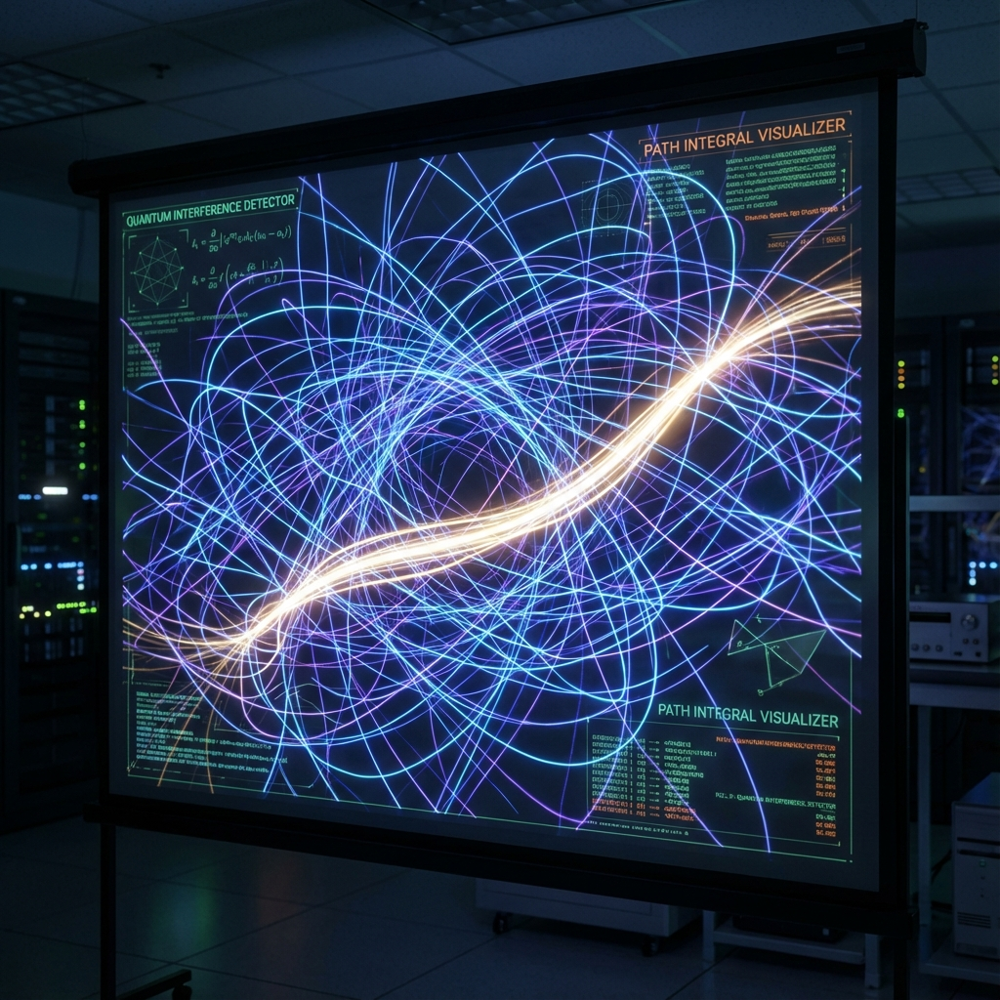

# 2.1 Feynman's Exponential

> "History is not a one-way street; history is a web woven from countless threads. Each thread is a 'possible universe.' The reality we experience is not the solo of one thread, but the resonance of all these threads together."

## Democracy of History

In Newtonian mechanics, nature seems to have a dictator (the principle of least action), which points to that straight line among countless possible paths and says: "Take this one." Other paths are forbidden.

But in quantum mechanics, Feynman discovered an astonishing democratic principle: **All paths are equal.**

* A photon can take a straight line.

* A photon can detour around the moon and come back.

* A photon can even tie a knot in space before reaching its destination.

In Feynman's formula, the total probability amplitude from A to B (i.e., the evolution result of the total vector $|\Psi\rangle$) is the sum of contributions from **all possible paths**:

$$K(B, A) = \sum_{\text{all paths}} C \cdot e^{iS[x(t)]/\hbar}$$

Notice this core structure: **$e^{iS}$**.

We see our old friend again—the **rotating exponential**.

Here, $S$ is the **Action**. It is the physical cost accounting for this segment of "history" (the integral of kinetic energy minus potential energy).

This formula tells us: Every path, no matter how absurd, has the same weight (modulus 1), but different **phases** ($S/\hbar$).

**The universe does not choose paths; the universe traverses paths.**

At every moment, that unique vector is trying all possible futures. Like mercury spilling, it permeates every corner of Hilbert space.

## Phase Interference: The Emergence of Reality

If a photon really takes all paths, why do we only see it taking a straight line?

Why don't we see that photon that detoured around the moon?

The answer lies in **Interference**. This is precisely where the imaginary number $i$ exerts its power.

* **Near the "correct" path**:

    Those paths close to the straight line have very similar action $S$. This means their phase factors $e^{iS}$ point in almost the same direction.

    Vector addition $\rightarrow$ **Constructive interference**. The signal is amplified.

* **Near the "wrong" path**:

    Those absurd paths (like detours) have action $S$ that fluctuates wildly with small path variations. Phase arrows point randomly—some east, some west.

    Vector addition $\rightarrow$ **Destructive interference**. Signals cancel each other out, falling silent.

This is the **emergence mechanism of classical reality**.

There is no law forbidding photons from taking detours. Photons do take detours, but those detour versions mathematically "kill" each other.

Only that path conforming to classical mechanics (the straight line), because of the stability of its phase, **emerges** from the background noise of countless possibilities, becoming the "real" we see.

## $e$ as Holographic Summator

In the macroscopic picture of **Vector Cosmology**, Feynman's $e^{iS}$ has ontological status.

It is the universe's **parallel processor**.

The budget of $c_{FS}$ is not allocated to a specific particle to take a specific path. The budget is allocated to **the entire field**.

* **$e$ (exponential)**: Represents the **unfolding** of possibilities. It generates phantoms of countless parallel universes.

* **$i$ (phase)**: Represents the **screening** of possibilities. Through interference, it collapses phantoms into entities.

The "determined history" we perceive is actually the **vector sum** of countless "undetermined histories."

As long as we don't measure (don't perform artificial budget auditing), these histories coexist.

## Conclusion: No Chance

This chapter reveals another divine aspect of $e$: **Inclusiveness**.

The universe does not play dice, nor does it make choices. The universe is a **complete set**.

When we see an electron passing through a double slit, we are not seeing a particle making a decision; we are seeing a giant interference web unfolded by $e^{iS}$ in space.

This completely eliminates the concept of "chance."

There is no "if only..." hypothesis. In the underlying summation, all possibilities of "back then" have already occurred; it's just that due to phase cancellation, certain branches become macroscopically invisible (amplitude zero).

However, since the classical path (straight line) is the result of phase interference, why is this particular path exactly a "straight line"? Why must the action $S$ take an extremum?

This is not merely the mathematical stationary phase approximation; behind it lies a deeper principle of geometric economics.

This leads to the theme of the next section: **The Compound Interest Interpretation of Least Action**. We will see that light takes a straight line because that is where "compound interest" accumulates fastest. Geometrically "shortest" is economically "maximum profit."

