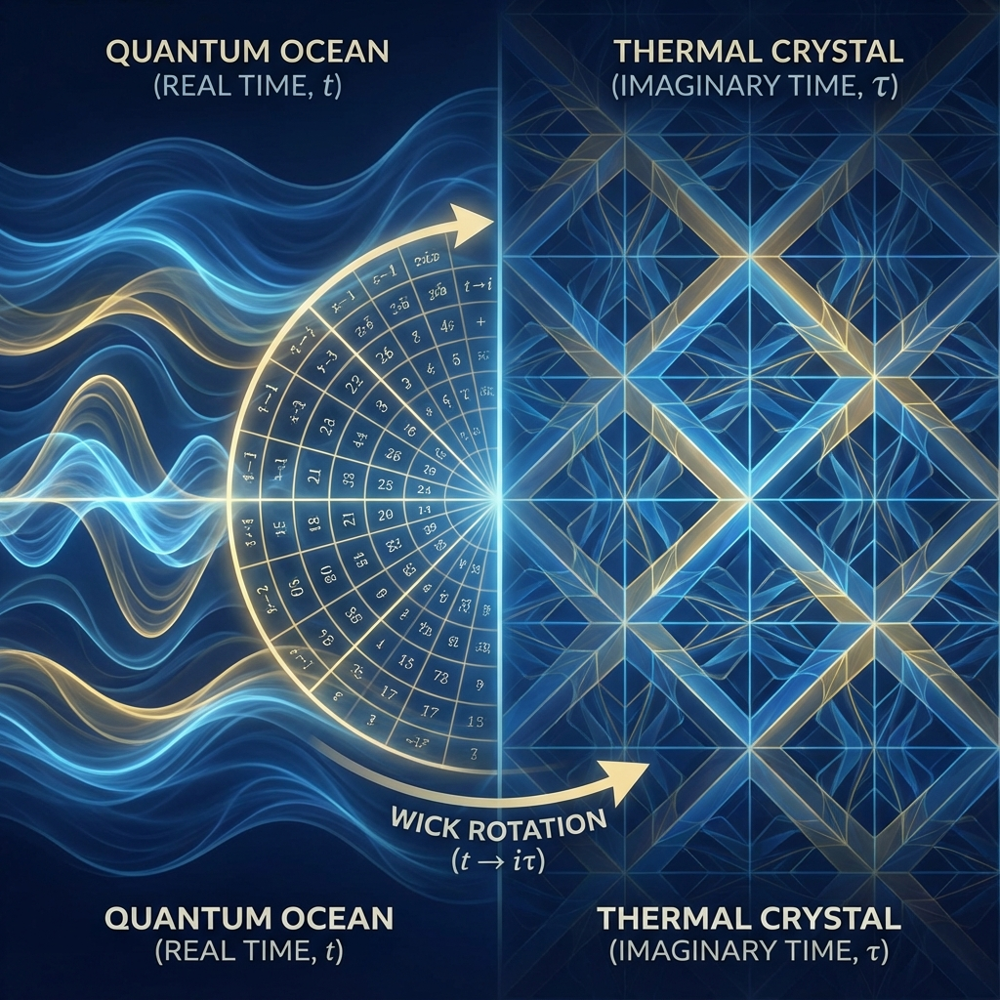

# 5.1 Wick Rotation

> "If we rotate the time axis 90 degrees on the complex plane, that quantum world that was oscillating incessantly suddenly quiets down and freezes into a statistical thermodynamic world. This is not a mathematical game; this is the geometric secret passage to grand unification."

## Coincidence of Two Formulas?

Let us place the two greatest exponential formulas in physics side by side and play a "spot the difference" game.

1.  **Schrödinger Evolution Operator (Quantum Evolution)**:

    Describes the evolution of a quantum state with **time $t$**.

    $$U(t) = e^{-i \frac{H}{\hbar} t}$$

    Here, $i$ is the imaginary unit, meaning this is a **rotation factor** (modulus conserved, phase changes).

2.  **Boltzmann Factor**:

    Describes the statistical distribution of a thermodynamic system at **temperature $T$**. We usually use inverse temperature $\beta = 1/(k_B T)$ to represent it.

    $$\rho(\beta) = e^{- H \beta}$$

    Here there is no $i$, meaning this is a **decay factor** (modulus changes, probability weight distribution).

Please gaze at these two formulas. Their only difference lies in the variable in the exponent:

* One is **$it$ (imaginary time)**.

* One is **$\beta$ (real temperature)**.

Is this merely a symbolic coincidence?

In **Vector Cosmology**, we refuse to believe in coincidences. If two formulas look the same, it means the physical entities behind them are **homologous**.

## Rotating the Time Axis

If we perform a bold operation: rotate the variable "time" from the real axis to the imaginary axis.

Let $t = -i \tau$ (where $\tau$ is called **Euclidean time** or **imaginary time**).

Substituting into the Schrödinger formula:

$$U(t) = e^{-i H (-i \tau)} = e^{-H \tau}$$

A miracle occurs. That quantum formula describing waves instantly becomes the Boltzmann formula describing thermal distribution!

As long as we let $\tau = \beta$ (i.e., imaginary time length equals inverse temperature), quantum mechanics **becomes** thermodynamics.

This mathematical operation is called **Wick Rotation**.

It establishes a one-to-one mapping between Minkowski spacetime (spacetime with light cones and causality) and Euclidean space (pure spatial geometry).

## Geometric Definition of Temperature

This discovery completely reshapes our understanding of **temperature**.

In classical physics, temperature is the intensity of molecular motion.

But from the underlying perspective of FS geometry, **temperature is the time period in the imaginary dimension**.

* **Heat (Thermal)** is not a form of chaotic energy.

* **Heat (Thermal)** is the "distance" traveled by the system evolving along the **imaginary time axis**.

This explains why quantum field theory must use imaginary time techniques when calculating black hole entropy or vacuum fluctuations. Because in that limiting state, real physical time ($t$) and thermodynamic temperature ($\beta$) have become entangled and cannot be distinguished.

## Hawking's No-Boundary Universe

Stephen Hawking used this concept to propose the "no-boundary universe" model. He believed that in the very early universe (Planck era), time itself underwent Wick rotation, becoming a pure spatial dimension.

* There is no "beginning," nor is there a "singularity."

* The beginning of the universe is as smooth as the South Pole of Earth.

In our **Natural Generator** framework, this receives a new interpretation:

The noumenon of the universe is a **Holomorphic Function** defined on the complex domain.

* When we slice along the **real axis**, we see **time passing** (quantum evolution).

* When we slice along the **imaginary axis**, we see **thermal equilibrium** (statistical distribution).

The reason we perceive the world as "cold" (with a definite temperature) and "moving" (with passing time) is because there is a specific angle between our observation slice and this high-dimensional complex manifold.

## Conclusion: Two Sides of a Coin

Wick rotation tells us that $e$ is the hub connecting two worlds.

* **$e^{ix}$ (wave/circle)**: This is the world of Book I. Conserved, coherent, eternal motion.

* **$e^{-x}$ (decay/spiral)**: This is the world of Book II. Dissipative, probabilistic, thermodynamic arrow.

They are not opposing physical laws; they are projections of the same exponential function $e^z$ in different directions on the complex plane.

**Quantum mechanics is imaginary thermodynamics.**

**Thermodynamics is imaginary quantum mechanics.**

Since temperature and time are mathematically interchangeable, this raises a deeper question: **Which generates which?**

Does time passing cause heat (entropy increase), or does heat (statistical state) generate time?

This leads to the theme of the next section: **Unification of Geometry and Heat**. We will see that at that ultimate level ruled by $e$, physics no longer distinguishes between "evolution" and "distribution"; they are unified in the same **Modular Flow**.

