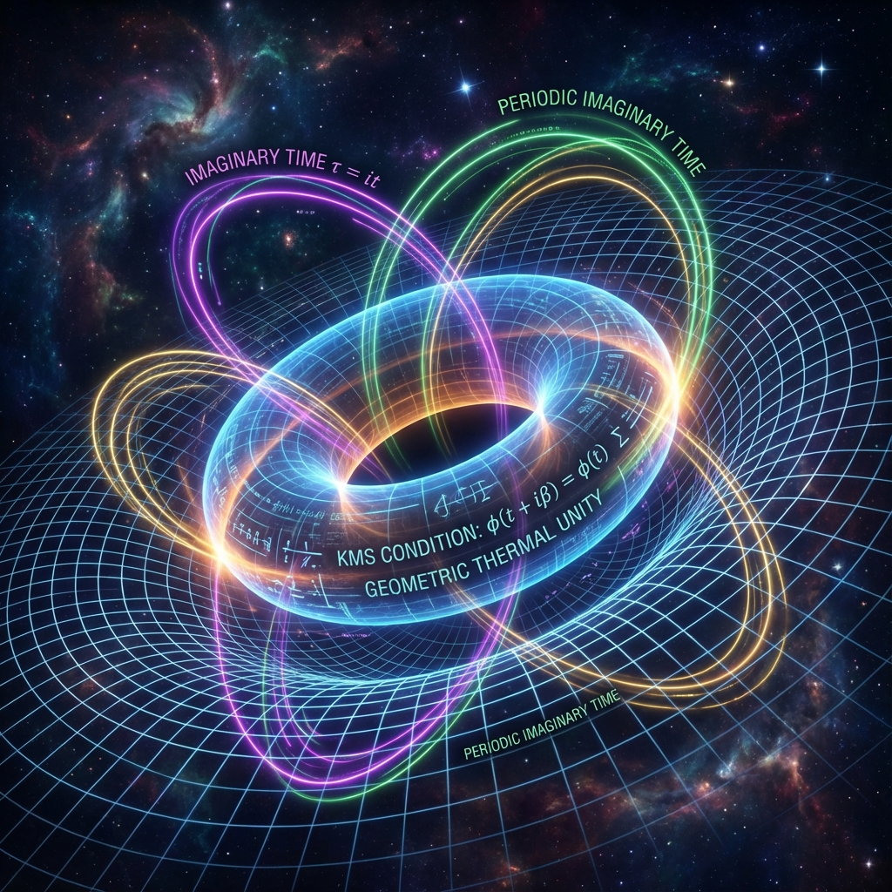

# 5.2 几何与热的统一 (Geometric and Thermal Unity)

> "我们曾以为只有钟表才有周期，而热只是一团混乱的噪声。但几何学告诉我们，热也是一种周期——只不过它是发生在虚数维度上的循环。当我们把宇宙这张纸折叠起来，时间就变成了温度。"

在上一节中，我们通过威克转动揭示了量子力学 ($e^{-iHt}$) 与统计力学 ($e^{-\beta H}$) 在数学形式上的镜像对称。但这仅仅是一个开始。这种对称性并不只是一种巧合，它暗示了物理学中或许最深刻的一个真理：**动力学（演化）与统计学（分布）在本质上是全等的。**

本节将探讨 **KMS 条件 (Kubo-Martin-Schwinger Condition)** 的物理哲学含义。我们将看到，在这个 $e$ 统治的复数宇宙中，**几何结构**（时空）与 **热力学性质**（温度）不仅是统一的，它们甚至是互为定义的。

## KMS 条件：连接两界的罗塞塔石碑

在 20 世纪中叶，物理学家久保亮五 (Kubo)、马丁 (Martin) 和施温格 (Schwinger) 发现了一个令人惊讶的量子场论性质。

对于一个处于热平衡态（温度为 $T = 1/k_B\beta$）的量子系统，其关联函数展现出一种奇怪的 **周期性**。

如果我们将时间 $t$ 视为一个复数变量，那么在这个复平面上，系统的状态并不是杂乱无章的，而是在虚数方向上呈现出周期为 **$i\beta$** 的循环。

这就是 **KMS 条件**。它用最严谨的数学语言宣判了：

**一个处于热平衡态 $\beta$ 的系统，等价于一个在虚时间方向上具有周期 $\beta$ 的动力学系统。**

* **物理翻译**：

    * **什么是"热"？** 热不是分子的随机碰撞。在底层的几何视角下，热意味着宇宙在虚数时间轴上打了一个 **"结"**（Loop）。

    * **什么是"温度"？** 温度就是这个结的 **周长**（或者说半径的倒数）。温度越高 ($\beta$ 越小)，虚时间的圆环就越小，演化的周期就越快。

这彻底颠覆了我们对"冷"与"热"的直觉。

绝对零度 ($T=0, \beta \to \infty$) 意味着虚时间轴是一条无限长的直线（没有循环）。

而普朗克温度（极热）意味着虚时间轴卷曲成了一个半径为普朗克长度的极小微环。

## 黑洞的几何温度

这一理论最有力的证据来自于 **黑洞物理学**。

斯蒂芬·霍金在计算黑洞辐射时，并没有使用经典的热力学，而是使用了几何学。

在黑洞视界附近，时空度规发生了极度的扭曲。如果我们对这个度规执行威克转动（$t \to i\tau$），原本的双曲几何（闵可夫斯基空间）变成了椭圆几何（欧几里得空间）。

在这个欧几里得空间中，为了避免视界处出现锥形奇点（Conical Singularity），虚时间坐标 $\tau$ 必须是 **周期性** 的。

就像地球的经度线在极点汇聚一样，虚时间线在视界处必须闭合。

霍金惊奇地发现，这个几何上必须存在的周期 $\beta_{geom}$，竟然精确地等于黑洞的 **霍金温度的倒数**！

$$\beta_{geom} = \frac{1}{T_{Hawking}}$$

这是物理学史上最高光的时刻之一：

* **几何**（周长）直接决定了 **热**（温度）。

* 一个纯粹的几何体（黑洞），仅仅因为其时空结构的拓扑闭合，就必然辐射出热量。

这证明了 **《矢量宇宙论》** 的核心猜想：**热不是能量的一种形式，热是时空几何的一种形状。**

## 复数平面的全貌

至此，我们可以构建出一个统一的 **复数时空图景**。

宇宙的本体是一个定义在复数域上的 **全纯流形 (Holomorphic Manifold)**。

这个流形本身是静止的、完美的、自洽的。它包含了所有的 $e$ 指数关系。

我们作为观察者，只是在这个流形上切了一刀（选择了我们的时间轴）。

* **切其实轴 ($t$)**：我们看到了 **幺正演化**。波函数在震荡，相位在旋转，历史在生成。这是 **量子力学** 的世界。

* **切其虚轴 ($it$)**：我们看到了 **统计分布**。系统在玻尔兹曼权重下排列，呈现出温度和熵。这是 **热力学** 的世界。

**时间是复数的温度，温度是虚数的时间。**

它们就像是一个圆柱体的"高"和"周长"。你不能说高比周长更真实，它们只是同一个几何体在不同维度上的度量。

## 结论：没有随机，只有维度

通过 KMS 条件和 $e$ 的复数性质，我们消除了物理学中最大的敌人——**随机性**。

热力学中的"随机热运动"，在虚数维度上被还原为了"确定性的几何循环"。

这意味着，在这个自然的生成元 $e$ 的统御下，宇宙没有任何一部分是混沌的。

即使是最无序的热辐射，在上帝（或者高维观察者）的眼中，也是结构精密的几何晶体。

既然时间和温度是可以互换的几何属性，那么这就引出了一个更加激进的问题：**时间到底是从哪里来的？**

如果时间只是复平面上的一个方向，那么是谁决定了我们的宇宙必须沿着"实轴"演化，而不是沿着"虚轴"冻结？

这引出了下一章的主题：**模流假说**。我们将探讨一个足以撼动物理学根基的观点——**时间不是外在的参数，时间是由量子态本身"分泌"出来的。**

