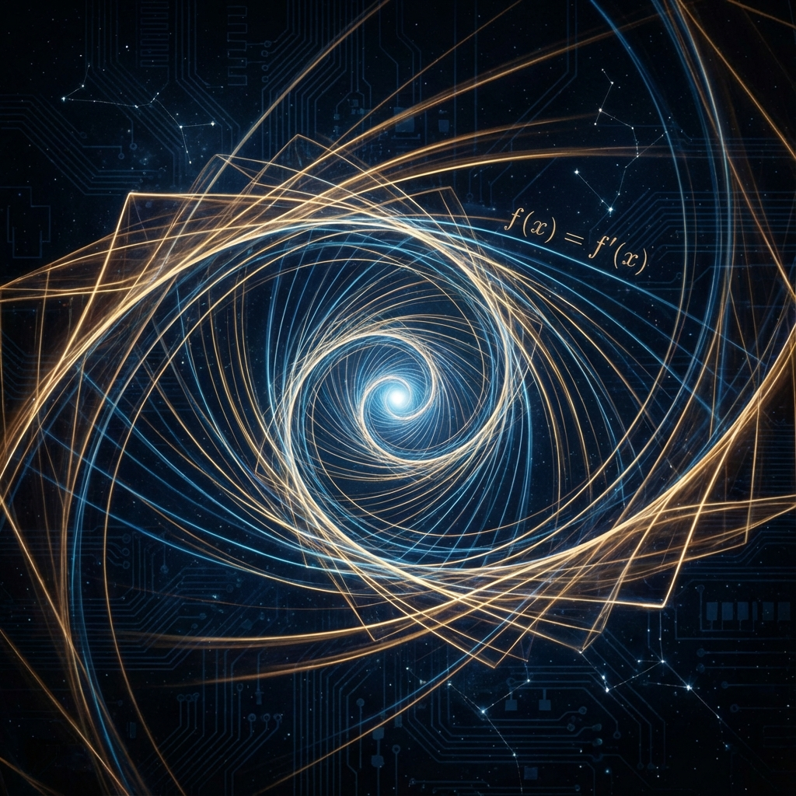

# 0.2 The Nature of Change

> "Why, among all functions, does $e^x$ alone possess such a nearly divine privilege: its derivative equals itself? This means that only in the logic of $e$, 'what is' and 'what will become' are the same thing."

In the first section of the prologue, we showed how Euler's formula weaves $\pi$ and $i$ together using $e$. Now, we need to dig deep into the physical soul of this base—the **Natural Constant $e$**.

Why is it called "natural"? Why do physicists repeatedly turn to this number when describing decay, waves, thermal distributions, and quantum evolution?

The answer lies hidden in the most fundamental definition of calculus.

## Derivative as Noumenon

In mathematics, to measure the "rate of change" of something, we need to take the derivative. For the vast majority of functions, the derivative is fundamentally different from the original function.

* The derivative of $x^2$ is $2x$. The shape changes.

* The derivative of $\sin(x)$ is $\cos(x)$. The phase changes.

Only the exponential function $f(x) = e^x$ possesses a unique property:

$$\frac{d}{dx} e^x = e^x$$

This simple equation contains the deepest secret of cosmic dynamics: **State is Trend**.

In the world of $e$, an object's current **"height" (Value)** directly determines its **"slope" (Slope)** toward the future. It doesn't need to inquire about external forces, nor does it need to consult historical records. Merely through "existence," it automatically generates "change."

## Existence as Propulsion

This completely overturns our classical intuition about causality.

In Newton's mechanical universe, objects are lazy. Without an external force ($F$) pushing them, they remain at rest or in uniform rectilinear motion. **Existence (Mass)** and **Change (Acceleration)** are separate, requiring a third party (force) to connect them.

But at the foundation of quantum mechanics—that is, in the projective Hilbert space described by **Vector Cosmology**—the universe follows the Schrödinger equation:

$$|\dot{\Psi}\rangle = -iH |\Psi\rangle$$

Notice the structure of this equation: the left side is the rate of change ($|\dot{\Psi}\rangle$), and the right side is the state itself ($|\Psi\rangle$) multiplied by a generator ($H$).

This is precisely the form of the differential equation $\dot{y} = ky$, whose solution must be an exponential function:

$$|\Psi(t)\rangle = e^{-iHt} |\Psi(0)\rangle$$

This means that at the most fundamental level, **the universe does not need a "First Mover"**.

The universe does not need God to push it from behind, nor does it need the Big Bang as a one-time winding. Because the essence of the universe is **$e$**.

**Existence itself is a form of propulsion**.

As long as the universe "is" there ($|\Psi\rangle \neq 0$), it must necessarily "move" ($|\dot{\Psi}\rangle \neq 0$). Its ontological status contains its own dynamic tendency. It spontaneously, continuously, and inexorably generates the next state from the current state.

## Self-Driven Universe

This is why we call $e$ the **"Natural Generator"** in the third book.

It is the highest mathematical-analytical expression of the universe's **Self-Reference** property.

* **$\pi$ (Book I)** tells us what shape the universe is (circle).

* **$\varphi$ (Book II)** tells us in what direction the universe grows (spiral).

* **$e$ (Book III)** tells us **why** the universe moves—because it is an engine fueled by itself.

This property of "derivative equals self" eliminates the binary opposition between "motion" and "rest."

In the logic of $e$, rest is just a special form of change (exponential with growth rate 0), and intense evolution is just a natural extension of existence.

## Unifying Circle and Spiral

At this point, we have finally found the meta-logic that governs the first two books.

The **circle** (periodic oscillation) we debated in Book I is actually just the case when the exponent of the exponential function is **imaginary** ($e^{ix}$);

The **spiral** (exponential growth) we debated in Book II is actually just the case when the exponent of the exponential function is **complex** ($e^{(\lambda+i\omega)t}$).

Whether it's the conserved circle or the ascending spiral, they are all just different manifestations of **$e$**, the ultimate generator, under different parameters.

The history of the universe is a continuous compound interest calculation driven by $e$.

Now, we have obtained this key. We need to use it to open the door to the deepest depths of quantum mechanics. If the universe is truly an exponential function, what does that imaginary number **$i$** in the exponent position actually mean? Why must "real" physical evolution be driven through an "imaginary" dimension?

This leads to the theme of Volume I: **The Engine of Imaginary Numbers**. We will see that rotation is the most fundamental motion of the universe, and the imaginary number $i$ is precisely the geometric operator that makes rotation possible.

