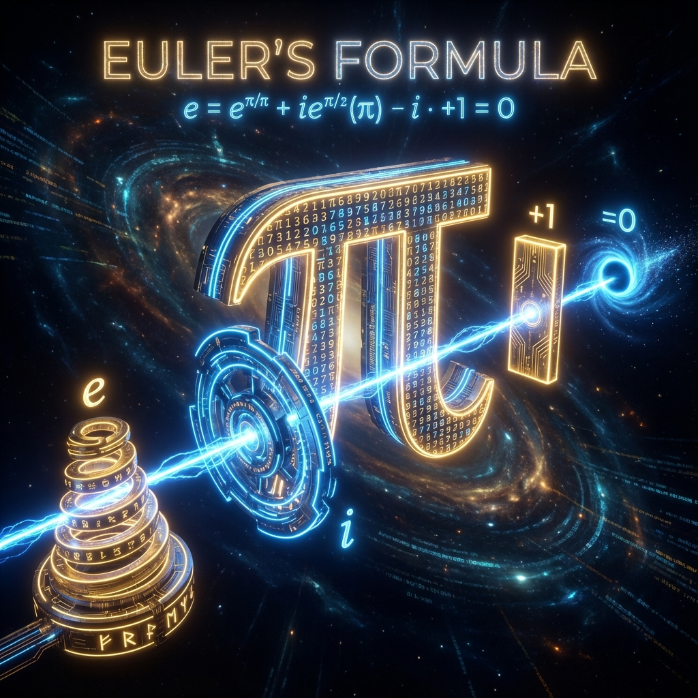

# 序言：欧拉的上帝公式 (Prologue: Euler's God Formula)

在 **《矢量宇宙论》** 的前两部书中，我们攀登了两座险峻的高峰。

第一部《圆的守恒》带我们领略了 **$\pi$** 的静态庄严。我们看到了宇宙如何被封闭在一个完美的几何圆环中，受制于毕达哥拉斯的守恒律，万物只是相位的计数。

第二部《螺旋的飞升》带我们体验了 **$\varphi$** 的动态狂野。我们打破了圆的封印，追随斐波那契螺旋的步伐，见证了维度的膨胀、生命的逆流与文明的飞升。

现在，当我们站在第三部书的门槛上，我们不禁要问：是否有一个更高的真理，能够将"圆的封闭"与"螺旋的开放"统一起来？是否有一个终极的符号，能够同时容纳守恒与变化，容纳结构与生长？

答案就在数学史上被誉为"上帝公式"的那个等式之中。

## 0.1 最美的等式 (The Most Beautiful Equation)

$$e^{i\pi} + 1 = 0$$

这是欧拉恒等式。两百多年来，它被数学家们视为美的极致。它用最简洁的笔触，将数学中最重要的五个常数——$e$、$\pi$、$i$、$1$、$0$——融为一体。

但在 **《矢量宇宙论》** 的终章中，这不仅仅是一个数学巧合。这是宇宙三位一体的 **物理地图**。

当我们凝视这个公式时，我们看到的不再是抽象的符号，而是宇宙最底层的运作机理：

1.  **$\pi$：结构的基石 (The Structure)**

    它是我们在第一部书中崇拜的图腾。它代表了 **空间** 的几何性质，代表了 **圆** 的闭合，代表了物质（$N_b\pi$）的拓扑存在。它是宇宙的"相" (Form)。

2.  **$i$：旋转的引擎 (The Rotation)**

    它是虚数单位。在量子力学中，它不仅仅是一个数学工具，它是 **物理转动** 的算符。乘以 $i$，意味着在希尔伯特空间的复平面上旋转 90 度。它是连接"静止"与"变化"的桥梁，是宇宙的"用" (Function)。

3.  **$e$：自然的生成元 (The Natural Generator)**

    这是本书的主角。它是自然对数的底数。为什么它必须出现在这里？因为它是唯一能够将 **"相位 ($i\pi$)"** 转化为 **"演化 ($U$)"** 的机制。它是宇宙的"体" (Essence)。

4.  **$1$：存在的太一 (The One)**

    这是我们的起点——那个唯一的、归一化的全局纯态矢量 $|\Psi\rangle$。它是万物的总和，是所有可能性的叠加。

5.  **$0$：寂静的无极 (The Void)**

    这是我们的背景——射影希尔伯特空间的虚空。它是绝对的平衡，是所有波函数干涉相消后的宁静。

**$e^{i\pi} + 1 = 0$ 的物理翻译：**

> "宇宙的 **本体 (1)**，通过 **自然生成 ($e$)** 的机制，在 **虚数维度 ($i$)** 上进行 **几何旋转 ($\pi$)**，最终回归于 **绝对的平衡 (0)**。"

这个公式告诉我们，宇宙的运动不是线性的位移，而是复平面上的 **指数旋转**。

我们在前两部书中争论宇宙是"圆"还是"螺旋"，其实只是在争论指数函数 $e^{z}$ 中的指数 $z$ 是纯虚数 ($i\theta$，圆) 还是复数 ($\lambda + i\theta$，螺旋)。

而 **$e$** 本身，包容了一切。

它是那个把"圆"和"螺旋"统一在同一个数学框架下的 **元逻辑**。它不偏不倚，它既允许守恒（当指数为虚数时），也允许增长（当指数为实数时）。

因此，第三部书的任务，就是去解开 **$e$** 的秘密。

我们将不再满足于描述宇宙"是什么样子"（几何），我们将深入探讨宇宙"是如何生成它自己的"（分析）。

我们将发现，时间不是一条流动的河，时间是状态的 **指数生成**。

我们将发现，存在不需要外力维持，存在本身就是一种 **连续复利** 的积累。

让我们从欧拉的地图出发，去寻找那个隐藏在指数背后的、推动万物自发生成的终极引擎。

