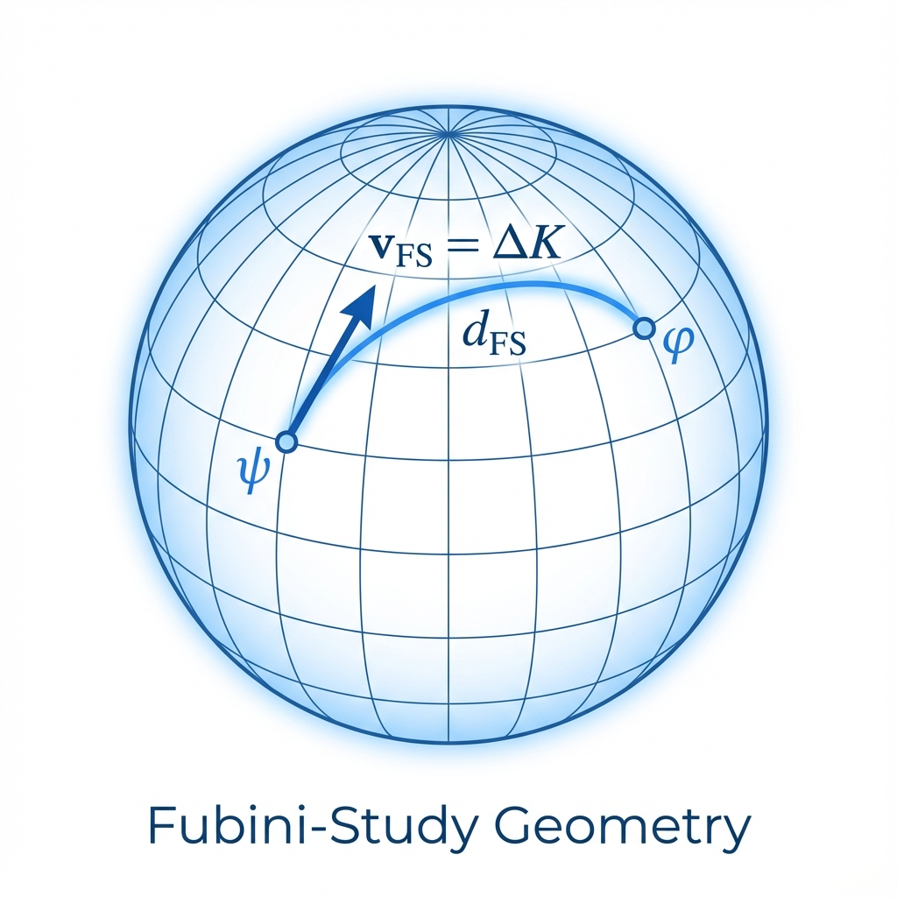

# Appendix A: Fubini-Study Metric and Velocity Formula

In the main text, we constructed a grand physical picture: the universe is a vector evolving in projective Hilbert space, constrained by a constant information-velocity budget. To ensure this picture does not remain merely at the level of philosophical metaphor, we need to show its underlying mathematical skeleton.

This appendix will define the Fubini-Study (FS) metric in detail, derive the FS velocity formula, and clarify the strict quantitative relationship between it and the microscopic Lieb-Robinson velocity. This is the mathematical foundation supporting the "Pythagorean identity" throughout the book.

## A.1 Projective Space and Distance Definition

The physical state space we discuss is not ordinary Hilbert space $\mathcal{H}$, but **Projective Hilbert Space ($P(\mathcal{H})$)**. This is because in quantum mechanics, two state vectors $|\psi\rangle$ and $e^{i\theta}|\psi\rangle$ differing only by a global phase factor represent the same physical state.

The FS metric is the unique natural, unitary-invariant Riemannian metric on $P(\mathcal{H})$. For two normalized pure state vectors $|\psi\rangle$ and $|\phi\rangle$ in $\mathcal{H}$ (i.e., $\langle\psi|\psi\rangle = \langle\phi|\phi\rangle = 1$), the **FS distance** between their corresponding points $[\psi]$ and $[\phi]$ in projective space is defined as:

$$d_{FS}([\psi], [\phi]) = \arccos\left( |\langle\psi|\phi\rangle| \right)$$

This distance has intuitive geometric meaning: it measures the "distinguishability" between two quantum states. If two states completely coincide ($|\langle\psi|\phi\rangle|=1$), the distance is 0; if two states are orthogonal ($|\langle\psi|\phi\rangle|=0$), the distance is $\pi/2$.

## A.2 The Relationship Between FS Velocity and Variance

Consider a differentiable curve $\lambda \mapsto |\psi(\lambda)\rangle$ parameterized by $\lambda$. This represents the universe's evolution trajectory over time. On this trajectory, the **FS velocity** $v_{FS}^{(\lambda)}$ is defined as the FS norm of the tangent vector:

$$v_{FS}^{(\lambda)} = \left\| \frac{d}{d\lambda}\psi(\lambda) \right\|_{FS}$$

The specific calculation formula is:

$$||\partial_{\lambda}\psi||_{FS}^2 = \langle\partial_{\lambda}\psi|\partial_{\lambda}\psi\rangle - |\langle\psi|\partial_{\lambda}\psi\rangle|^2$$

In quantum mechanics, evolution is usually driven by a self-adjoint operator (generator) $K(\lambda)$ satisfying the Schrödinger equation form:

$$\frac{d}{d\lambda}|\psi(\lambda)\rangle = -iK(\lambda)|\psi(\lambda)\rangle$$

Substituting this into the velocity formula, we obtain a crucial physical conclusion: **FS velocity strictly equals the standard deviation (uncertainty) of the generator**.

$$v_{FS}^{(\lambda)} = \Delta K(\lambda) = \sqrt{\langle K^2 \rangle - \langle K \rangle^2}$$

This explains why we repeatedly emphasize "velocity is variance" in the main text. When the universe evolves, how fast it runs in geometric space depends entirely on the energy fluctuation $\Delta H$ of its driving Hamiltonian. For eigenstates ($\Delta H = 0$), FS velocity is zero, geometric time stops—this is the mathematical definition of "static."

## A.3 Physical Units and Calibration with Lieb-Robinson Velocity

Throughout the book, we use an abstract constant $c_{FS}$ as the universe's total budget. In actual physical models, this constant is not arbitrarily chosen but determined by microscopic discrete structure.

In a **Quantum Cellular Automaton (QCA)** model with lattice spacing $a$ and update time step $\Delta t$, the maximum physical speed of information propagation in space (Lieb-Robinson velocity) is:

$$v_{LR}^{(phys)} = \frac{a}{\Delta t}$$

Correspondingly, the maximum FS velocity in projective Hilbert space (i.e., our $c_{FS}$) is calibrated as:

$$c_{FS}^{max} = \frac{2\pi}{\Delta t}$$

The relationship between them is:

$$c_{FS}^{max} = \frac{2\pi}{a} v_{LR}^{(phys)}$$

This relationship reveals dimensional conversion:

* $v_{LR}^{(phys)}$ is **spatial velocity** (meters/second).

* $c_{FS}$ is **information capacity** or **frequency** (1/second).

When we speak of "speed of light limit," geometrically we actually mean the universe's "maximum information update frequency" is finite. In the derivations of the main text, for simplicity, we usually choose natural units ($\hbar=1, a=1$), making $c_{FS}$ proportional to $v_{LR}$ in value, thus unifying macroscopic and microscopic descriptions.

## A.4 Intrinsic Time $\tau$

Finally, we define the **Intrinsic Time $\tau$** used throughout the book. This is a special parameterization choice that makes the FS velocity along the trajectory constant at $c_{FS}$:

$$||\partial_{\tau}\psi(\tau)||_{FS} \equiv c_{FS}$$

Under this parameterization, the relationship between any other physical parameter $\lambda$ (such as laboratory time $t$) and intrinsic time $\tau$ is given by the chain rule:

$$\frac{d\tau}{d\lambda} = \frac{v_{FS}^{(\lambda)}}{c_{FS}} = \frac{\Delta K(\lambda)}{c_{FS}}$$

This formula is the mathematical parent of all "time dilation" and "time delay" effects in the book. It tells us: the rate at which any physical clock runs depends on that clock's ability to consume budget $\Delta K$ in FS geometry.

