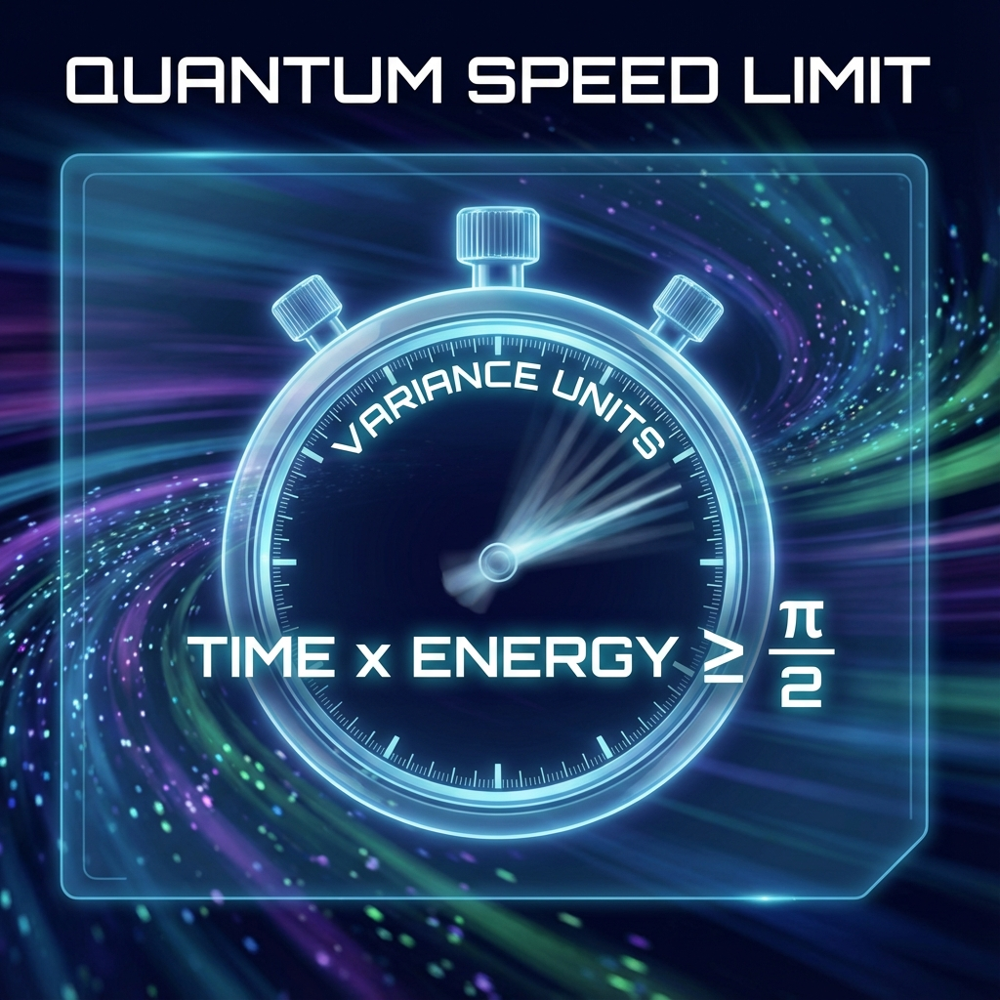

# 附录 B：量子速度极限的几何推导 (Appendix B: Geometric Derivation of Quantum Speed Limits)

在正文的第 2 章"速度的贫困"和第 10 章"熵限速公理"中，我们反复利用了一个核心结论：系统的演化速度受限于其能量（或生成元）的方差。物理变化不能无限快地发生，它受到严格的 **量子速度极限 (Quantum Speed Limits, QSL)** 的制约。

本附录将基于 Fubini-Study 几何，给出这些速度极限的严格数学推导。我们将证明，曼德尔斯坦-塔姆 (Mandelstam-Tamm) 类型的界限不仅仅是能量-时间不确定性原理的体现，更是黎曼几何中"两点之间直线最短"这一公理的直接推论。

## B.1 从方差到距离

考虑一个由参数 $\lambda$（可以是任意物理时间参数）描述的量子演化过程。其状态矢量 $|\psi(\lambda)\rangle$ 遵循广义薛定谔方程：

$$\frac{d}{d\lambda}|\psi(\lambda)\rangle = -iK(\lambda)|\psi(\lambda)\rangle$$

其中 $K(\lambda)$ 是驱动演化的自伴算符（生成元）。

根据附录 A 的结论，沿此轨迹的瞬时 FS 速度严格等于生成元的标准差：

$$v_{FS}^{(\lambda)} = \Delta K(\lambda) = \sqrt{\langle K^2 \rangle - \langle K \rangle^2}$$

我们要计算从参数 $\lambda_0$ 到 $\lambda_1$ 期间，系统在射影希尔伯特空间中走过的 **FS 路径长度 (FS Length)**。这可以通过对速度进行积分得到：

$$L_{FS}(\lambda_0, \lambda_1) = \int_{\lambda_0}^{\lambda_1} v_{FS}^{(\lambda)} d\lambda = \int_{\lambda_0}^{\lambda_1} \Delta K(\lambda) d\lambda$$

## B.2 几何界限的推导

在黎曼几何中，连接两点 $[\psi(\lambda_0)]$ 和 $[\psi(\lambda_1)]$ 的最短路径是测地线。因此，系统实际走过的路径长度 $L_{FS}$ 必然大于或等于这两点之间的 **FS 距离 (FS Distance)** $d_{FS}$：

$$d_{FS}([\psi(\lambda_0)], [\psi(\lambda_1)]) \le \int_{\lambda_0}^{\lambda_1} \Delta K(\lambda) d\lambda$$

如果假设在整个演化过程中，生成元的方差有一个最大值 $\Delta K_{max}$，我们就可以将积分放大，得到一个简单的不等式：

$$d_{FS} \le \Delta K_{max} \cdot |\lambda_1 - \lambda_0|$$

重新排列这个公式，我们得到了关于时间间隔的下界：

$$|\lambda_1 - \lambda_0| \ge \frac{d_{FS}([\psi(\lambda_0)], [\psi(\lambda_1)])}{\Delta K_{max}}$$

这就是著名的 **量子速度极限 (QSL)** 的无参数几何形式。

它告诉我们：**要让一个量子系统改变其状态（即走过距离 $d_{FS}$），必须消耗一定的"方差资源" ($\Delta K$) 和"时间资源" ($|\lambda_1 - \lambda_0|$) 的乘积。** 如果系统的能量方差很小（"贫穷"），它就必须花费漫长的时间才能完成演化。

## B.3 内禀时间与实验室时间的关系

现在，我们将这个不等式应用到 **《矢量宇宙论》** 的核心架构中。

引入 **内禀时间 $\tau$** 的定义，即选择参数使得 FS 速度恒定为宇宙总预算 $c_{FS}$：

$$||\partial_{\tau}\psi(\tau)||_{FS} = c_{FS}$$

利用链式法则 $d\tau/d\lambda = v_{FS}^{(\lambda)}/c_{FS}$，我们可以建立任意物理时间参数 $\lambda$（如实验室时间 $t$）与内禀时间 $\tau$ 之间的严格换算关系：

$$d\lambda = \frac{c_{FS}}{\Delta K(\lambda)} d\tau$$

积分这个关系式，我们得到两个时间流逝量的联系：

$$\lambda_1 - \lambda_0 = \int_{\tau_0}^{\tau_1} \frac{c_{FS}}{\Delta K(\lambda(\tau))} d\tau$$

这个积分公式是全书所有"时间相对性"现象的数学根源。

* **时间膨胀**：如果 $\Delta K$（例如内部质量能隙）变小，分母变小，为了走完同样的内禀距离 $d\tau$，所需的外部时间 $d\lambda$ 就会变大（时间膨胀）。

* **光子的永恒**：对于光子，$\Delta K \to 0$（在质量扇区），这意味着 $d\lambda \to \infty$。即在其自身坐标系中有限的一瞬间，对应了外部世界无限长的时间。

通过这个推导，我们证明了相对论效应并不是时空背景的弯曲，而是系统在 **"方差-时间"交易市场** 中遵循几何守恒律的必然结果。

