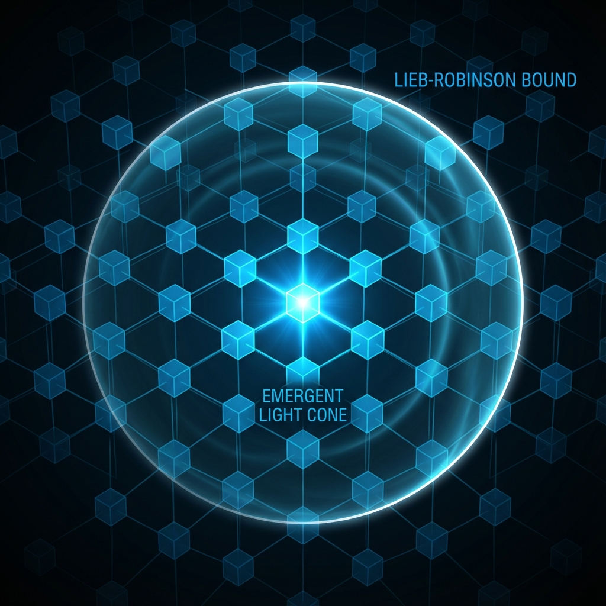

# 附录 D：QCA 实现与 Lieb-Robinson 界 (Appendix D: QCA Realisation and Lieb-Robinson Bounds)

在正文的第二卷"微观引擎"中，我们提出了宇宙的底层架构并非连续的流形，而是离散的 **量子元胞自动机 (Quantum Cellular Automaton, QCA)**。这一假设不仅解决了紫外发散问题，还为光速限制提供了一个微观的机械解释。

本附录将给出 QCA 的严格数学定义，并引入 **Lieb-Robinson 界 (Lieb-Robinson Bounds)**。这是数学物理学中的一个里程碑式定理，它证明了即使在非相对论性的量子格点系统中，局部相互作用也会自动涌现出一个"光锥"般的因果边界。

## D.1 微观网格的数学定义

考虑一个 $d$ 维的正则晶格 $\Lambda$（例如 $\mathbb{Z}^d$）。在晶格的每一个节点 $x \in \Lambda$ 上，都附着一个有限维的希尔伯特空间 $\mathcal{H}_{cell}$（例如一个二能级的量子比特，$\mathcal{H}_{cell} \simeq \mathbb{C}^2$）。

全宇宙的希尔伯特空间是所有这些局部空间的张量积：

$$\mathcal{H} \simeq \bigotimes_{x \in \Lambda} \mathcal{H}_{cell}$$

QCA 的演化由一个全局幺正算符 $U$ 描述。离散时间的演化方程极其简单：

$$|\Psi_{n+1}\rangle = U |\Psi_n\rangle$$

其中 $n \in \mathbb{Z}$ 代表离散的时间步（普朗克时间节拍）。

## D.2 局部性公理

QCA 最核心的物理公理是 **局部性 (Locality)**。这意味着信息不能瞬间传遍全网。

数学上，如果 $\mathcal{A}_R$ 表示支撑在有限区域 $R$ 上的算符代数，那么幺正算符 $U$ 必须满足：

$$U \mathcal{A}_R U^{\dagger} \subset \mathcal{A}_{R^{(+r)}}$$

这里 $R^{(+r)}$ 表示区域 $R$ 的 $r$-邻域（即距离 $R$ 不超过 $r$ 个格点的所有点）。

这条公理确保了在一次时间更新 $\Delta t$ 内，任何格点的信息最多只能传播到距离为 $r$ 的邻居处。这就在微观层面硬编码了因果律。

## D.3 Lieb-Robinson 界：涌现的光锥

虽然单步更新的局部性是显而易见的，但在经历了 $n$ 步复杂的量子纠缠演化后，这种局部性是否还能维持？

Lieb-Robinson 定理给出了肯定的回答。它证明了在具有短程相互作用的格点系统中，两个原本相距遥远的可观测量的对易子，随距离呈指数衰减。

对于任意两个局部算符 $A$（位于区域 $X$）和 $B$（位于区域 $Y$），在经历了 $n$ 步演化后，它们之间的关联满足如下不等式：

$$|| [U^n A U^{-n}, B] || \le C ||A|| ||B|| \exp\left( -\mu ( \text{dist}(X, Y) - v_{LR} |n| ) \right)$$

这个公式的物理含义极其深刻：

* **$\text{dist}(X, Y)$**：两点之间的空间距离。

* **$v_{LR} |n|$**：信号在 $n$ 步内能够传播的有效距离。

* **指数衰减**：在以速度 $v_{LR}$ 扩张的"光锥"之外，任何因果关联都被指数级地压制为零。

## D.4 宏观光速的微观起源

Lieb-Robinson 速度 $v_{LR}$ 是格点系统固有的最大信号传播速度。在连续极限下，如果我们定义物理晶格间距为 $a$，时间步长为 $\Delta t$，那么宏观物理中的最大速度（光速 $c$）就是 $v_{LR}$ 的物理化身：

$$c \approx v_{max} = \frac{v_{LR}}{\Delta t}$$

这证明了我们在正文中反复强调的观点：**相对论的因果结构不是天赐的背景，而是由微观局部相互作用涌现出来的统计结果。**

FS 容量恒等式 $v_{ext}^2 + v_{int}^2 = c_{FS}^2$ 中的 $c_{FS}$，实际上就是被这个微观的 $v_{LR}$ 所界定的。宇宙之所以有最大速度，是因为在底层的 QCA 引擎中，信息传递受到严格的"邻居访问规则"限制。光速，就是这一微观规则的宏观边界。

