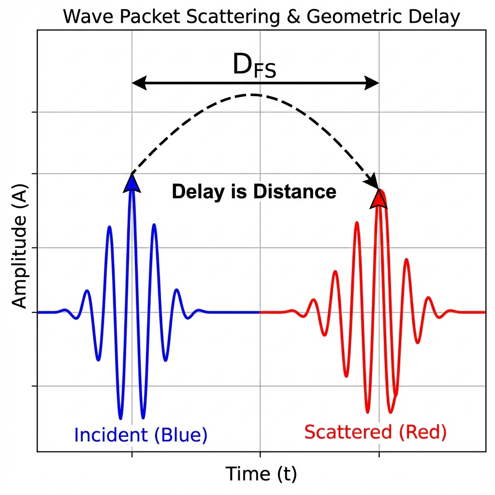

# 附录 E：窄带散射与 FS 距离推导 (Appendix E: Narrow-Band Scattering and FS Distance Derivation)

在正文的第 8 章"物质即拓扑"中，我们提出了一个颠覆性的几何观点：散射过程中的 **时间延迟 (Time Delay)** 本质上是量子态在射影希尔伯特空间中走过的 **FS 距离 (FS Distance)**。具体而言，对于一个窄带波包，其延迟越大，意味着它在内部几何维度上划过的弧长越长，从而导致散射后的状态与初始状态在几何上的区分度越大。

本附录将对这一结论提供详细的数学推导。我们将计算一个高斯波包经过散射后的重叠积分（可见度），并证明在小延迟极限下，FS 距离严格正比于 Wigner-Smith 时间延迟与能量带宽的乘积。

## E.1 散射重叠积分

考虑一个单通道散射问题，其散射矩阵为纯相位形式 $S(\omega) = e^{2i\delta(\omega)}$。

假设入射波包的幅度 $f(\omega)$ 是一个中心在 $\omega_0$、标准差（带宽）为 $\sigma$ 的实高斯函数：

$$|f(\omega)|^2 = \frac{1}{\sqrt{2\pi}\sigma} \exp\left( -\frac{(\omega-\omega_0)^2}{2\sigma^2} \right)$$

出射态 $|\Psi_{out}\rangle$ 由散射矩阵作用于入射态 $|\Psi_{in}\rangle$ 得到。为了衡量散射过程造成的几何改变，我们需要计算这两个态之间的 **重叠幅度 (Overlap Amplitude)**：

$$\langle \Psi_{in} | \Psi_{out} \rangle = \int |f(\omega)|^2 e^{2i\delta(\omega)} d\omega$$

## E.2 相位线性化与高斯积分

对于 **窄带波包 (Narrow-Band Packet)**，即带宽 $\sigma$ 远小于散射相位发生剧烈变化的能量尺度，我们可以将相位 $\delta(\omega)$ 在中心频率 $\omega_0$ 附近进行泰勒展开。

保留到一阶项（线性近似）：

$$\delta(\omega) \approx \delta(\omega_0) + \delta'(\omega_0)(\omega - \omega_0)$$

根据 Wigner-Smith 时间延迟的定义，相位的导数即为时间延迟的一半（在 $S=e^{2i\delta}$ 的约定下，$T_{WS} = \partial_\omega \delta(\omega_0)$ 为单通道相位半延迟，或通常定义为全延迟的一半，此处沿用论文约定 $T_{WS} := \delta'(\omega_0)$）。

令 $x = \omega - \omega_0$，积分变为标准的高斯傅里叶变换形式：

$$\langle \Psi_{in} | \Psi_{out} \rangle \approx e^{2i\delta(\omega_0)} \int \frac{1}{\sqrt{2\pi}\sigma} e^{-\frac{x^2}{2\sigma^2}} e^{2iT_{WS}x} dx$$

利用高斯积分公式 $\int_{-\infty}^{\infty} e^{-ax^2+ikx} dx = \sqrt{\frac{\pi}{a}} e^{-k^2/4a}$，其中 $a = 1/(2\sigma^2)$，$k = 2T_{WS}$，我们可以算出重叠幅度的模长（即干涉条纹的 **可见度 V**）：

$$V := |\langle \Psi_{in} | \Psi_{out} \rangle| = \exp\left( -2\sigma^2 T_{WS}^2 \right)$$

## E.3 FS 距离与延迟的几何对应

现在，我们将这个物理上的重叠度 $V$ 转换为几何上的 FS 距离 $D_{FS}$。根据定义：

$$V = \cos(D_{FS})$$

在小延迟极限下（即 $2\sigma^2 T_{WS}^2 \ll 1$），我们可以对等式两边进行二阶泰勒展开：

1.  **左边（高斯函数展开）**：$V \approx 1 - 2\sigma^2 T_{WS}^2$

2.  **右边（余弦函数展开）**：$V \approx 1 - \frac{1}{2} D_{FS}^2$

比较两边的二阶项，我们得到：

$$\frac{1}{2} D_{FS}^2 \approx 2\sigma^2 T_{WS}^2 \implies D_{FS} \approx 2\sigma |T_{WS}|$$

## E.4 物理结论

这一推导严格证明了正文中的核心几何命题：

**FS 距离 $\approx$ 带宽 $\times$ 时间延迟**

这揭示了时间延迟的本质：它不是时间轴上的停顿，而是 **状态矢量在射影希尔伯特空间中被拉开的距离**。

* 如果延迟 $T_{WS} = 0$，则 $D_{FS} = 0$，状态没有发生几何偏转（除了全局相位）。

* 延迟越大，出射态与入射态在几何上就越"正交"。

这也为 **"延迟-保真度权衡"** 提供了数学基础：你无法在获得巨大时间延迟的同时，保持量子态的完美保真度。因为获得延迟（$T_{WS}$）本身就意味着你必须在几何上远离出发点（$D_{FS}$ 增大，重叠 $V$ 下降）。这是几何学强加给信号处理的铁律。

