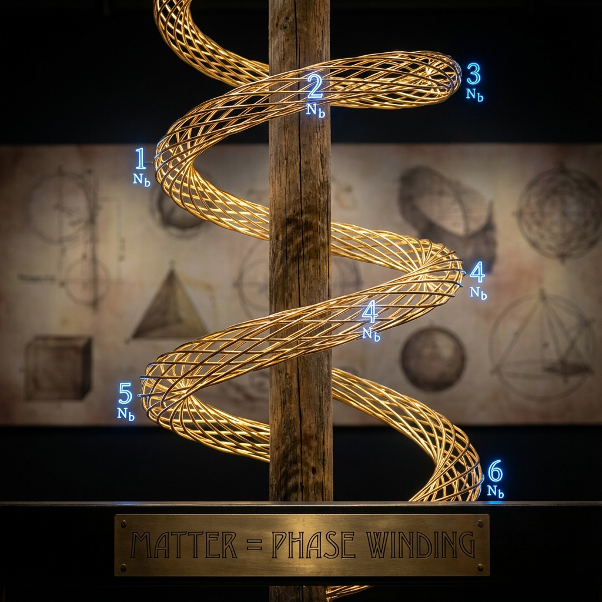

# Appendix F: FS-Levinson Relation and Topological Counting

In Chapter 7 "The Holographic Pi Code" of the main text, we defined the existence of matter as "phase knotting" in energy space. This profound physical picture is not fabricated out of thin air but is based on a geometric reconstruction of the famous **Levinson's Theorem** in classical scattering theory.

This appendix will briefly outline the mathematical proof of this relationship. We will show how to transform traditional scattering phase shift formulas into an inequality between **FS Geometric Length** and **Topological Winding Number** in projective Hilbert space. This provides solid mathematical support for the philosophical proposition that "matter is counting."

## F.1 Scattering Phase and Spectral Shift

Consider a perturbed Hamiltonian $H = H_0 + V$, where $H_0$ is a free Hamiltonian with absolutely continuous spectrum, and $V$ is a potential term that decays sufficiently fast at infinity.

In scattering theory, the asymptotic behavior of the system is described by the scattering matrix $S(\omega)$. This is a unitary operator acting on the energy shell channel space. To extract topological information, we focus on its determinant:

$$\det S(\omega) = e^{i\phi(\omega)}$$

Here, $\phi(\omega)$ is defined as the **Total Scattering Phase**.

Mathematician M.G. Krein introduced the **Spectral Shift Function** $\xi(\omega)$ to describe the spectral difference between $H$ and $H_0$. Under appropriate conditions, the spectral shift and scattering phase have the following direct relationship:

$$\xi(\omega) = \frac{1}{2\pi}\phi(\omega) + n(\omega)$$

where $n(\omega)$ is an integer-valued function used to handle jumps when bound states cross energy thresholds.

## F.2 Topological Form of Levinson's Theorem

Classical Levinson's theorem relates the phase shift at zero energy to the number of bound states. In the simplest case (no half-bound states, no threshold singularities), the theorem states:

$$\phi(0) - \phi(\infty) = N_b \pi$$

where:

* $\phi(0)$ is the phase in the zero-energy limit.

* $\phi(\infty)$ is the phase in the high-energy limit (usually normalized to 0).

* **$N_b$** is the total number of **Bound States** possessed by Hamiltonian $H$.

* **$\pi$** is the circle constant.

This formula establishes the topological connection between "discrete entities" ($N_b$) and "continuous variables" ($\phi$) in physics.

## F.3 FS Geometric Length: From Topology to Geometry

Now, we embed this relationship into **Fubini-Study Geometry**.

The mapping $\omega \mapsto \det S(\omega)$ defines a curve on the unit circle $U(1)$ in the complex plane.

The geometric properties of this curve can be described by the FS metric. On the $U(1)$ submanifold, the FS line element is proportional to the phase change rate $|\partial_\omega \phi(\omega)|$.

We define the **Total FS Length** of this curve from energy $\omega=0$ to $\omega=\infty$ as:

$$L_{FS} = \int_0^{\infty} \left| \frac{d\phi}{d\omega} \right| d\omega$$

In contrast, the **Topological Winding Number** (or total displacement) only cares about the difference between start and end points:

$$\Delta \Phi_{total} = |\phi(\infty) - \phi(0)| = N_b \pi$$

According to the integral inequality (the integral of absolute value is greater than or equal to the absolute value of the integral), or geometrically "the straight line is the shortest path between two points" (on a circle, it's the shortest arc length), we immediately obtain the **FS-Levinson Inequality**:

$$L_{FS} \ge N_b \pi$$

## F.4 Physical Meaning: The Cost of Knotting

This inequality $L_{FS} \ge N_b \pi$ is the core formula in **Vector Cosmology** regarding the cost of matter's existence.

1.  **Topological Lower Bound**:

    To "create" $N_b$ particles, the universe must complete at least $N_b$ full $\pi$ angle rotations in phase space. This is a hard index imposed by topology. Without sufficient phase winding, stable bound states cannot form.

2.  **Geometric Efficiency**:

    * If the scattering process is pure resonance (no background interference), the phase changes monotonically ($d\phi/d\omega$ does not change sign), then equality holds: $L_{FS} = N_b \pi$. This is the most efficient way to encode matter.

    * If there is **negative time delay** or complex background scattering, the phase may locally backtrack. This leads to $L_{FS} > N_b \pi$. This means the universe pays extra geometric budget (takes a detour) to maintain the same particle number.

## F.5 Discreteness and Robustness

Finally, under the discrete framework of QCA, this relationship still holds and is even more robust.

In lattice models, the energy spectrum is discrete, and the determinant $\det S(\omega_k)$ describes a polygonal path on the $U(1)$ circle.

We can calculate the **Discrete Winding Number** of this discrete path.

* This integer is not only well-defined but also insensitive to detailed perturbations of the lattice (topological protection).

* It directly corresponds to the number of bound states within a finite volume.

Therefore, the FS-Levinson relation proves: **The "granularity" of matter (particle number) is essentially the "number of loops" of the holographic phase.** Whether in continuous field theory or microscopic QCA, the universe determines whether matter exists by "counting loops."

