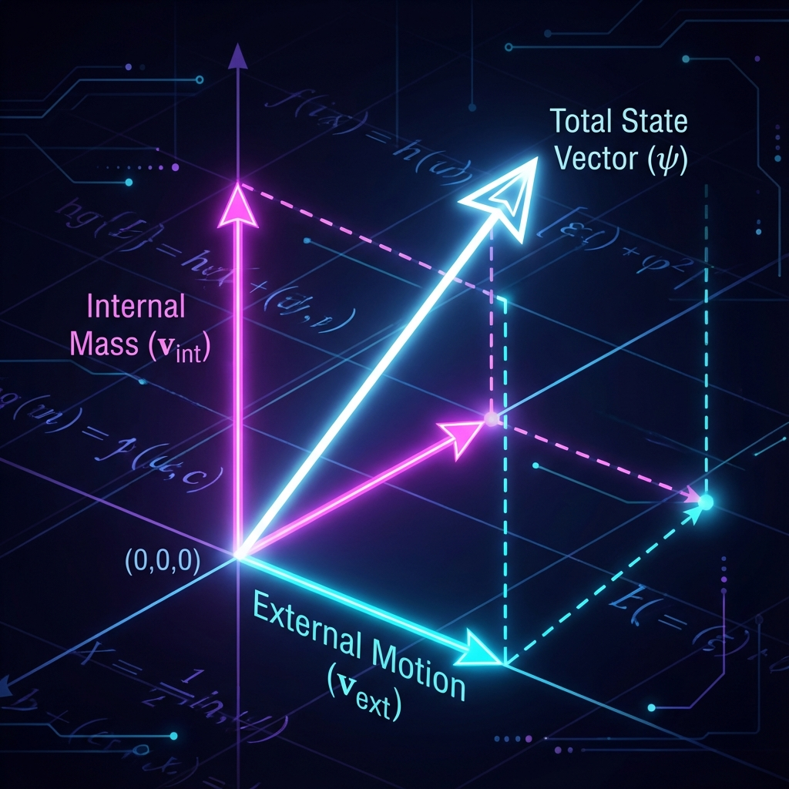

# 第1章 太初有圆 (In the Beginning was the Circle)

在创世的第一天，没有光，没有物质，甚至没有空间。只有那个唯一的、永恒转动的圆。

我们在序言中确立了那个唯一的矢量 $|\Psi\rangle$ 和它恒定的变化预算 $c_{FS}$。只要这个矢量仅仅是作为一个整体在虚空中旋转，宇宙就是完美的、对称的，但也是单调的。为了产生我们所感知的这个充满差异的世界——有天与地，有动与静，有快与慢——这个完美的圆必须打破自身的完整性。

它必须做出一个选择：将自己撕裂。

本章将讲述宇宙最初的创伤，也是物理学诞生的时刻。我们将目睹这个"一"是如何通过几何上的 **正交分解**，化身为"二"，并由此确立了宏观物理世界最底层的博弈规则。

## 1.1 第一次正交分解 (The First Orthogonal Decomposition)

"分解"这个词在物理学中听起来或许有些抽象，但在我们的 **《矢量宇宙论》** 中，它具有最直观的几何意义。

想象一支指向天空的箭（代表矢量）。我们可以将这支箭的指向分解为"向北的分量"和"向东的分量"。这一操作并没有改变箭本身，但对于生活在"北方"和"东方"这两个不同世界的观察者来说，他们看到了两个截然不同的现象。

宇宙的创世，就是这样一个将全能的 $c_{FS}$ 进行正交投影的过程。我们将这种切分定义为 **第一次正交分解**：将宇宙的总变化率，拆解为 **外部运动 ($v_{ext}$)** 与 **内部演化 ($v_{int}$)**。

#### 维度的撕裂：外与内

在数学上，这一过程表现为射影希尔伯特空间切线空间 ($T_{[\psi]}P(\mathcal{H})$) 的分裂。我们将全域的切线矢量 $\dot{\psi}$ 分解为两个相互垂直的分量：

$$|\dot{\psi}\rangle = |\dot{\psi}_{ext}\rangle + |\dot{\psi}_{int}\rangle$$

这两个分量在 Fubini-Study 度量下必须是 **正交** 的，即它们之间没有干涉项，能够被独立区分。

这不仅仅是数学游戏，这是物理现实的二元起源：

1.  **外部扇区 (External Sector, $v_{ext}$)**：

    这是矢量在"位置"或"空间"算符特征方向上的投影。

    当宇宙在这个扇区投入预算时，我们观测到了 **位移**、**动量** 和 **传播**。它是显性的、可见的、宏观的。在中国哲学中，这对应于 **"阳"**——动的、外在的力量。

2.  **内部扇区 (Internal Sector, $v_{int}$)**：

    这是矢量在"结构"或"内禀属性"特征方向上的投影。

    当宇宙在这个扇区投入预算时，物体并没有在空间中移动，但其内部的量子态正在剧烈翻转。我们观测到了 **质量**、**自旋** 和 **电荷**。它是隐性的、静的、微观的。这对应于 **"阴"**——静的、内在的本质。

#### 零和的契约

既然 $c_{FS}$ 是恒定的总预算，那么这种分解立刻带来了一个残酷但公正的后果：**你不能同时拥有一切。**

在欧几里得几何中，如果一个直角三角形的斜边（总预算）固定，那么两条直角边（分量）就必须处于一种此消彼长的竞争关系中。这便是 **毕达哥拉斯定理** 在宇宙学层面的回响：

$$v_{ext}^2 + v_{int}^2 = c_{FS}^2$$

这个公式是本书最重要的基石之一。它告诉我们，宇宙中的 **运动（Space）** 和 **物质（Matter）** 并不是两个独立的实体，它们是同一个 $c_{FS}$ 预算的两种不同消费方式。

* 如果你想在空间中跑得快（增加 $v_{ext}$），你就必须削减内部的演化（减少 $v_{int}$）。

* 如果你想拥有巨大的质量和复杂的内部结构（维持高额的 $v_{int}$），你就必然在空间中变得迟缓（压低 $v_{ext}$）。

这就是 **第一次切分** 建立的宇宙秩序。宇宙不再是一个混沌的整体，变成了一个巨大的交易市场。每一个粒子、每一个星系，都在通过调整自己在"外"与"内"两个扇区上的投影角度，来决定自己的物理命运。

而在这种博弈中，最极端的案例莫过于那个放弃了所有"内在"的存在——光。这将在后续章节中揭示相对论的全部秘密。但在此之前，我们需要明白，这第一次切分，不仅创造了空间，也创造了物理学中最深层的矛盾与和谐。

