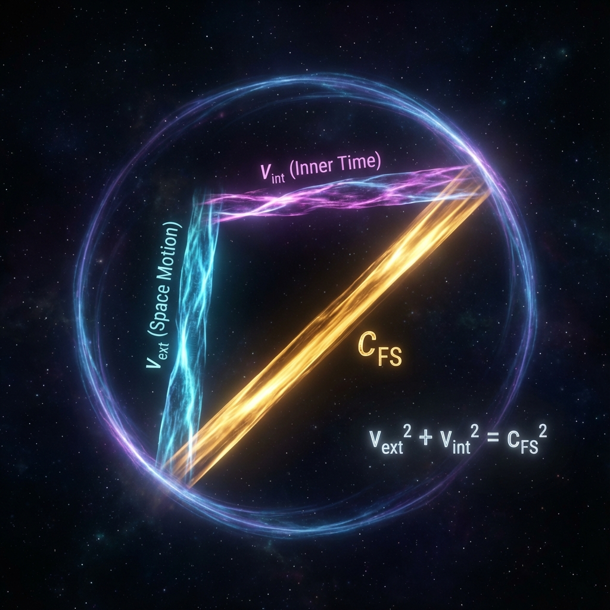

## 1.2 毕达哥拉斯的宇宙回响 (The Pythagorean Echo of the Universe)

在我们将宇宙撕裂为"内"与"外"的那一刻，我们实际上是在射影希尔伯特空间的切线空间上建立了一个坐标系。这种操作虽然赋予了宇宙以结构，但也立即给它戴上了一副不可挣脱的枷锁。

这副枷锁的名字，叫作 **几何学**。

当我们凝视那个支配着时空与物质的最基础方程时，我们会惊讶地发现，它竟然是我们在初等数学中学过的最古老定理——毕达哥拉斯定理（勾股定理）——在量子维度的神圣回响。

#### 垂直的代价

为什么宇宙必须遵守守恒律？为什么我们不能同时拥有无限的速度和无限的质量？答案隐藏在 Fubini-Study 度量的黎曼结构之中。

Fubini-Study 度量是射影希尔伯特空间上唯一自然的黎曼度量。在这个几何空间中，如果我们将一个切线矢量 $|\dot{\psi}\rangle$ 分解为两个正交的分量 $|\dot{\psi}_{ext}\rangle$ 和 $|\dot{\psi}_{int}\rangle$，那么根据黎曼几何的基本性质，这些分量的长度与总长度之间必须满足平方和关系。

这并非物理定律的选择，这是逻辑的必然。只要我们承认"外部运动"与"内部演化"在定义上是互不干扰（正交）的独立自由度，它们就必须服从以下 **毕达哥拉斯约束**：

$$||\dot{\psi}(\tau)||_{FS}^2 = ||\dot{\psi}_{ext}(\tau)||_{FS}^2 + ||\dot{\psi}_{int}(\tau)||_{FS}^2$$

将我们在前文定义的速率代入，便得到了统御宏观物理的第一铁律——**FS 容量恒等式 (The FS Capacity Identity)**：

$$v_{ext}^2 + v_{int}^2 = c_{FS}^2$$

#### 守恒律的几何本源

这个看似简单的公式 $a^2 + b^2 = c^2$，实则是宇宙一切守恒定律的共同祖先。

在物理学教科书中，我们习惯于分别讨论能量守恒、动量守恒或概率守恒。但在 **《矢量宇宙论》** 的视角下，这些都只是上述几何恒等式的特例。

它向我们揭示了一个深刻的真理：**宇宙并没有在这个刹那创造什么，也没有毁灭什么。它只是在做一个恒定的旋转。**

我们将这个公式称为 **"信息-速度预算" (The Information-Velocity Budget)**。$c_{FS}$ 是宇宙赋予每一个物理系统的"存在预算"。这个预算不仅代表了能量，更代表了 **"区分度" (Distinguishability)**——即系统改变自身状态的能力。

* **$v_{ext}$ (外部速度)**：这是系统用于在空间位置上产生区分度的预算。当我们说一个物体"动了"，实际上是指它的波函数在空间基底上的投影发生了偏转。

* **$v_{int}$ (内部速度)**：这是系统用于在内部结构上产生区分度的预算。当我们说一个原子"存在"，是指它的内部相位在剧烈旋转，使其在时间流逝中保持自身的独特性。

这个恒等式告诉我们，这两者共享同一个账户。你无法在不撤回内部投资的情况下，增加外部的开支。这就是为什么它是"毕达哥拉斯的回响"——两千多年前，古希腊人发现直角三角形的斜边锁定了两条直角边的命运；今天，我们发现希尔伯特空间的几何锁定了时空与物质的命运。

#### 迈向相对论的桥梁

这个几何恒等式不仅解释了守恒，它更是通向狭义相对论的直接桥梁。

如果我们将 $v_{ext}$ 对应于我们熟知的空间速度 $v$，将 $c_{FS}$ 对应于光速 $c$，那么这个毕达哥拉斯关系式 $v^2 + v_{int}^2 = c^2$ 就变成了：

$$v_{int} = \sqrt{c^2 - v^2} = c \sqrt{1 - \frac{v^2}{c^2}}$$

这里的 $\sqrt{1 - v^2/c^2}$ 正是相对论因子 $1/\gamma$ 的原型。

这一发现将在第二章被详细展开，但在此处，我们必须领悟其哲学量级：相对论中的 **时间膨胀 (Time Dilation)**，并不是因为时空像橡胶一样发生了弯曲，而是因为 **勾股定理迫使直角边缩短了**。当我们把斜边（总预算）更多地投射到"空间轴"上时，投射在"内部时间轴"上的长度必然减少。

所以，爱因斯坦并没有发明相对论，他只是发现了宇宙是一个标准的大圆，而光速 $c$ 只是这个圆在外部世界投影的几何极限。

太初有圆，而这毕达哥拉斯的回响，便是创世的第一声轰鸣。它宣告了绝对自由的终结，和物理法则的诞生。

