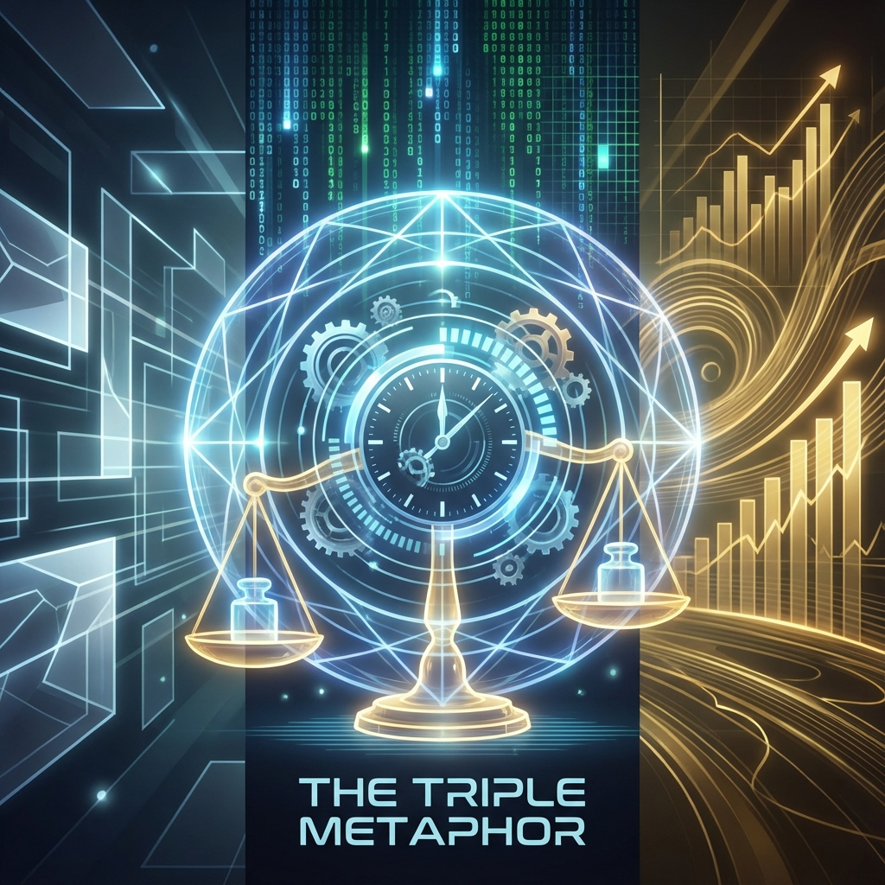

## 1.3 The Triple Metaphor

We have established the core axiom of the universe: a unique vector, constrained by a constant FS capacity budget, and following the Pythagorean theorem under orthogonal decomposition.

However, mathematical formulas, though precise, often appear cold and abstract. To truly understand how the formula $v_{ext}^2 + v_{int}^2 = c_{FS}^2$ governs everything from microscopic particles to macroscopic galaxies, we need to translate it into a language that human intuition can grasp.

In this section, we will construct the worldview of **Vector Cosmology** through three metaphors: **geometry**, **computation**, and **economics**. These three languages, seemingly disparate, are actually describing three facets of the same physical reality.

#### Metaphor One: Geometry—The Division of the Great Circle

The most intuitive perspective comes from geometry, which is precisely the origin of the Fubini-Study metric.

Imagine a **hypersphere** eternally rotating in multidimensional space. The universe's total state vector $|\Psi\rangle$ is like a pointer on the sphere's surface, which must rotate at a constant angular velocity $c_{FS}$. This rotation itself is perfect and isotropic, making no distinction between "internal" and "external."

The birth of physics stems from us, as observers, establishing a coordinate system that forcibly projects the motion of this circle onto two axes:

* **Horizontal axis (spatial axis)**: Represents the displacement of objects in three-dimensional space.

* **Vertical axis (internal axis)**: Represents the evolution of the internal quantum phase of objects.

When we see a particle racing through space, we are actually seeing the projection of that high-dimensional vector lengthen on the horizontal axis. But because the circle's radius (total velocity) is locked, its projection on the vertical axis must shorten.

In this metaphor:

* **$c_{FS}$ is the radius**: It defines the curvature limit of the universe's projective geometry.

* **Physical laws are trigonometry**: All dynamical evolution is essentially just the trajectory traced by the vector on the sphere's surface. What we call "force" is merely the vector changing its tangent direction on the sphere, thereby altering its projection ratio on the coordinate axes.

The universe is not a flat chessboard; the universe is a strictly constrained **Information-Velocity Circle**.

#### Metaphor Two: Computation—Allocation of Clock Frequency

If we remove the geometric lens and put on the computer science lens, the universe transforms into a **quantum computer** running at the Planck scale.

In this computer, space is not a continuous background but a discrete grid composed of countless **Quantum Cellular Automata (QCA)**. Every physical system (such as an electron) is a "process" or "program" running on this grid.

This program consumes computational power to update its own state. **$c_{FS}$ is the maximum clock frequency** or **Information Update Capacity** that this cosmic computer allocates to this process.

The system must make difficult scheduling decisions:

* **I/O overhead ($v_{ext}$)**: Transmitting data through the grid, copying its own state information from one node to adjacent nodes. This manifests as **"motion"**.

* **Logic overhead ($v_{int}$)**: Performing complex internal state flips and computations at the local node. This manifests as **"mass"** or **"existence"**.

Since bus speed and CPU frequency are finite ($c_{FS}$), if a program is busy moving data (high-speed motion) in this clock cycle, it has no remaining clock cycles to process internal logic.

In this metaphor, the time dilation effect of relativity has the most hardcore explanation: **system lag**. When I/O occupancy reaches 100% (light speed), the internal logic thread is suspended, and time stops updating.

#### Metaphor Three: Economics—The Zero-Sum Budget Game

Finally, and perhaps the most profound perspective, is the economic perspective. This directly responds to the **"Information-Velocity Budget"** we defined in the paper.

From this perspective, the universe is a resource-scarce market. **$c_{FS}$ is the only hard currency**. It represents "the ability to change."

Every physical entity is a **rational agent**, holding limited budget and facing two investment choices:

1.  **Invest in "logistics" ($v_{ext}$)**: Purchase displacement in space. This is a consumption-type investment aimed at changing position.

2.  **Invest in "assets" ($v_{int}$)**: Purchase internal structural complexity. This is a savings-type investment that freezes the budget as **"rest mass"**.

The Pythagorean identity $v_{ext}^2 + v_{int}^2 = c_{FS}^2$ is the **balance sheet** of this market. It enforces a **zero-sum game**: you cannot print money out of thin air. Any greed for external velocity must be paid for by selling internal assets (mass/time flow rate).

* **Photons** are complete proletarians, spending all their budget on the road, penniless (massless).

* **Black holes** are extreme misers (or monopolists), hoarding all their budget in the entanglement structure on the horizon, causing liquidity to dry up in the external market.

#### The Trinity of Truth

These three metaphors—**geometry's circle**, **computation's clock**, **economics' money**—are not three independent theories. They are projections of the mathematical truth **$v_{ext}^2 + v_{int}^2 = c_{FS}^2$** at different cognitive levels.

* Geometry tells us **"what"** (structure).

* Computation tells us **"how"** (mechanism).

* Economics tells us **"why"** (cost).

Through these three lenses, the fragmented concepts of physics—light speed, mass, time, energy—are forged into a unified whole. We no longer face a jumble of disconnected formulas; we face a **vector universe** that is exquisitely designed, logically self-consistent, and meticulously accounts for every transaction.

With this complete cognitive map, we are ready to enter the next chapter, to unravel the mystery that has puzzled humanity for a century—why is light speed unattainable? Why does motion slow down time? In Vector Cosmology, these are no longer mysteries but inevitable outcomes after the budget is exhausted.

