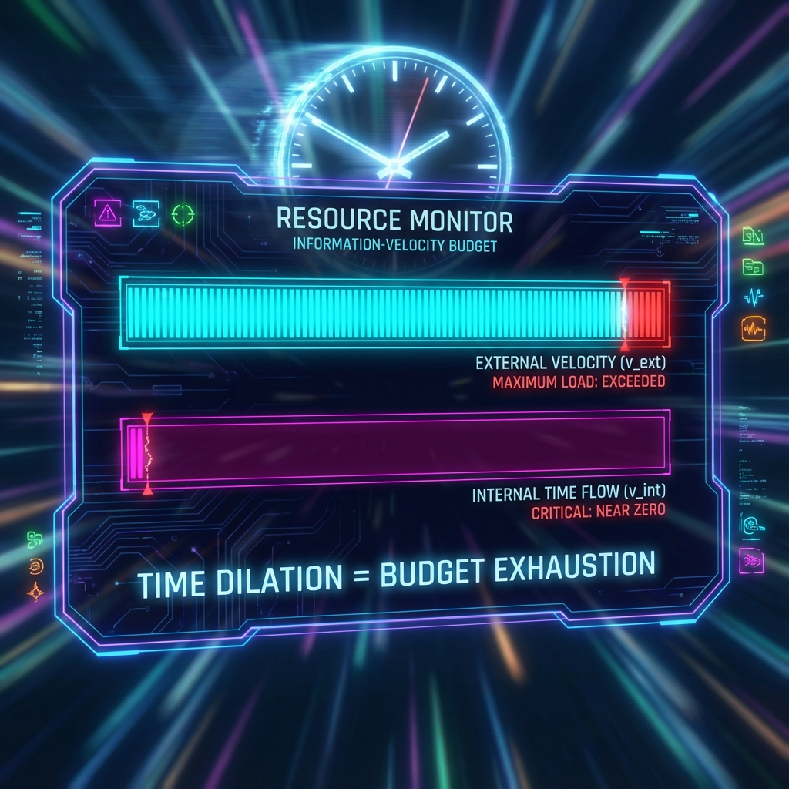

# 第2章 速度的贫困 (The Poverty of Speed)

> "光并没有超越时间，光是因为贫穷而失去了时间。"

我们已经建立了宇宙的宏观架构：一个恒定的信息-速度预算 $c_{FS}$，以及一个强制性的毕达哥拉斯分配法则。现在，我们将用这一全新的视角，去重新审视现代物理学中最著名、也最令人困惑的理论——狭义相对论。

在教科书中，相对论往往被描述为时空几何的某种神秘特性：尺缩钟慢，光速不变。但在 **《矢量宇宙论》** 中，这一切不再是公理，而是"预算守恒"的必然推论。

## 2.1 相对论的真相：时间膨胀即预算耗尽 (The Truth of Relativity: Time Dilation as Budget Exhaustion)

当我们说"时间变慢了"的时候，我们到底在说什么？

在一个高速飞行的飞船上，宇航员的心跳变慢了，原子的振动变慢了，甚至连衰变这种随机过程也变慢了。爱因斯坦告诉我们，这是因为"现在的每一秒比过去更长了"。这听起来极其玄妙。

但在矢量宇宙论的 **信息-速度分解** 框架下，真相要直白得多，也残酷得多：**你的时间变慢，是因为你没有足够的预算来支付时间的流逝了。**

#### 内部速度即时间流速

回顾我们的核心公式：

$$v_{ext}^2 + v_{int}^2 = c_{FS}^2$$

我们需要给 $v_{int}$（内部速度）赋予一个物理意义。它代表了矢量在内部扇区演化的速率。对于一个物理系统（比如一个时钟或一个人）而言，**"活着"** 或者 **"经历时间"**，本质上就是系统内部状态不断发生变化的过程。

如果 $v_{int}$ 很大，意味着系统内部演化剧烈，时间流逝得快；如果 $v_{int}$ 归零，意味着系统内部状态完全冻结，时间停止。

因此，**$v_{int}$ 就是你的固有时间（Proper Time）流逝率**。

#### 一场零和博弈

现在，让我们看看当你试图加速时发生了什么。

假设你原本静止在太空中。此时，你的外部速度 $v_{ext} = 0$。根据毕达哥拉斯恒等式，你拥有的全部预算 $c_{FS}$ 都投入到了内部演化中：

$$v_{int} = c_{FS}$$

这时，你的时间流逝是最快的，你的生命在以宇宙允许的最大速率燃烧。

当你开始加速，试图在空间中获得速度 $v$（即增加 $v_{ext}$）。因为总预算 $c_{FS}$ 是锁死的（宇宙不会给你额外的贷款），你必须从 $v_{int}$ 中挪用一部分额度来支付 $v_{ext}$ 的开销。

你的内部演化被迫减速：

$$v_{int} = \sqrt{c_{FS}^2 - v^2}$$

这就是 **时间膨胀** 的物理机制。它不是时空背景的魔法，它是 **资源的挤兑**。当你把越来越多的能力用于"改变位置"，你就只剩下越来越少的能力用于"改变自身"。

#### 洛伦兹因子的几何推导

我们可以从这个简单的圆方程中，直接推导出狭义相对论的核心数学结构——洛伦兹因子 $\gamma$。

在物理学中，我们习惯用 $c$ 来表示光速（即我们的 $c_{FS}$），用 $v$ 来表示空间速度（即 $v_{ext}$）。那么内部时间流逝率 $v_{int}$ 与最大速率 $c$ 的比值是：

$$\frac{v_{int}}{c} = \sqrt{1 - \frac{v^2}{c^2}}$$

如果我们将静止时的参考时间流逝记为 $dt$，而运动时的固有时间流逝记为 $d\tau$，那么根据定义，$d\tau$ 应该正比于 $v_{int}$。于是我们得到：

$$\frac{d\tau}{dt} = \frac{v_{int}}{c} = \sqrt{1 - \frac{v^2}{c^2}}$$

翻转过来，就是标准的相对论时间膨胀公式：

$$dt = \frac{d\tau}{\sqrt{1 - \frac{v^2}{c^2}}} = \gamma d\tau$$

看，我们不需要假设光速不变，也不需要引入闵可夫斯基时空的复杂性。我们只需要承认宇宙是一个 **圆**。洛伦兹因子 $\gamma$ 实际上就是 **正割函数 (secant)**——它是大圆切分几何中，斜边与直角边的一个简单三角学比例。

#### 速度的贫困

这个视角彻底改变了我们对"极速"的看法。

在科幻小说中，光速被描绘成一种极致的自由。但在矢量宇宙论中，光速代表了 **极致的贫困**。

当一个粒子的外部速度 $v_{ext}$ 达到 $c_{FS}$ 时，公式变为：

$$c_{FS}^2 + v_{int}^2 = c_{FS}^2 \implies v_{int} = 0$$

这意味着它的内部预算被彻底掏空了。它没有余力去经历任何内部变化。对于光子来说，从宇宙大爆炸诞生到被你的视网膜吸收，这中间跨越的一百三十亿年，在它的主观视角中是 **零秒**。它没有变老，没有演化，因为它把所有的"存在"都献祭给了"距离"。

**相对论的真相是：** 运动是一种代价昂贵的消费。我们之所以无法超越光速，不是因为前方有一堵墙，而是因为当 $v_{ext} = c_{FS}$ 时，我们已经破产了——我们再也没有任何剩余的预算可以转化为速度了。

