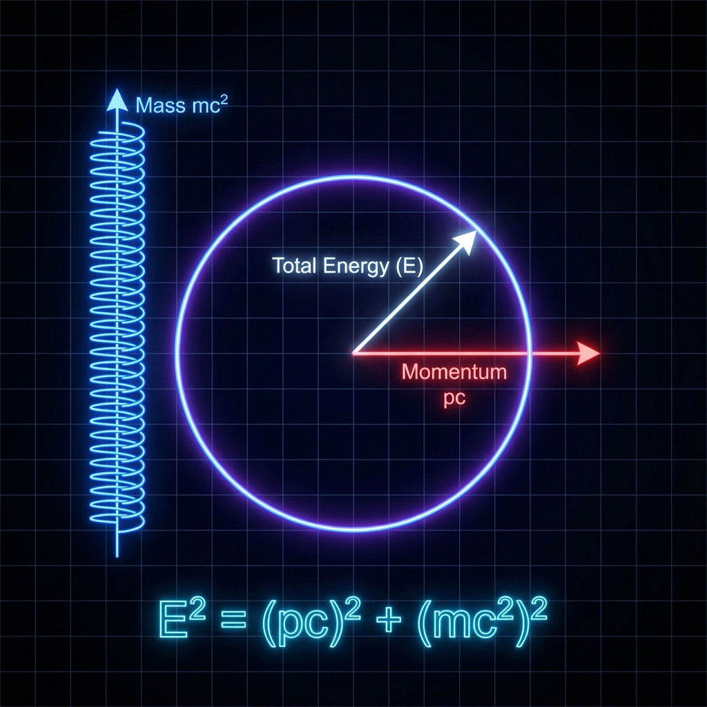

## 2.2 狄拉克圆 (The Dirac Circle)

> "物质不是静止的重物，物质是被囚禁的光。"

在上一节中，我们揭示了运动是如何通过"预算挤兑"导致时间变慢的。现在，我们将目光投向另一个物理学圣杯：**质能方程**。

爱因斯坦最著名的公式 $E=mc^2$ 告诉我们质量就是能量。但这仅仅是一个数量上的等式，它并没有解释 *为什么*。为什么原本无形的能量会凝固成有形的质量？

在 **《矢量宇宙论》** 中，答案隐藏在一个完美的几何图形中——我们称之为 **"狄拉克圆" (The Dirac Circle)**。

#### 能量的毕达哥拉斯定理

让我们重写那个支配所有相对论粒子的核心方程——色散关系（Dispersion Relation）。对于一个动量为 $p$、静止质量为 $m$ 的自由粒子，其总能量 $E$ 满足：

$$E^2 = (pc)^2 + (mc^2)^2$$

在传统物理课上，这是一个需要通过洛伦兹变换推导出来的结论。但在我们的 FS 几何视角下，请你仔细凝视这个方程。形式上，$A^2 = B^2 + C^2$。

这不就是 **勾股定理** 吗？

如果我们把方程两边同时除以 $E^2$（总能量的平方），并乘以 $c^2$（光速的平方），我们得到了一个关于速度的恒等式：

$$\left( c \cdot \frac{pc}{E} \right)^2 + \left( c \cdot \frac{mc^2}{E} \right)^2 = c^2$$

让我们来看看这两项分别代表什么：

1.  **第一项**：$v_{group} = \frac{\partial E}{\partial p} = \frac{pc^2}{E}$。这正是粒子的 **群速度**，也就是我们在宏观空间中看到的物理速度。在我们的体系中，这就是 **外部速度 ($v_{ext}$)**。

2.  **右边**：$c$。这是宇宙的 **极限速度**，也就是我们的 **FS 容量 ($c_{FS}$)**。

那么，中间那神秘的第二项 $c \cdot \frac{mc^2}{E}$ 是什么？

根据我们的核心公理 $v_{ext}^2 + v_{int}^2 = c_{FS}^2$，这一项 **必须** 是 **内部速度 ($v_{int}$)**。

$$v_{int} = c \cdot \frac{mc^2}{E}$$

这揭示了一个惊人的几何事实：**物理学中著名的质能色散关系，在数学上严格等价于信息速度空间中的一个圆。**

#### 质量即冻结的资产 (Mass as Frozen Assets)

这一推导彻底重构了我们对"质量" ($m$) 的理解。

在 $v_{int}$ 的表达式中，我们看到质量 $m$ 是分子。这意味着：**质量并不是一种死板的物质属性，它是内部演化速度的度量。**

* **当粒子静止时** ($p=0$)：

    外部速度 $v_{ext} = 0$。此时，所有的预算都必须投入内部。

    $$v_{int} = c$$

    这意味着，一个看似静止在桌面上的苹果，其实在微观的希尔伯特空间中，正以宇宙最高速度（光速）进行着疯狂的内部旋转。这种旋转的能量，就是我们所谓的 **"静止质量"**。

* **经济学隐喻**：

    如果 $c_{FS}$ 是你的现金流，那么 **质量 ($m$) 就是被冻结的资产（Fixed Assets）**。

    你把一部分现金流（$c_{FS}$）锁死在了一个不再向外流动的账户（内部维度）里，这部分被锁定的预算，就表现为物体的"重量"和"惯性"。它抗拒改变（惯性），因为它已经把改变的能力消耗在了维持自身存在上。

#### 物质是被囚禁的光

狄拉克圆让我们看到了物质的本质。

如果我们把质量项 $m$ 去掉（设 $m=0$），狄拉克圆就崩塌成了一条直线：$v_{ext} = c$。这就是光子。光子没有内部结构，不在此地停留，它是纯粹的流动。

而所谓"物质"（电子、夸克），本质上就是 **被囚禁的光**。它们通过某种机制（我们将在第三卷探讨的希格斯机制或拓扑打结），强行将原本应该直线传播的矢量，卷曲到了内部维度中。

于是，光不再前行，而是开始原地打转。这种"原地打转"的频率，被我们观测为"质量"。

**$E=mc^2$ 的真正含义是：** 能量 ($E$) 是矢量的总长度，质量 ($m$) 是矢量在内部维度的投影长度。它们之所以可以互换，是因为它们本质上是同一个矢量在不同角度的投影。

原子弹的爆炸，不是物质变成了能量，而是 **卷曲的矢量被拉直了**。那些原本在微观维度里疯狂空转的 $v_{int}$ 预算，被瞬间释放到了外部空间轴上，变成了毁灭性的 $v_{ext}$。

狄拉克圆不仅画出了相对论的优雅，也画出了宇宙中最剧烈的力量之源。

