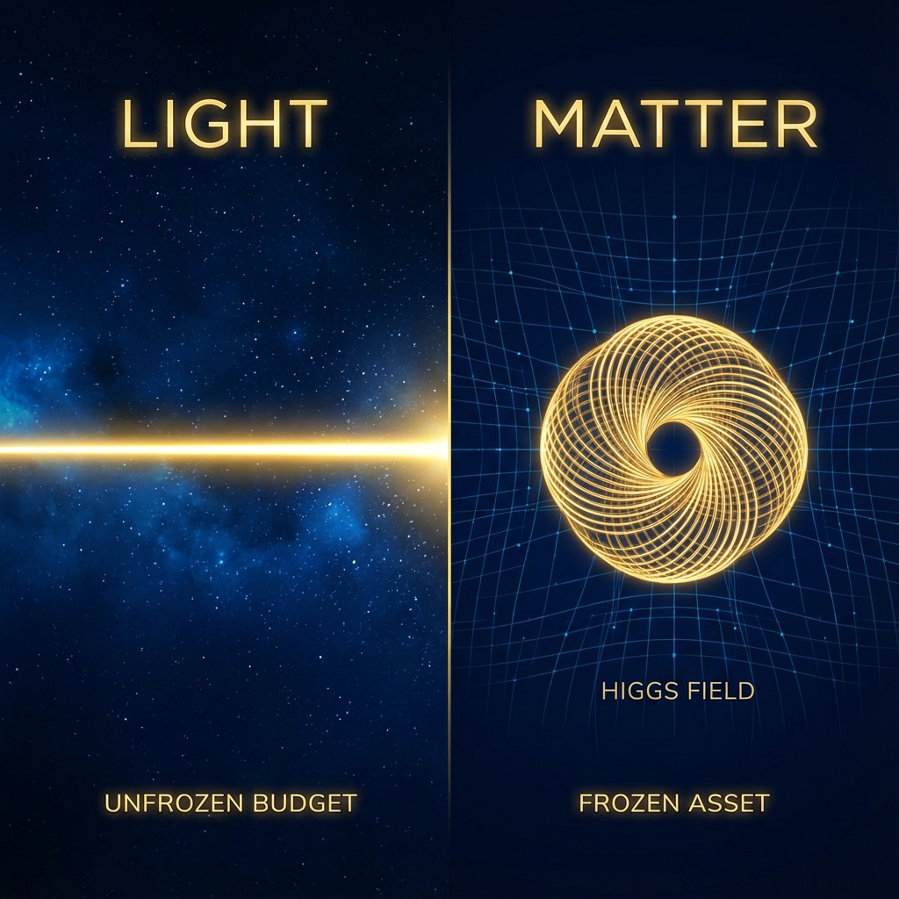

## 2.3 质量即冻结的资产 (Mass as Frozen Assets)

> "惯性不是物体抵抗运动的属性，而是预算抵抗重新分配的阻力。"

在狄拉克圆的几何推导中，我们见证了数学上的奇迹：物理学中著名的质能关系 $E^2 = p^2c^2 + m^2c^4$，本质上只是信息速度圆 $v_{ext}^2 + v_{int}^2 = c_{FS}^2$ 的代数变形。

然而，这不仅仅是一个数学游戏。这个等式迫使我们重新定义物理学中最基础、却也最令人费解的概念之一——**质量 (Mass)**。

在牛顿力学中，质量被视为物质的一种内禀属性，代表了"物质的量"。但在 **《矢量宇宙论》** 的视角下，这种静态的定义被彻底打破。质量不再是一个名词，而是一个**动词**的后果。

#### 静态预算与惯性的起源

如果我们将宇宙看作一个经济体，那么 **$c_{FS}$ (FS 容量)** 就是你在每个时刻必须花掉的现金流。你不能把它存起来，你必须让它流动——要么流向外部空间 ($v_{ext}$)，要么流向内部结构 ($v_{int}$)。

**什么是质量 ($m$)？**

质量就是系统选择将大部分预算投入到内部演化 ($v_{int}$) 中所形成的 **"资产沉淀"**。

当一个粒子拥有质量时，它实际上是在说："我将我的 $c_{FS}$ 预算锁定在了内部维度的旋转上。"这种锁定产生了一种强烈的**路径依赖**，我们在宏观物理中称之为 **惯性 (Inertia)**。

为什么推动一个大质量物体很难？

* **传统解释**：因为它重。

* **矢量宇宙论解释**：因为你在试图强迫一个已经满负荷运行的系统更改其预算分配表。

    一个静止的大质量物体，其 $v_{int}$ 几乎占据了 100% 的 $c_{FS}$ 预算。当你试图推它（增加它的 $v_{ext}$）时，系统必须极其痛苦地从它庞大的内部开销中"撤资"，将一部分 $v_{int}$ 转化为 $v_{ext}$。

    这种 **"撤资的阻力"**，就是惯性。质量越大，意味着被锁定的内部预算越多，改变这笔巨额投资方向所需的"交易成本"（力）就越大。

#### 光的永恒性：无产者的自由

为了真正理解质量的本质，我们必须看一看它的对立面——**光 (Light)**。

光子（以及其他无质量粒子）是宇宙中的 **无产者**。它们在狄拉克圆上的位置是极端的：

$$m = 0 \implies v_{int} = 0$$

代入毕达哥拉斯恒等式，我们得到：

$$v_{ext} = c_{FS}$$

这揭示了关于光的三个深刻真理：

1.  **光必须以光速运动**：

    光并不是"想要"跑得快。光是因为**一无所有**（没有内部质量来消耗预算），所以被迫将所有的 $c_{FS}$ 预算都倾泻到了外部空间轴上。光速 $c$ 不是速度的极限，它是预算无处可去时的 **全额赔付**。

2.  **光没有时间**：

    因为 $v_{int} = 0$，光子的内部时钟永远不会走动。对于一个光子来说，从它在恒星核心诞生的那一刻，到它撞击你视网膜的那一刻，这两者是 **同时** 发生的。在光的主观视角里，宇宙是一个瞬间的切片。光获得了空间上的绝对自由，代价是失去了时间上的所有体验。

3.  **光没有惯性**：

    因为光没有将任何预算锁定在 $v_{int}$ 中，它没有"固定资产"需要维护。但这并不意味着光没有能量，它的能量全部表现为动能（频率）。

#### 希格斯机制的几何预演

这就引出了一个显而易见的问题：如果宇宙的默认状态应该是像光一样自由飞翔（$v_{ext} = c_{FS}$），那么为什么会有物质停下来，变成了有质量的东西？

在粒子物理的标准模型中，这被称为 **希格斯机制 (Higgs Mechanism)**。在我们的几何语言中，这可以被描述为一场 **"强制性的预算冻结"**。

你可以想象，在宇宙的极早期，所有粒子都是无质量的，都在以 $c_{FS}$ 狂奔。突然，空间中出现了一种"粘性"场（希格斯场）。有些粒子与这个场发生了相互作用。这种相互作用强迫它们将一部分 $c_{FS}$ 转向内部，开始在原地打转（获得 $v_{int}$）。

这种"原地打转"的频率，就被我们定义为 **质量**。

于是，光速的飞行停止了，时间的流逝开始了。原本的能量流被卷曲成了 **物质**。每一个原子，都是一段被囚禁的、正在内部维度疯狂空转的光。

#### 本章小结

至此，我们完成了对宏观架构的第一轮重构。

* **相对论** 告诉我们预算是有限的。

* **狄拉克圆** 告诉我们质量是预算的内部锁定。

* **光** 告诉我们完全释放预算后的永恒状态。

我们眼中的实体物质——桌子、椅子、星辰——本质上都是 **"冻结的资产"**。宇宙通过将 $c_{FS}$ 锁死在微观的内部循环中，构建了稳定的宏观世界。但是，这些资产并没有真正消失，它们只是在以我们看不见的方式（$v_{int}$）剧烈燃烧。一旦这笔资产被解冻（核反应），被释放出的 $c_{FS}$ 将再次震撼世界。

既然我们已经理解了"单一粒子"如何通过预算分配形成质量，接下来的问题是：当这些拥有巨额 $v_{int}$ 资产的粒子聚集在一起时，它们会如何通过"垄断"来扭曲整个市场的规则？下一章，我们将进入引力的领域。

