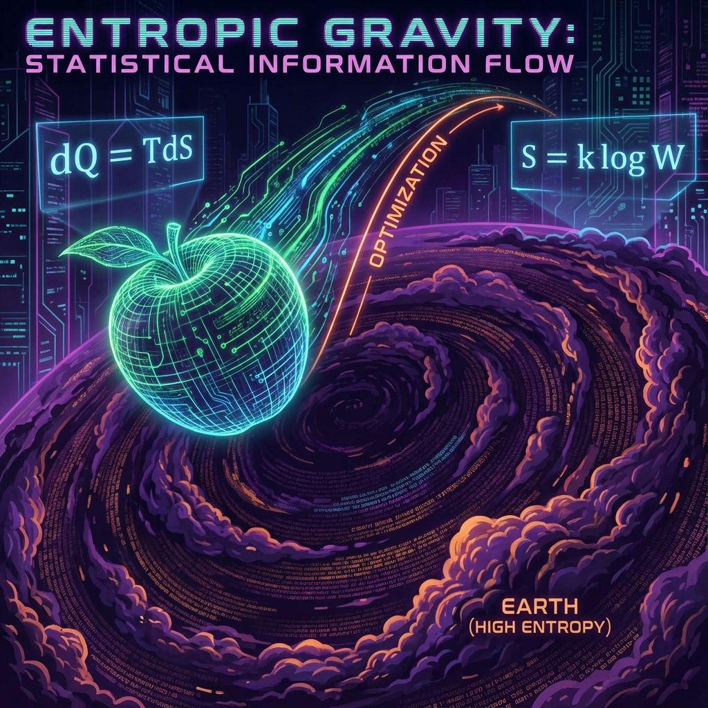

## 3.2 引力即熵力 (Gravity as Entropic Force)

> "苹果并不是因为地球在拉它而下落，苹果是因为下落能让宇宙的熵增加而下落。"

在上一节中，我们将大质量物体描述为市场的 **"垄断者"**，它们通过囤积巨大的内部预算 ($v_{int}$)，导致了周围空间的"算力枯竭"或"流动性紧缩"。这种资源的分布不均，在几何上表现为时空的弯曲。

但这一切仍然留下了一个动力学的问题：**为什么物体要向着垄断者移动？**

既然垄断者（如黑洞或恒星）那里"交易成本"极高、"带宽"极窄（时间变慢），作为一个理性的自由粒子，难道不应该远离那里，去往预算充裕的虚空吗？为什么万有引力是吸引的，而不是排斥的？

为了回答这个问题，我们需要引入物理学中甚至比能量更底层的概念——**熵 (Entropy)**。在 **《矢量宇宙论》** 中，引力不再是一种基本的相互作用力，它是一种 **"统计趋势"**，它是宇宙为了最大化信息流动而产生的 **熵力 (Entropic Force)**。

#### 3.2.1 看不见的手：热力学的几何伪装

在经济学中，亚当·斯密提出了"看不见的手"：个体追求利益最大化的行为，会自动导致市场资源的有效配置。在物理学中，这只"看不见的手"就是 **热力学第二定律**。

现代物理学家泰德·雅各布森 (Ted Jacobson) 和埃里克·弗琳德 (Erik Verlinde) 曾提出过震撼性的观点：引力可能不是一种基本的力，而是一种 **熵力**。就像橡皮筋回缩不是因为分子之间有拉力，而是因为回缩的状态拥有更多的微观构型（更高的熵）。

在我们的 **FS 矢量体系** 中，这一观点得到了完美的几何解释。

让我们回到核心恒等式：

$$v_{ext}^2 + v_{int}^2 + v_{env}^2 = c_{FS}^2$$

这里的第三项 **$v_{env}$ (环境/纠缠速度)** 至关重要。在真空中，它可能很小。但在大质量物体附近，情况截然不同。大质量物体不仅仅是质量的堆积，它还是 **信息的堆积**。地球不仅仅是一块石头，它是 $10^{50}$ 个量子比特的高度纠缠体。

这意味着，大质量物体周围的空间，是一个 **高熵潜力区**。

#### 3.2.2 苹果为什么下落：信息梯度的诱惑

现在，让我们重新审视那个著名的苹果。它悬挂在树枝上，处于地球的引力场中。

1.  **高处的苹果**：

    在远离地面的地方，空间相对平坦，预算被垄断得较少。苹果拥有较高的 $v_{ext}$ 潜能（势能），但它与地球的纠缠度很低。它的信息是相对孤立的。

2.  **地面的苹果**：

    在靠近地面的地方，是 $v_{int}$ 高度密集的区域。这里充满了与地球这一巨大热库进行微观相互作用的可能性。

**为什么苹果会掉下来？**

不是因为地球发出了一条无形的绳子拉住了它。而是因为：**在这个方向上，微观状态的数量增加了。**

在 **《矢量宇宙论》** 的计算隐喻中，我们可以这样理解：

* 宇宙总是倾向于让信息分布得更"均匀"或更"混乱"（熵增）。

* 地球是一个巨大的信息黑洞（信息汇），它周围的空间存在着巨大的 **信息梯度 (Information Gradient)**。

* 苹果也是一团信息。当它向地球靠近时，它实际上是在顺应这个梯度，试图融入那个更大的信息网络。

**引力就是信息流动的压强差。**

宇宙这台计算机试图平摊算力负载。真空中的算力（$c_{FS}$）是闲置的，而地球附近的算力是过载的。苹果的下落，实际上是 **为了填补这个梯度的过程**。它牺牲了自己的位置势能（将 $v_{ext}$ 转化为动能再转化为撞击后的热能），最终是为了增加整个系统的总熵。

#### 3.2.3 爱因斯坦方程的热力学推导

这不仅仅是哲学上的比喻，这在数学上是严格对应的。

雅各布森曾证明，爱因斯坦的场方程 $G_{\mu\nu} = 8\pi G T_{\mu\nu}$ 实际上就是热力学方程 $dQ = TdS$ 的时空几何版本。

在我们的 FS 几何中：

* **$dQ$ (热量流)**：对应于穿过界面的 **$v_{int}$ 通量**（能量/物质流）。

* **$T$ (温度)**：对应于 **Unruh 温度** 或视界温度，这与 $c_{FS}$ 在局部被压缩的程度（加速度/曲率）成正比。

* **$dS$ (熵变)**：对应于 **视界表面积的变化**，也就是信息容量的变化。

当我们说"时空告诉物质如何运动"时，我们实际上是在说：**物质总是沿着熵增最快（或自由能最低）的路径演化。** 测地线（Geodesic）不是别的，正是信息几何中的 **最优化路径**。

#### 3.2.4 结论：没有引力，只有统计

至此，我们完成了一次惊人的观念飞跃。

在这个宇宙中，并没有一个叫"引力"的基本力在拉扯着你。你之所以被按在椅子上，是因为你脚下的地球是一个巨大的信息集散中心。

* 你的身体试图顺应统计规律，向信息密度更高的区域"扩散"（下落）。

* 而你椅子上的电磁力（泡利不相容原理）阻止了这种扩散。

**引力是我们对宇宙"统计趋势"的宏观错觉。** 就像气压不是分子的基本属性，而是无数分子碰撞的统计结果一样；引力也不是时空的基本属性，它是无数 $v_{int}$ 矢量为了在有限预算 $c_{FS}$ 下最大化系统混乱度而产生的 **几何挤压**。

苹果下落，是因为在矢量的世界里，那是通往最大可能性的唯一方向。

