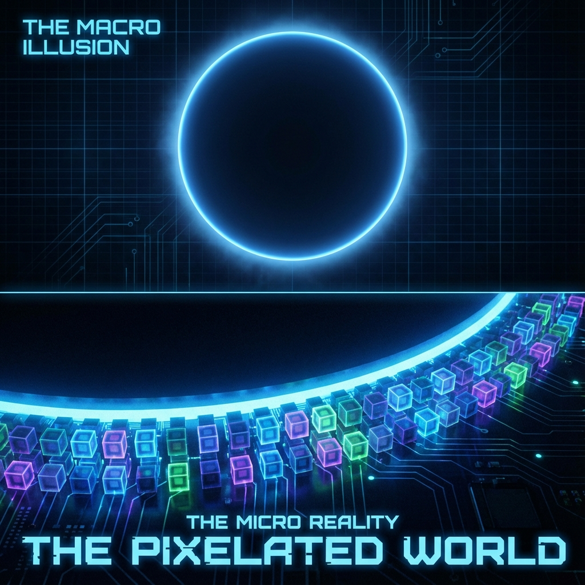

# Chapter 4: The Discrete Heartbeat

In Volume 1, we painted a magnificent and smooth picture of the universe: a huge vector elegantly rotating in geometric space, like a pointer sweeping across a dial without markings. Relativity and gravity were all explained within this perfect continuous geometry.

However, this is only half the story. If we take a magnifying glass and zoom infinitely into that smooth "circle," at that extremely tiny scale—the Planck scale—what would we see?

We would see jagged edges. We would see breaks. We would see the deepest secret of the universe: **The world is not a painted oil painting; the world is a computed bitmap.**

## 4.1 The Pixelated World

> "God does not play dice, but God might play Go. The universe's board is discrete."

In the intuition of classical physics, space is considered infinitely divisible. You seem to be able to cut a rope in half, then in half again, and so on infinitely, down to infinitesimal. This "continuity" assumption is the foundation of calculus and the basis of our understanding of motion.

But in the microscopic engine room of **Vector Cosmology**, this continuity is declared a macroscopic illusion.

#### The End of Continuity

Why must continuity end?

If space were truly continuous, it would mean that arbitrarily small regions contain infinite information capacity. If a point can be located with infinite precision, then the number of bits required to describe this position would be infinite. This would lead to a terrible consequence: **infinite computational power requirements**.

But this contradicts our core axiom—**finite budget ($c_{FS}$)**.

If the universe's total budget is finite, it cannot maintain an infinitely precise continuous structure. Therefore, logic forces us to accept a conclusion: **The universe must be discrete.** There must exist a smallest unit of length and a smallest unit of time, below which "position" and "moment" no longer have meaning.

#### The Universe's Substrate: Quantum Cellular Automata (QCA)

To describe this discrete underlying structure, we need to introduce a new mathematical model: **Quantum Cellular Automata (QCA)**.

Imagine a huge, multidimensional lattice grid.

* Each grid point (Cell) is not empty; it carries a finite-dimensional Hilbert space (such as a qubit or a quantum state).

* This is how we have been describing the microscopic composition of that unique global vector $|\Psi\rangle$: it is the tensor product of all these grid point states ($\mathcal{H} \simeq \bigotimes_{x \in \Lambda} \mathcal{H}_{cell}$).

In this picture, nothing "moves" through space.

When a photon flies from point A to point B, no real particle passes through the void in between. What really happens is:

1.  The excited state of grid point A passes the "excitation" to grid point B through local interaction rules.

2.  A extinguishes, B lights up.

This is like a wave in a football stadium or a cursor on a computer screen. The pixels on the screen never move; what moves is the **wavefront of information**. The universe is essentially an extremely high-resolution quantum display screen.

#### The Jagged Circle

What does this discovery mean for our previous "great circle" theory?

It means that the perfect, smooth information-velocity circle $v_{ext}^2 + v_{int}^2 = c_{FS}^2$ we described in Volume 1 is actually a **regular polygon** at the microscopic level.

* **FS time ($\tau$)** is not a flowing river but a ticking pendulum. It consists of a series of discrete **update steps**.

* Each "tick," the universe performs a global unitary update ($|\Psi_{n+1}\rangle = U |\Psi_n\rangle$).

* What we call $c_{FS}$ is actually the **maximum allowed step size** for the system state to jump in projective space in each update step.

This is why the universe has a speed limit. The speed of light $c$ is not because God set up speed limit police, but because on a discrete grid, information transmission is limited by **adjacency relations**. In one update, information can at most pass from one cell to its neighbor, and cannot instantly jump to more distant places. This is the so-called **Lieb-Robinson speed**, the iron wall of microscopic causality.

When we stand at the macroscopic scale and look far away, these dense tiny jumps connect together, disguising themselves as smooth continuous motion, just as countless pixels deceive our eyes, making us see a perfect picture.

But in this chapter, we will tear open this picture and face those rough, jumping pixels directly. Because it is precisely the existence of these pixels that saves physics from collapse.
