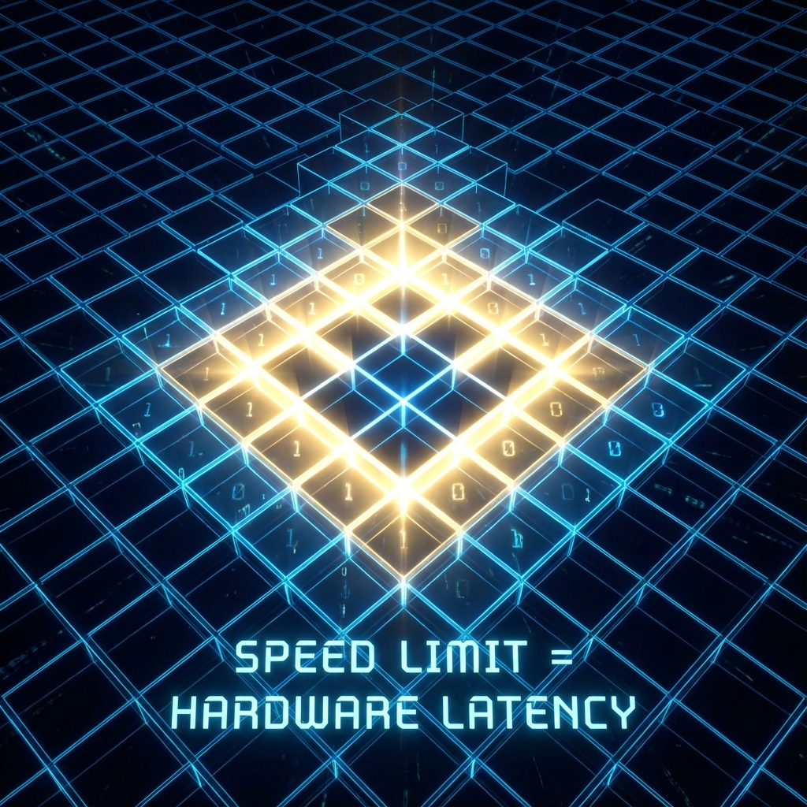

## 4.2 光速的微观来源 (The Microscopic Origin of Light Speed)

> "光并没有收到交警的罚单。光是因为走遍了所有的格子，才显得那么快。"

在狭义相对论中，光速 $c$ 被奉为一个神圣不可侵犯的常数。爱因斯坦将其作为一个公理引入，却从未解释 **为什么** 宇宙必须有一个极限速度。为什么是 $299,792,458$ 米/秒？为什么不是无穷大？

在 **《矢量宇宙论》** 的微观引擎室里，我们终于可以揭开这个常数的面纱。光速不是上帝随意设定的参数，它是宇宙底层离散结构的 **硬件性能指标**。

#### 信息的跳跃限制

我们在上一节中确立了宇宙的底层是 **量子元胞自动机 (QCA)** 的晶格。在这个离散的世界里，并不存在真正的"连续运动"。所谓的运动，本质上是信息在相邻网格点之间的传递与复制。

让我们审视一下这个过程的微观机制：

1.  **局部性 (Locality)**：在 QCA 的规则中，每一个格点在一次更新步骤 $\Delta t$ 内，只能与它直接相邻的格点发生相互作用。

2.  **有限性 (Finiteness)**：格点之间的距离 $a$ 是固定的（普朗克长度），更新的时间间隔 $\Delta t$ 也是固定的（普朗克时间）。

这意味着，无论相互作用多么剧烈，信息在一步之内传播的最大距离被死死地锁定为 $a$。因此，信息传播的最大物理速度就是：

$$v_{LR} = \frac{a}{\Delta t}$$

这个速度在数学物理中被称为 **Lieb-Robinson 速度 (Lieb-Robinson Velocity)**。它是所有格点系统所固有的因果边界。没有任何信号能超越这个速度，就像在国际象棋棋盘上，无论你的策略多么高明，你的棋子一步也只能走到相邻的格子，而无法瞬间传送到棋盘另一端。

我们所熟知的 **光速 $c$**，正是这个微观 Lieb-Robinson 速度在宏观连续极限下的涌现表现。光速有限，是因为宇宙的"刷新率"和"像素间距"是有限的。

#### FS 容量的物理校准

现在，我们需要将这个物理上的晶格速度 $v_{LR}$ 与我们在第一卷中定义的抽象预算 **FS 容量 ($c_{FS}$)** 联系起来。

在射影希尔伯特空间的几何中，$c_{FS}$ 衡量的是全局量子态演化的角速度。而在 QCA 的物理图像中，$v_{LR}$ 衡量的是波包在晶格上传播的空间速度。两者之间存在着严格的数学对应关系。

对于一个标准的狄拉克型 QCA 模型，我们可以证明：

$$c_{FS}^{max} = \frac{2\pi}{\Delta t} = \frac{2\pi}{a} v_{LR}$$

这个公式揭示了 $c_{FS}$ 的真实物理量纲：

* $v_{LR}$ 是空间速度（长度/时间）。

* $c_{FS}$ 是 **信息处理容量**（1/时间，或频率）。

这再次印证了我们的"经济学隐喻"：**光速 ($v_{LR}$) 只是表象，算力 ($c_{FS}$) 才是本质。** 宇宙之所以限制物体运动的快慢，是因为它限制了每一个普朗克时间内所能处理的 **信息更新量**。

当我们说"光速是极限"时，我们实际上是在说：**宇宙这台计算机的带宽被占满了。** 当一个物理过程消耗了全部的 $c_{FS}$ 预算用于在网格间搬运数据（$v_{ext}$ 达到极大），它就达到了物理上的光速 $c$。

#### 涌现的光锥

至此，神秘的 **光锥 (Light Cone)** 结构也有了极其朴素的解释。

在相对论中，光锥区分了过去、未来和绝对的"他处"。在 QCA 视角下，光锥就是 **信息扩散的波前**。

想象你在平静的水面上扔下一颗石子（一个局部扰动）。

* 在 $t=1$ 时刻，只有中心点受影响。

* 在 $t=2$ 时刻，影响扩散到最近的邻居。

* 在 $t=n$ 时刻，影响范围是一个半径为 $n \times a$ 的区域。

这个不断扩大的区域边界，就是光锥。Lieb-Robinson 定理从数学上严格保证了，在这个光锥之外，任何关联函数都以指数级衰减。这意味着因果律不是这一种抽象的哲学原则，而是离散动力学的 **统计必然**。

#### 结论：硬件的铁律

通过微观视角的审视，我们发现狭义相对论并不是宇宙的终极真理，它只是 **离散晶格动力学在低能长波极限下的近似**。

* 并没有一个叫做"光速不变"的魔法公理。

* 只有一套死板的、机械的 **局部更新规则**。

我们生活在一个巨大的元胞自动机中。每一次普朗克时间的嘀嗒，宇宙就根据这套规则重绘一次万物。正是这种机械的、有限的更新过程，赋予了我们稳定的因果关系，也赋予了我们那个不可逾越的速度极限。

但是，既然宇宙是离散的晶格，那么当我们用极高的能量去探测极其微小的尺度时，那个完美的、圆形的相对论对称性还能保持吗？就像放大一张低分辨率的照片会看到马赛克一样，我们的物理定律会不会在微观尽头出现裂痕？

这正是下一章的主题——**下垂的圆**。我们将看到，在那个极限尺度上，连相对论本身也会崩溃。

