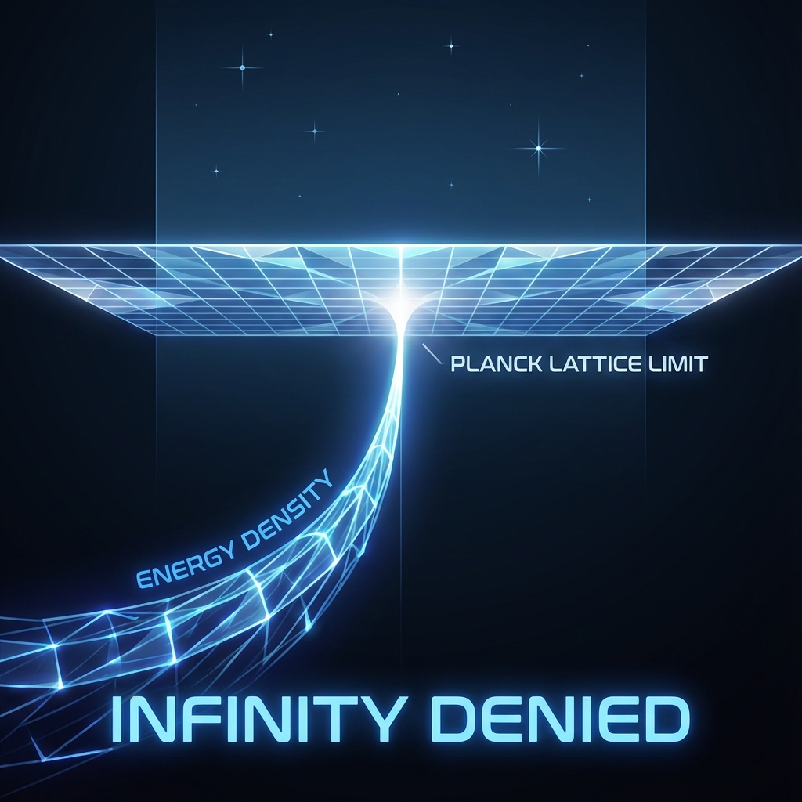

## 4.3 拒绝无穷大 (The Denial of Infinity)

> "自然界厌恶真空，但自然界更加厌恶无穷大。真正的物理学只在有限的边界内呼吸。"

在经典物理学和量子场论的辉煌殿堂中，游荡着一个挥之不去的幽灵——**无穷大 (Infinity)**。

当我们试图计算一个电子的自能，或者计算真空的零点能时，标准理论给出的答案往往是"无穷大"。物理学家被迫发明了一种名为 **重整化 (Renormalization)** 的数学技巧，小心翼翼地减去这些无穷大，以获得有限的观测值。虽然这种方法在实验上取得了惊人的成功，但在哲学和逻辑上，它始终像是一种为了掩盖理论缺陷而进行的"作弊"。

在 **《矢量宇宙论》** 的微观视角下，我们不再需要这种掩饰。

通过引入量子元胞自动机 (QCA) 作为宇宙的底层架构，我们不仅解释了光速的来源，更彻底地**"拒绝了无穷大"**。在这个离散的宇宙中，奇点消失了，发散终止了，一切回归于优雅的有限性。

#### 连续性的诅咒：紫外发散

为什么传统物理学会遇到无穷大？罪魁祸首在于我们对 **"连续空间"** 的执念。

在连续场论中，我们将空间视为无限可分的。这意味着波长可以无限短，频率可以无限高。当我们试图统计一个空间区域内的总能量（或总概率）时，我们需要对所有可能的频率模式进行积分：

$$E_{total} \sim \int_0^{\infty} \omega^3 d\omega = \infty$$

积分的上限是无穷大，这被称为 **紫外发散 (Ultraviolet Divergence)**。它暗示着，如果在极微小的尺度上空间仍然是连续的，那么每一寸虚空中都蕴含着足以摧毁宇宙的无限能量。这显然是荒谬的。

#### 晶格的救赎：布里渊区的封闭

在 QCA 的离散晶格模型中，这个积分上限被自然地截断了。

我们在第 4.1 节中确立了宇宙存在一个最小的尺度——普朗克长度 $a$。这意味着物理波长不能短于 $2a$。

在动量空间（Momentum Space）中，这种空间上的离散性导致了一个深刻的几何后果：动量不再是一条无限延伸的直线，而是一个首尾相接的圆环，或者一个有限的区间。这在固体物理中被称为 **布里渊区 (Brillouin Zone)**。

所有的物理动量 $k$ 被限制在区间 $[-\pi/a, \pi/a]$ 内。

所有的能量 $\omega(k)$ 被限制在一个有限的带宽内。

因此，那个导致无穷大的积分被物理机制强行终止了：

$$E_{total} \sim \int_0^{\pi/a} \omega^3 d\omega = \text{有限值}$$

这并不是人为引入的截止（Cutoff），这是宇宙离散结构的 **内禀属性**。在这个体系中，没有任何物理过程能够激发超过布里渊区边界的能量。所谓的"无穷大能量"，只是因为我们在使用错误的数学工具（连续微积分）去描述一个本质上是数字化的世界时产生的计算伪影。

#### 跨普朗克尺度的幻觉

这一机制完美地解决了困扰黑洞物理和宇宙学的 **"跨普朗克问题" (Trans-Planckian Problem)**。

在霍金辐射或宇宙暴胀的计算中，如果一直回溯时间，粒子的波长似乎会由于红移效应被无限压缩，最终变得比普朗克长度还小，能量变得无限大。这曾让无数理论物理学家感到恐慌。

但在 **《矢量宇宙论》** 的 QCA 模型中，这种恐慌是多余的。

* **没有无限的压缩**：当一个波包的波长被压缩到接近晶格常数 $a$ 时，它触碰到了布里渊区的边界。

* **频闪效应 (Aliasing)**：在离散网格上，波长 $0.9a$ 的波动与波长 $1.1a$ 的波动是无法区分的（类似于车轮转得太快看起来像是在倒转）。

那些看似拥有"超普朗克能量"的模式，实际上只是位于布里渊区边缘的普通模式。它们被映射回了有限的能带中。宇宙没有崩溃，也没有奇点，只有信息在有限带宽内的循环往复。

#### FS 容量的终极限制

这种有限性再次回扣了我们的核心公理——**恒定的 FS 容量 ($c_{FS}$)**。

$$c_{FS}^{max} = \frac{2\pi}{\Delta t}$$

这个公式不仅定义了光速，也定义了 **宇宙的最大算力**。

如果宇宙允许无穷大（无论是无限的能量密度，还是无限细分的空间），那么维持这个宇宙运转所需的 $c_{FS}$ 就必须是无穷大。但既然我们假定宇宙是一个单一的、归一化的矢量 $|\Psi\rangle$，它的总变化率就必须是有限的。

**拒绝无穷大，就是承认宇宙的资源是有限的。**

* **黑洞奇点** 不存在：在引力坍缩的中心，物质不会被挤压成一个密度无限大的点，而是达到了晶格的信息存储极限（达到饱和的 $v_{env}$）。

* **宇宙大爆炸奇点** 不存在：在 $t=0$ 时刻，宇宙不是一个体积为零、温度无限的点，而是一个处于极高（但有限）纠缠态的初始网格配置。

#### 结论：有限即完美

我们曾经认为，只有"无限"才配得上宇宙的宏大。但在 **《矢量宇宙论》** 中，我们发现 **"有限"** 才是真正的优雅。

通过 QCA 这一微观引擎，我们剔除了物理学中所有的病态发散。我们构建了一个干净的、可计算的宇宙。在这里，每一份能量都有账可查，每一个比特都有处安放。

至此，我们已经完成了对微观离散结构的探索。我们知道宇宙是像素化的，光速是它的刷新率，无穷大是它的禁区。

但是，这种离散性真的无法被察觉吗？那个完美的"狄拉克圆"在微观的像素格子上真的还能保持完美吗？

下一章，我们将进行一项大胆的预测。我们将看到，当我们逼近这个晶格极限时，相对论的对称性将发生破缺。那个原本光滑的圆，将开始 **"下垂"**。

