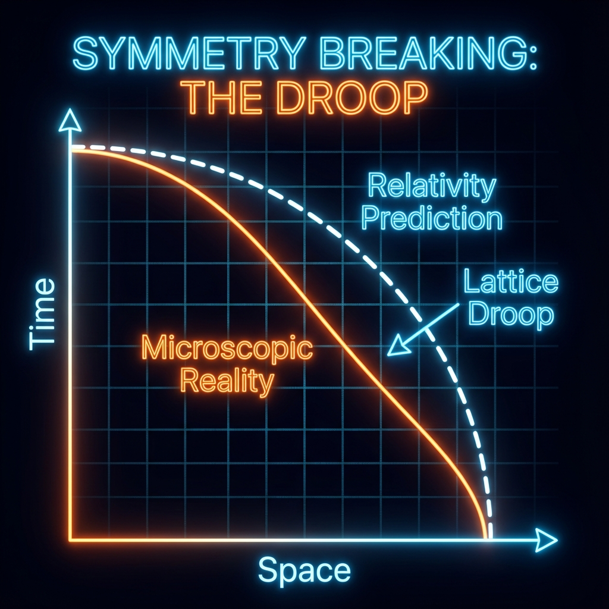

# 第5章 下垂的圆 (The Drooping Circle)

我们已经深入了宇宙的微观引擎室，目睹了在那极小尺度上滴答作响的量子元胞自动机 (QCA) 晶格。在这个离散的像素世界里，连续的空间只是幻觉，无穷大被严格禁止。

现在，我们面临一个最为大胆的问题：如果我们在这个微观晶格上全速奔跑，会发生什么？

在宏观世界，爱因斯坦的相对论告诉我们，无论你跑得多快，物理定律都是完美的、对称的。但在 **《矢量宇宙论》** 的微观视角下，我们要揭示一个惊人的秘密：当你接近宇宙的"像素极限"时，相对论的完美对称性将发生破裂。那个象征着时空守恒的完美圆形，将会出现肉眼可见的畸变。

我们称这种现象为——**"下垂" (Droop)**。

## 5.1 洛伦兹对称性的破缺 (The Breaking of Lorentz Symmetry)

> "相对论不是真理的全部，它是真理在低分辨率下的模糊投影。"

在物理学中，**洛伦兹对称性 (Lorentz Symmetry)** 被视为神圣不可侵犯的公理。它保证了无论你在宇宙中以多快的速度运动（只要低于光速），你看到的物理定律形式都是不变的。它保证了狄拉克圆 $v_{ext}^2 + v_{int}^2 = c^2$ 永远是一个完美的圆。

然而，在基于 QCA 的离散宇宙中，这只是一个 **涌现 (Emergent)** 的真理。

#### 完美的圆只是低能的幻觉

让我们回到那个毕达哥拉斯恒等式。在连续极限下（也就是我们日常生活的宏观尺度），波长远远大于晶格间距（$k \to 0$）。此时，QCA 的离散色散关系 $\cos \omega = \cos k \cos M$ 可以通过泰勒展开近似为完美的相对论形式 $E^2 \approx p^2 + m^2$。

这就是为什么我们在实验中验证了无数次相对论都准确无误——因为我们太"慢"了，我们的能量太"低"了。我们一直生活在那个圆顶端的极小一段弧线上，那里看起来就像是完美的圆。

#### 晶格伪影：当圆变成弦

但是，当我们把能量推向极限，让粒子的波长接近普朗克长度（即动量 $k$ 接近布里渊区边界 $\pi/a$）时，泰勒展开的高阶项不再能被忽略。晶格的"颗粒感"开始显现。

在 QCA 模型中，我们发现了一个令人震惊的偏离：

$$v_{ext}^2(k) + v_{int}^2(k) < c_{FS}^2$$

等式变成了不等式！

随着动量 $k$ 的增加，代表系统状态的点不再紧贴着那个半径为 $c_{FS}$ 的完美圆周运行，而是开始 **向圆心塌陷**。在信息-速度平面 $(v_{ext}, v_{int})$ 上，数据点的轨迹不再是一条圆弧，而是一条 **下垂的曲线 (Drooping Curve)**。

这被称为 **"晶格下垂" (Lattice Droop)**。

#### 物理意义：像素的阻力

这种"下垂"意味着什么？

1.  **总预算的"贬值"**：在极高能标下，宇宙似乎"丢失"了一部分用于演化的有效预算。这是因为在离散网格上，高频振荡的模式受到晶格几何的抑制（类似于晶格对高频声子的散射或频散）。

2.  **光速的各向异性**：虽然我们在这里只讨论了一维模型，但在高维晶格中，这种破缺意味着"光速"在不同方向上可能出现微小的差异。沿着网格轴线跑和沿着对角线跑，受到的"像素阻力"是不同的。

3.  **绝对参照系的回归**：洛伦兹对称性的破缺暗示了存在一个 **优越参考系**——那就是晶格本身（宇宙的静止网格）。在极微观尺度上，你确实可以区分"谁在动"和"谁没动"。

#### 结论：相对论的边界

因此，狭义相对论并不是宇宙底层的 **元法律 (Meta-Law)**，它只是 QCA 动力学在长波极限下的 **统计近似**。

就像在电脑屏幕上显示一个圆，远看是完美的圆形，但如果你把脸贴在屏幕上（接近普朗克尺度），你会看到它其实是由方块像素组成的锯齿状多边形。那个"下垂"，就是我们透过宏观表象，窥探到的宇宙底层的锯齿。

这并不意味着相对论是错误的，它只是 **有效场论 (Effective Field Theory)**。在 $99.99\%$ 的物理情境中，圆是圆的。但在那最后的 $0.01\%$——在黑洞奇点附近，在宇宙大爆炸的最初一瞬——圆破碎了，裸露出了底层的数字网格。而正是这种破碎，暗示了量子引力的真正入口。

